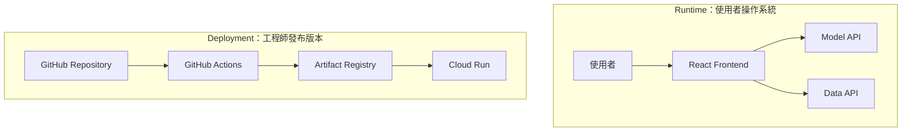

---
authors:
  - name: Charles Cao
date: 2026-08-21
updated: 2026-08-21
tags:
  - Architecture
  - Overview
---

# 第 1 章：部署前，先看懂兩條流程

這套系統同時存在「使用者正在使用服務」與「工程師正在發布版本」兩種流程。本章只負責建立全貌，後續章節再分別深入每一條路徑。

## 學習目標

- [ ] 分辨執行期（Runtime）與部署期（Deployment）。
- [ ] 知道後續各頁分別要回答什麼問題。

## 本章在整體架構的位置

本章是整套部署筆記的入口，先把 Runtime 與 Deployment 分開；後續章節再沿著各自的箭頭逐一深入。

!!! info "這個系列討論什麼？"
    本系列記錄 `ai-asst-km` 如何開發、測試與部署，不討論 RAG、Prompt、知識檢索或員工 KM 內容。

## 前置知識

不需要先熟悉 GCP、Docker 或 CI/CD。閱讀時只要先問：「這個箭頭傳的是使用者請求，還是程式版本？」

## 1.1 核心問題：兩條流程不要混在一起

| 流程 | 發生時機 | 主要參與者 | 要回答的問題 |
|---|---|---|---|
| Runtime（執行期） | 使用者開啟網頁並送出問題 | Browser、Frontend、Model API、Data API | 一次 HTTP 請求如何取得答案並保存紀錄？ |
| Deployment（部署期） | 程式碼合併或手動發布時 | GitHub、GitHub Actions、Artifact Registry、Cloud Run | 新程式如何變成正式服務？ |

## 1.2 基礎觀念

!!! info "基礎觀念"
    Runtime 關心已上線服務如何處理請求；Deployment 關心程式碼如何被測試、建置並發布。兩者發生在不同時間，也由不同元件負責。

## 1.3 ai-asst-km 實際做法

!!! example "ai-asst-km 實際做法"
    使用者請求會經過 React Frontend、Model API 與 Data API；新版本則由三個 GitHub Repository 的 Actions workflow 分別交付到 Cloud Run 或 Firebase Hosting。



上半部的箭頭代表 HTTP 請求與資料流；下半部的箭頭代表程式版本的交付。先分清箭頭屬於哪一類，後面的服務就不容易混在一起。

## 系列閱讀順序

1. [Runtime：使用者請求如何流動](02_runtime_request_flow.md)：Frontend、Model API 與 Data API 如何合作。
2. [Deployment：程式碼如何上線](03_cicd_deployment_flow.md)：三個 Repository 的 GitHub Actions 交付流程。
3. [Cloud Run：Service、Revision、Instance](04_cloud_run_core_concepts.md)：程式部署後在 GCP 如何執行。
4. [設定、環境變數與 Secret](05_configuration_and_secrets.md)：公開設定、機密資料與線上設定放在哪裡。

## 先記住這四個角色

| 元件 | 一句話理解 |
|---|---|
| GitHub Actions | 執行測試、建置與部署指令的自動化工作站 |
| Artifact Registry | 保存 Model API 與 Data API Container Image 的倉庫 |
| Cloud Run | 實際執行 Flask + Gunicorn API 的平台 |
| Firebase Hosting | 發送 React 靜態網站檔案的平台 |

GitHub Actions 不負責長期執行 API，Artifact Registry 也不會回應使用者請求。可以把三者想成：GitHub Actions 是物流中心、Artifact Registry 是倉庫、Cloud Run 是實際營業的門市。

## 實際設定查證

| 查證項目 | 現行結論 | 來源 | 查證日期 |
|---|---|---|---|
| Model API 執行位置 | Cloud Run | `ai-asst-model-api/.github/workflows/deploy.yml` | 2026-08-21 |
| Data API 執行位置 | Cloud Run | `ai-asst-data-api/.github/workflows/deploy.yml` | 2026-08-21 |
| Frontend 發布位置 | Firebase Hosting | `ai-asst-frontend/.github/workflows/deploy.yml` | 2026-08-21 |

## Lab 實作練習

**安全等級**：本機實作

### 目標

在本機程式碼中找出三條部署流程，確認架構圖不是抽象示例。

### 環境需求

本機已有 `ai-asst-km` 三個主要 Repository，並在 `ai-asst-km` 根目錄執行以下指令。

### 步驟

```bash title="找出三個部署 workflow"
rg -n "^name: Deploy" \
  ai-asst-model-api/.github/workflows/deploy.yml \
  ai-asst-data-api/.github/workflows/deploy.yml \
  ai-asst-frontend/.github/workflows/deploy.yml
```

### 驗證結果

- [ ] Model API 與 Data API 顯示 `Deploy (Cloud Run)`。
- [ ] Frontend 顯示 `Deploy (Firebase Hosting)`。

## 常見問題

??? question "為什麼第一章沒有直接介紹 Cloud Run 的所有設定？"
    第一章只建立全貌。Service、Revision、Instance、資源與擴縮會在第 4 章集中說明，避免同一頁同時承擔太多概念。

## 小結

- Runtime 描述使用者請求。
- Deployment 描述程式版本交付。
- 後續每一頁只深入處理其中一個問題。

## 延伸閱讀

- [Google Cloud：What is Cloud Run](https://docs.cloud.google.com/run/docs/overview/what-is-cloud-run)
- [GitHub Docs：Understanding GitHub Actions](https://docs.github.com/actions/about-github-actions/understanding-github-actions)
