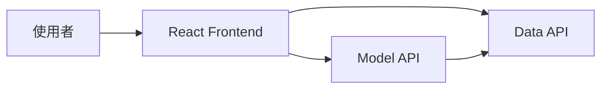
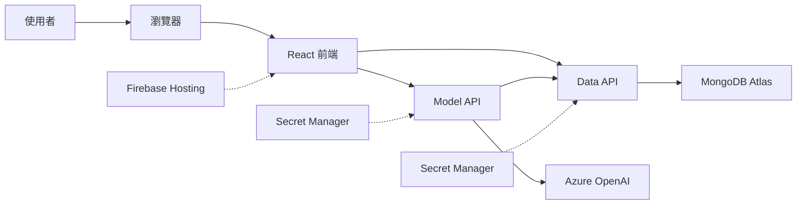
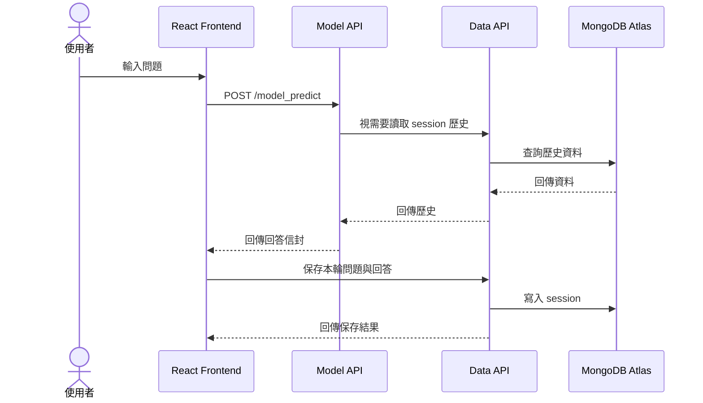

---
authors:
  - name: Charles Cao
tags:
  - Runtime
  - Architecture
  - API
---

# 第 2 章：Runtime 使用者請求如何流動

Runtime 是系統已經上線後，使用者實際操作網頁時發生的流程。這一頁先建立元件責任與資料流；HTTP Method、Flask route 和狀態碼會在後續 API 章節獨立說明。

## 學習目標

- [ ] 說明 Frontend、Model API 與 Data API 的責任。
- [ ] 依序描述一次提問如何取得回答並保存。
- [ ] 分辨「網站託管位置」與「程式實際執行位置」。

## 本章在整體架構的位置



本章只追蹤使用者送出問題後的 Runtime 路徑，不討論 GitHub Actions 與部署指令。

## 前置知識

先閱讀[第 1 章](01_ai_asst_deployment_overview.md)，能分辨 Runtime 與 Deployment 即可。

## 2.1 核心問題：誰負責畫面、回答與資料？

三個應用元件必須各自負責清楚的工作，才能分開部署、調整資源與排查問題。

## 2.2 基礎觀念

!!! info "基礎觀念"
    Hosting 負責把前端檔案送到瀏覽器；API Server 負責接收 HTTP 請求並執行後端邏輯；Database 負責持久保存資料。它們不是同一種服務。

## 2.3 ai-asst-km 實際做法

!!! example "ai-asst-km 實際做法"
    React 前端由 Firebase Hosting 發送，Model API 與 Data API 以 Flask + Gunicorn 執行在 Cloud Run，對話資料由 Data API 寫入 MongoDB Atlas。

### 完整 Runtime 架構圖



實線代表主要請求或資料流，虛線代表託管或設定注入關係。

## 三個核心應用元件

| 元件 | 技術 | 部署位置 | 主要責任 |
|---|---|---|---|
| Web Frontend | React、TypeScript、Vite | Firebase Hosting | 顯示畫面、呼叫 API、把成功回覆送去保存 |
| Model API | Flask、Gunicorn | Cloud Run | 接收問題、執行 AI 問答流程、回傳回答信封 |
| Data API | Flask、Gunicorn | Cloud Run | 寫入與查詢對話歷史、回饋與刪除資料 |

### Frontend 為什麼同時出現在 Hosting 和瀏覽器？

Firebase Hosting 保存並發送 build 後的 HTML、CSS、JavaScript。使用者開啟網站後，JavaScript 會下載到瀏覽器中執行；真正呼叫 Model API 與 Data API 的是瀏覽器裡的前端程式。

### 兩支 API 為什麼分開？

- Model API 專注在產生回答。
- Data API 專注在保存與查詢資料。

分開後可以獨立部署、調整資源與排查問題。例如 Model API 需要較多記憶體和較長 Timeout，Data API 的請求通常較短。

## 一次提問的順序



1. 使用者在 React 前端輸入問題。
2. 前端向 Model API 發送 `POST /model_predict`。
3. Model API 視需要向 Data API 讀取同一個 session 的歷史。
4. Model API 完成處理後，把回答信封傳回前端。
5. 前端再向 Data API 發送請求，保存這一輪問題與回答。
6. Data API 將資料寫入 MongoDB Atlas。

!!! warning "聊天紀錄只有一條正式寫入路徑"
    正式設計是由 Frontend 呼叫 Data API 寫入聊天紀錄。Model API 只讀歷史，不應再寫一次，否則同一輪可能被重複保存。

## 實際設定查證

| 查證項目 | 現行結論 | 來源 | 查證日期 |
|---|---|---|---|
| 問答入口 | Frontend 呼叫 `POST /model_predict` | `ai-asst-frontend/src/services/api.ts` | 2026-08-21 |
| 對話寫入 | Frontend 呼叫 Data API append turn | `ai-asst-frontend/src/services/dataApi.ts` | 2026-08-21 |
| Data API 儲存 | Flask route 寫入 MongoDB session history | `ai-asst-data-api/app.py` | 2026-08-21 |
| API 啟動方式 | Flask + Gunicorn | Model/Data API Dockerfile | 2026-08-21 |

## Lab 實作練習

**安全等級**：本機實作

### 目標

從前端程式碼確認 Model API 與 Data API 的呼叫分工。

### 環境需求

本機已有 `ai-asst-frontend` Repository、可使用 `rg`，並在 `ai-asst-km` 根目錄執行以下指令。

### 步驟

```bash title="查找兩支 API 的呼叫位置"
rg -n "model_predict" ai-asst-frontend/src/services/api.ts
rg -n "appendTurn|data-api/sessions" ai-asst-frontend/src/services/dataApi.ts
```

### 驗證結果

- [ ] `api.ts` 包含 Model API 的問答請求。
- [ ] `dataApi.ts` 包含 Data API 的 session 寫入請求。

## 常見問題

??? question "使用者送出問題時，GitHub Actions 會參與嗎？"
    不會。GitHub Actions 屬於部署期；使用者請求只會經過已經上線的 Frontend 與 API。

??? question "Firebase Hosting 會執行 Flask 嗎？"
    不會。Firebase Hosting 發送前端靜態檔；Flask + Gunicorn 執行在 Cloud Run。

## 小結

- Frontend 負責互動與串接 API。
- Model API 產生回答，Data API 管理資料。
- Firebase Hosting 發送前端檔案，Cloud Run 執行兩支後端 API。
- Runtime 不包含 GitHub Actions、Docker build 或部署指令。

下一頁：[Deployment：程式碼如何上線](03_cicd_deployment_flow.md)。

## 延伸閱讀

- [MDN：Overview of HTTP](https://developer.mozilla.org/docs/Web/HTTP/Guides/Overview)
- [Firebase：Hosting](https://firebase.google.com/docs/hosting)
