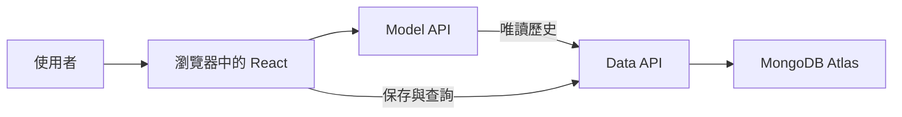
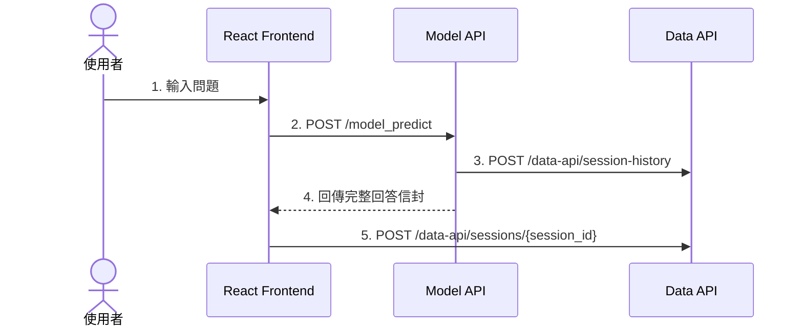

---
authors:
  - name: Charles Cao
tags:
  - Runtime
  - Architecture
  - API
  - Authentication
---

# 第 2 章：Runtime 使用者請求如何流動

Runtime 是系統已經上線後，使用者操作網頁時真正發生的流程。本章追蹤一次提問如何穿過瀏覽器、Model API、Data API 與資料庫，也說明登入身分、歷史讀取與失敗時的邊界。

HTTP Method、Flask route 與狀態碼會在後續 API 章節深入說明；本章先把元件分工和請求順序看懂。

## 學習目標

- [ ] 分辨 Firebase Hosting、瀏覽器與 Cloud Run 的責任。
- [ ] 說明 Frontend、Model API 與 Data API 各自處理什麼。
- [ ] 依序描述一次提問的歷史讀取、回答與保存流程。
- [ ] 說明使用者 JWT 與 server-to-server service token 的差異。
- [ ] 判斷 Model API 或 Data API 失敗時，畫面與歷史紀錄會發生什麼。

## 本章在整體架構的位置



本章只追蹤上圖的 Runtime 路徑。GitHub Actions、Docker build 與 Cloud Run deploy 屬於 Deployment，會留在後續章節。

## 前置知識

先閱讀[第 1 章](01_ai_asst_deployment_overview.md)，能分辨 Runtime 與 Deployment 即可。不需要先理解 RAG、向量資料庫或模型 Prompt。

## 2.1 同一個畫面，其實跨越三個執行位置

使用者看到的是一個聊天網站，但請求會跨越不同位置：

| 位置 | 執行內容 | 不負責什麼 |
|---|---|---|
| Firebase Hosting | 保存並傳送 build 後的 HTML、CSS、JavaScript | 不執行 Flask，也不產生 AI 回答 |
| 使用者瀏覽器 | 執行 React、保存登入狀態、呼叫兩支 API、更新畫面 | 不直接連 MongoDB |
| Cloud Run | 執行 Model API 與 Data API 的 Flask + Gunicorn Container | 不負責把 React 原始碼送進瀏覽器 |

!!! info "基礎觀念"
    Hosting 是「把前端檔案送出去」，Browser 是「執行前端程式」，API Server 是「接收 HTTP 請求並執行後端邏輯」。三者可能一起構成同一個產品，但不是同一種服務。

## 2.2 三個應用元件如何分工

| 元件 | 現行技術 | 部署位置 | 主要責任 |
|---|---|---|---|
| Web Frontend | React、TypeScript、Vite | Firebase Hosting／Browser | 登入、顯示畫面、產生 `session_id`、呼叫 API、還原歷史 |
| Model API | Flask、Flask-RESTX、Gunicorn | Cloud Run | 驗證使用者、讀取既有歷史、處理問題、回傳完整回答信封 |
| Data API | Flask、Gunicorn | Cloud Run | 驗證資料擁有者、保存與查詢 session、回饋、刪除資料 |

!!! example "ai-asst-km 實際做法"
    Model API 只負責回答與唯讀歷史，不保存本輪對話；Data API 不產生回答，只管理聊天資料。正式寫入只有「Frontend → Data API」一條路徑，避免同一輪被重複保存。

## 2.3 登入後，每個 API 請求如何證明身分

使用者先向 Model API 的登入端點送出員工編號與密碼。登入成功後，Frontend 將 JSON Web Token（JWT）保存在瀏覽器的 `localStorage`。

之後 Frontend 的兩個 Axios Client 都會自動加入：

```http
Authorization: Bearer <使用者 JWT>
```

Model API 用 JWT 決定能否執行問答；Data API 則從 JWT 的 `sub` 取得使用者身分，不信任 Request Body 自己填入的 `user_id`。若任何 API 回傳 HTTP `401`，Frontend 會廣播 `auth:unauthorized`，清除登入資料並回到登入頁。

!!! warning "JWT 和 CORS 解決不同問題"
    JWT 用來驗證呼叫者身分；CORS 只限制瀏覽器允許哪些來源跨站呼叫。看到正確的 CORS Header，不代表請求已通過身分驗證。

### 為什麼 Model API 讀歷史不用使用者 JWT？

Model API 呼叫 Data API 的 `POST /data-api/session-history` 時使用 server-to-server service token。這個 token 只能讀取歷史，不能新增、修改或刪除 session。

因此系統有兩種不同權限：

| 呼叫方向 | 使用身分 | 權限 |
|---|---|---|
| Browser → Model API／Data API | 使用者 JWT | 問答及本人 session 的讀寫 |
| Model API → Data API | Service token | 唯讀 session history |

## 2.4 一次提問的五個主要步驟



### 步驟 1：Frontend 先更新畫面

Frontend 檢查問題不是空白且沒有超過長度限制，接著把使用者訊息加入目前畫面。`session_id` 由 Frontend 產生，同一段對話持續沿用。

### 步驟 2：Frontend 呼叫 Model API

Frontend 傳送的主要欄位是：

```json
{
  "message": "使用者的問題",
  "session_id": "同一段對話固定使用的識別碼",
  "filtered_cond": null
}
```

Frontend 不會把整包聊天歷史重新塞進 Request。Model API 依 `session_id` 自己向 Data API 讀取需要的歷史。

### 步驟 3：Model API 唯讀既有歷史

Model API 使用 service token 查詢 Data API，現行設定最多回放最近 5 輪。若是第一次提問，Data API 可能回傳 `404`；Model API 會把它視為「尚無紀錄」，不是系統故障。

本章不展開 Model API 內部如何產生回答，只要先掌握：歷史由 Data API 提供，Model API 不直接讀寫 MongoDB。

### 步驟 4：Model API 回傳回答信封

Model API 回傳的不是單一字串，而是一個 Response Envelope。外層包含 `uuid`、`return_code`、`return_message` 與 `data`；`data` 中才有回答訊息、參考資料與執行資訊。

Frontend 使用這個信封建立畫面上的助理訊息。

### 步驟 5：Frontend 非同步保存本輪對話

只有 Model API 成功回覆後，Frontend 才呼叫 Data API 保存：

- `user_ask`：使用者問題。
- `sys_answer`：Model API 回傳的完整信封，不只是一段回答文字。
- `title`、`preview`、`create_ts`：側欄與顯示需要的 metadata。

Data API 再把本輪 append 到 MongoDB Atlas 的 session history。這個保存呼叫採非同步處理，因此回答可以先顯示；若保存失敗，畫面仍可能看得到回答，但重新載入後找不到該輪紀錄。

## 2.5 歷史如何載入，又如何避免一直下載整包資料

除了送出問題，Frontend 還有三種讀取方式：

| 使用情境 | Data API | 取得內容 |
|---|---|---|
| 登入後建立側欄 | `GET /data-api/sessions` | 本人的 session metadata，不含完整 history |
| 選擇一段對話 | `GET /data-api/sessions/{session_id}` | 該 session 的完整 history |
| 檢查對話是否更新 | `GET /data-api/sessions/{session_id}/meta` | 輪數與 `updated_at`，小於完整 history |

目前 Frontend 每 2 秒檢查一次作用中 session 的 `/meta`，但背景分頁、尚未保存的 session 或 metadata 沒變時，不會下載完整歷史。只有輪數或更新時間改變，才再次呼叫完整 GET。

這個設計把「有沒有變」和「把全部資料拿回來」拆開，可減少 Cloud Run 請求內容與網路傳輸量。

## 2.6 失敗時，哪一段會受到影響？

| 失敗位置 | 使用者看到什麼 | 是否寫入本輪歷史 |
|---|---|---|
| JWT 無效或過期 | 回到登入頁 | 否 |
| Model API 無法回答 | 顯示連線失敗訊息 | 否 |
| Model API 讀不到舊歷史 | 可能在缺少多輪脈絡下繼續回答 | 尚未進入本輪保存 |
| Model API 成功、Data API 保存失敗 | 當下仍看得到回答 | 否，重新載入可能消失 |
| 查詢不存在的 session | Frontend 視為尚無紀錄 | 不適用 |

最容易誤判的是「畫面有回答」不等於「歷史已成功保存」。Model API 與 Data API 的健康狀態需要分開觀察。

## 實際設定查證

以下結論以三個 Repository 的最新 `origin/main` 為準；未合併的本機功能分支不列為正式現況。

| 查證項目 | 現行結論 | 來源 | 查證日期 |
|---|---|---|---|
| 問答入口 | Frontend 呼叫 `POST /model_predict` | `ai-asst-frontend/src/services/api.ts` | 2026-08-22 |
| 使用者驗證 | 兩支 Frontend API Client 都加入 Bearer JWT | `ai-asst-frontend/src/services/api.ts`、`dataApi.ts` | 2026-08-22 |
| 對話寫入 | Model 回覆成功後，由 Frontend 非同步 append | `ai-asst-frontend/src/pages/ChatPage.tsx` | 2026-08-22 |
| Model 歷史權限 | Service token 唯讀，`save()` 為 no-op | `ai-asst-model-api/prod/model/session_store.py` | 2026-08-22 |
| Session 清單與輪詢 | Metadata 清單、完整 GET、輕量 `/meta` 分開 | Frontend `dataApi.ts`、Data API `app.py` | 2026-08-22 |
| Data API 身分來源 | 以 JWT `sub` 為準，service token 不可寫入 | `ai-asst-data-api/app.py` | 2026-08-22 |
| API 執行方式 | Model／Data API 均為 Flask + Gunicorn | 兩個 API 的正式 Dockerfile | 2026-08-22 |

## Lab 實作練習

**安全等級**：本機實作

### 目標

不用啟動服務，只從正式分支程式碼追出「問答、讀歷史、寫歷史」三條呼叫路徑。

### 環境需求

- 本機已有 `ai-asst-frontend`、`ai-asst-model-api`、`ai-asst-data-api`。
- 可使用 Git 與 `rg`。
- 在 `ai-asst-km` 根目錄執行。

### 步驟

```bash title="1. 找出 Frontend 的問答與保存順序"
rg -n "prodApi.predict|appendTurn" ai-asst-frontend/src/pages/ChatPage.tsx
```

```bash title="2. 確認 Model API 正式分支只讀歷史"
git -C ai-asst-model-api show origin/main:prod/model/session_store.py \
  | rg -n "session-history|唯讀|No-op"
```

```bash title="3. 找出 Data API 的使用者與 service token 邊界"
rg -n "list_my_sessions|post_session_history|post_turn|is_service" \
  ai-asst-data-api/app.py
```

### 驗證結果

- [ ] `prodApi.predict()` 出現在 `appendTurn()` 之前。
- [ ] Model API 的 `MongoSessionStore.save()` 明確是 no-op。
- [ ] Data API 的 session-history 只允許 service token。
- [ ] Data API 的新增對話拒絕 service token，正式寫入來自使用者端。

## 常見問題

??? question "使用者送出問題時，GitHub Actions 會參與嗎？"
    不會。GitHub Actions 屬於部署期；Runtime 請求只會經過已經上線的 Frontend、Model API、Data API 與其相依服務。

??? question "為什麼 Frontend 要分別呼叫 Model API 和 Data API？"
    因為回答與資料持久化是不同責任。即使其中一支 API 發生問題，也能更清楚判斷故障位於回答流程還是保存流程。

??? question "Model API 可以順便把回答寫進 Data API 嗎？"
    不應該。Frontend 已經負責正式寫入；Model API 再寫一次會造成同一輪重複保存。目前 Model API 的持久化 `save()` 刻意設為 no-op。

??? question "HTTP 200 就一定代表業務成功嗎？"
    不一定。這套 API 還有 `return_code` 信封；Data API Frontend Client 以 `return_code === "0"` 判斷成功。HTTP Status 和業務回傳碼是兩個不同層次。

## 小結

- Firebase Hosting 傳送前端檔案，真正的 React 程式在瀏覽器執行。
- Browser 使用 JWT 呼叫 Model API 與 Data API；Model API 用唯讀 service token 查歷史。
- Model API 產生回答，Data API 管理 session，MongoDB Atlas 保存資料。
- 正式寫入只有 Frontend → Data API 一條路徑。
- 畫面顯示回答與歷史成功保存是兩個不同結果，排錯時要分開確認。

下一頁：[Deployment：程式碼如何上線](03_cicd_deployment_flow.md)。

## 延伸閱讀

- [MDN：HTTP overview](https://developer.mozilla.org/docs/Web/HTTP/Guides/Overview)
- [MDN：Authorization header](https://developer.mozilla.org/docs/Web/HTTP/Reference/Headers/Authorization)
- [Flask：Request lifecycle](https://flask.palletsprojects.com/en/stable/lifecycle/)
- [Firebase：Hosting](https://firebase.google.com/docs/hosting)
