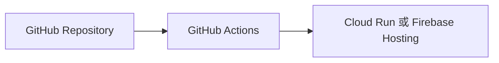
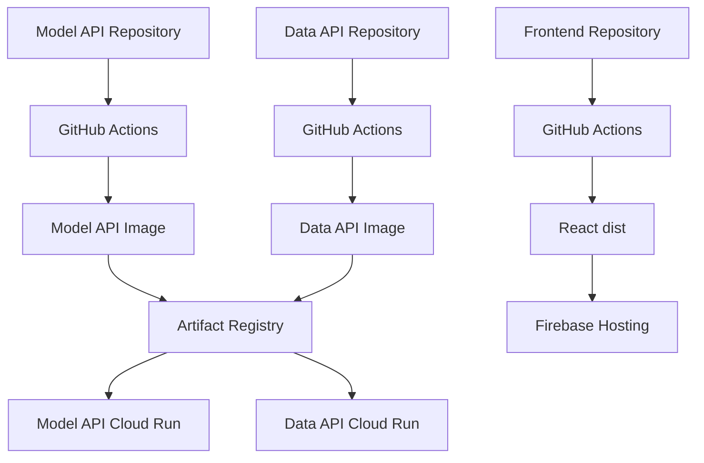
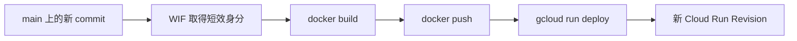

---
authors:
  - name: Charles Cao
tags:
  - CI/CD
  - GitHub Actions
  - Artifact Registry
---

# 第 3 章：Deployment 程式碼如何上線

Deployment 是工程師把新版本交付到正式環境的流程。`ai-asst-km` 的三個主要 Repository 都使用 GitHub Actions，但 API 與前端的部署產物不同。

## 學習目標

- [ ] 分辨 CI 與 CD 的責任。
- [ ] 看懂兩支 API 的 Image 交付路徑。
- [ ] 說明前端為什麼部署到 Firebase Hosting。
- [ ] 理解 Workload Identity Federation（WIF）在流程中的位置。

## 本章在整體架構的位置



本章涵蓋從 Git commit 到雲端部署目標的交付箭頭，不討論使用者送出問題後的 Runtime 流程。

## 前置知識

先理解 Repository、commit 與 branch 的基本概念；不需要先會撰寫 GitHub Actions YAML。

## 3.1 核心問題：三個 Repository 交付什麼？

兩支 API 交付可執行的 Container Image，Frontend 則交付瀏覽器可下載的靜態網站檔案。

## 3.2 基礎觀念

!!! info "基礎觀念"
    CI 回答「這次修改能否通過檢查與建置」；CD 回答「通過檢查的版本如何交付」。CI/CD 是自動化流程，不是實際長期執行 API 的平台。

## 3.3 ai-asst-km 實際做法

!!! example "ai-asst-km 實際做法"
    三個 Repository 都有 CI 與 deploy workflow。Model API、Data API build Docker Image 並部署 Cloud Run；Frontend 執行 Vite build 後發布 Firebase Hosting。

### 三條交付路徑



| Repository | CI 主要檢查 | CD 主要工作 | 最終位置 |
|---|---|---|---|
| `ai-asst-model-api` | Python 測試、Graph build 測試、Docker boot check | 建立 Image、推送 Registry、部署 Cloud Run | Model API Service |
| `ai-asst-data-api` | Python 測試、Docker build | 建立 Image、推送 Registry、部署 Cloud Run | Data API Service |
| `ai-asst-frontend` | ESLint、TypeScript、Vite build | 建置 Frontend 與 Monitor 靜態檔、發布 Hosting | Firebase Hosting |

## CI 與 CD 的差別

| 階段 | 完整名稱 | 主要問題 | 本系統的例子 |
|---|---|---|---|
| CI | Continuous Integration | 這次修改是否能通過檢查與建置？ | pytest、ESLint、Vite build、Docker build |
| CD | Continuous Delivery/Deployment | 通過檢查的版本如何交付到正式環境？ | push Image、`gcloud run deploy`、Firebase deploy |

CI 成功只代表程式通過 workflow 定義的檢查；CD 成功表示部署步驟完成。服務是否真的能正確回答，仍需部署後的 Health Check、Logs 與 API 實測。

## API 的共同部署流程

Model API 與 Data API 在 `main` 收到新 commit 後，大致執行：

1. Checkout Repository 程式碼。
2. 透過 WIF 取得短效 GCP 身分。
3. 建立 Docker Image。
4. 使用 Git commit SHA 前七碼作為 Image tag。
5. 將 Image 推送到 Artifact Registry。
6. 執行 `gcloud run deploy`。
7. Cloud Run 建立新的 Revision 並接收流量。



### 為什麼使用 commit SHA 當 Image tag？

Image tag 可以直接對回 Git commit。發生問題時，可以確認線上版本來自哪一段程式碼，也能找到前一次正常版本使用的 Image。

### WIF 解決什麼問題？

WIF 讓 GitHub Actions 用 GitHub 身分交換短效 GCP 憑證，不必在 GitHub 長期保存一把 GCP Service Account Key。Workflow 仍需要被授權的 Provider 與 Service Account，但取得的登入憑證具有時效性。

## 前端部署為什麼不同？

React 經 Vite build 後產生 `dist/`，內容主要是 HTML、CSS、JavaScript 與圖片。這些是靜態檔案，適合由 Firebase Hosting 透過 CDN 發送，不需要額外維持 Python 或 Node.js Web Server。

目前 Frontend workflow 也會一起建置 Monitor 靜態網站，放到 `dist/monitor/` 後再發布 live channel。

## 實際設定查證

| 查證項目 | 現行結論 | 來源 | 查證日期 |
|---|---|---|---|
| Model API CI | pytest、Graph build test、Docker boot check | `ai-asst-model-api/.github/workflows/ci.yml` | 2026-08-21 |
| API deploy trigger | push 到 `main` | Model/Data API `deploy.yml` | 2026-08-21 |
| Image tag | Git commit SHA 前七碼 | Model/Data API `deploy.yml` | 2026-08-21 |
| GCP 身分 | Workload Identity Federation | Model/Data API `deploy.yml` | 2026-08-21 |
| Frontend deploy | Vite build 後發布 Firebase live channel | `ai-asst-frontend/.github/workflows/deploy.yml` | 2026-08-21 |

## Lab 實作練習

**安全等級**：雲端唯讀

### 目標

查看三個 Repository 的 workflow 名稱與啟用狀態，不觸發部署。

### 環境需求

GitHub CLI 已登入，且目前帳號有權讀取這三個 Repository。

### 步驟

```bash title="確認 GitHub 登入並列出 workflows"
gh auth status
gh workflow list -R CaoCharles/ai-asst-model-api
gh workflow list -R CaoCharles/ai-asst-data-api
gh workflow list -R CaoCharles/ai-asst-frontend
```

預期可以找到：

```text
CI                           active
Deploy (Cloud Run)           active
Deploy (Firebase Hosting)    active
```

不同 Repository 只會顯示屬於自己的 workflow。這些 `list` 指令不會觸發部署。

### 驗證結果

- [ ] 三個 Repository 都能找到 `CI`。
- [ ] 兩支 API 能找到 `Deploy (Cloud Run)`。
- [ ] Frontend 能找到 `Deploy (Firebase Hosting)`。

## 常見問題

??? question "CI 成功是否代表線上 API 一定正常？"
    不代表。CI 驗證程式與建置，CD 執行交付；部署後仍需檢查 Health Check、Logs 與實際 API 回應。

??? question "Artifact Registry 會執行 API 嗎？"
    不會。Artifact Registry 保存 Image，Cloud Run 才負責執行 Image。

## 小結

- 兩支 API 交付成 Docker Image，再部署到 Cloud Run。
- Frontend 交付成靜態檔，再發布到 Firebase Hosting。
- WIF 提供 GitHub Actions 到 GCP 的短效身分。
- Artifact Registry 保存 Image；真正執行 Image 的是 Cloud Run。

下一頁：[Cloud Run：Service、Revision、Instance](04_cloud_run_core_concepts.md)。

## 延伸閱讀

- [Google Cloud：Workload Identity Federation](https://github.com/google-github-actions/auth)
- [Google Cloud：Manage Artifact Registry images](https://cloud.google.com/artifact-registry/docs/docker/manage-images)
- [Firebase：Get started with Firebase Hosting](https://firebase.google.com/docs/hosting/quickstart)
