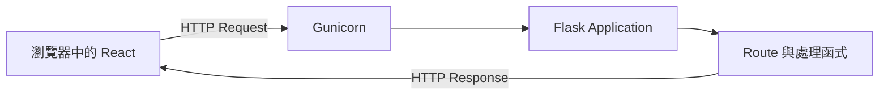
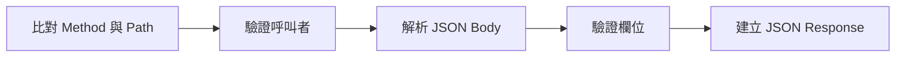

---
authors:
  - name: Charles Cao
tags:
  - HTTP
  - Flask
  - API
  - REST
---

# HTTP Request、GET、POST 與 REST API

使用者在網頁按下「送出」後，瀏覽器不是直接呼叫 Python 函式，也不是直接操作 MongoDB。它先組成一個 HTTP Request，送到指定的 API；Flask 再依照 Method 與 Path，把 Request 交給正確的處理函式。

這篇先看懂這一層公開介面。Gunicorn 的 workers、threads，以及 Flask／FastAPI、Gunicorn／Uvicorn 的比較，會在另一篇專題完整說明。

## 學習目標

- [ ] 從一個 HTTP Request 中辨認 Method、Path、Header 與 Body。
- [ ] 說明 GET、POST、PUT、DELETE 與 OPTIONS 的主要用途。
- [ ] 看懂 Flask `route` 如何把 URL 對應到 Python 函式。
- [ ] 分辨 HTTP Status Code 與 JSON `return_code`。
- [ ] 從正式分支程式碼找出 `ai-asst-km` 的主要 API 路徑。

## 這篇筆記涵蓋的範圍



這篇聚焦在 HTTP Request 進入 Flask、再形成 HTTP Response 的過程。Gunicorn 如何接住連線，以及 Flask 函式後面如何操作 MongoDB，會在其他專題拆解。

## 前置知識

可以先閱讀[一次 API 請求如何流動](02_runtime_request_flow.md)，能說出 Frontend、Model API 與 Data API 的責任即可。不需要先會寫 Flask。

## 一個 API Request 到底包含什麼？

以下是一個簡化後的問答請求：

```http title="Frontend 呼叫 Model API"
POST /model_predict HTTP/1.1
Content-Type: application/json
Authorization: Bearer <使用者 JWT>

{
  "message": "使用者的問題",
  "session_id": "session-123",
  "filtered_cond": null
}
```

它可以拆成四個主要部分：

| 部分 | 範例 | 用途 |
|---|---|---|
| Method | `POST` | 表達這次想進行哪一類操作 |
| Path | `/model_predict` | 指定要呼叫的 API 資源或功能 |
| Header | `Authorization`、`Content-Type` | 傳遞身分、內容格式等附加資訊 |
| Body | JSON object | 傳遞問題、session ID 等資料 |

!!! info "基礎觀念"
    URL 不只是一段字串。完整 URL 通常還包含 Scheme、Host、Path 與 Query String。例如 `https://api.example.com/data-api/sessions?limit=20` 中，`https` 是 Scheme、`api.example.com` 是 Host、`/data-api/sessions` 是 Path、`limit=20` 是 Query String。

### Request 與 Response 是一來一回

API 收到 Request 後會回傳 Response：

```http title="簡化後的 HTTP Response"
HTTP/1.1 200 OK
Content-Type: application/json

{
  "return_code": "0",
  "return_message": "查詢成功",
  "data": {}
}
```

Response 也有 Header 與 Body，另外包含 HTTP Status Code。Frontend 會同時依 Status Code 與 JSON 內容判斷結果。

## GET、POST、PUT、DELETE 有什麼差別？

HTTP Method 表達「希望 Server 對目標資源做什麼」。它不是函式名稱，也不直接等於資料庫指令。

| Method | 一般語意 | `ai-asst-km` 範例 | 是否通常改變資料 |
|---|---|---|---|
| `GET` | 取得目前的資源表示 | 取得 session 清單或完整歷史 | 否 |
| `POST` | 交付內容，由目標資源依自身規則處理 | 產生回答、附加一輪對話 | 通常會，但不一定 |
| `PUT` | 建立或完整取代指定資源的狀態 | 更新某一筆回答回饋 | 是 |
| `DELETE` | 移除指定資源 | 刪除一個 session | 是 |
| `OPTIONS` | 詢問 Server 支援的通訊選項 | 瀏覽器的 CORS Preflight | 否 |

!!! warning "Method 是語意，不是安全機制"
    使用 `GET` 不代表任何人都能讀取，使用 `POST` 也不代表一定安全。API 仍需驗證 JWT、檢查資料擁有者、驗證 Body，並限制允許的來源。

### 為什麼讀取歷史也有一支 POST？

Data API 的 `POST /data-api/session-history` 是 Model API 專用的 server-to-server 唯讀端點。它把 `session_id` 放在 JSON Body，並要求 service token。

這個端點雖然使用 `POST`，實際處理仍然只有查詢，不會寫入 MongoDB。判斷副作用不能只看 Method，還要查看 API 契約與實作；不過設計新 API 時，仍應盡量讓 Method 符合一般 HTTP 語意，降低理解成本。

### OPTIONS 為什麼常在程式碼裡出現？

瀏覽器進行跨來源請求前，可能先送出 OPTIONS Preflight，詢問 Server 是否允許目前的 Origin、Method 與 Header。Data API 會對 `/data-api/` 的 OPTIONS Request 回傳空的 `204`，再加入允許的 CORS Headers。

OPTIONS 通過只代表瀏覽器允許送出真正的 Request；後續的 JWT 驗證仍然必須成功。

## Flask route 如何找到正確的 Python 函式？

Flask 使用 Route 將「Path + Method」對應到 View Function。例如 Data API 的概念可以簡化成：

```python title="Flask route 概念範例"
@app.route("/data-api/sessions/<session_id>", methods=["GET", "OPTIONS"])
def get_session(session_id: str):
    ...


@app.route("/data-api/sessions/<session_id>", methods=["POST", "OPTIONS"])
def post_turn(session_id: str):
    ...


@app.route("/data-api/sessions/<session_id>", methods=["DELETE", "OPTIONS"])
def delete_session(session_id: str):
    ...
```

三個 Route 的 Path 相同，但 Method 不同，因此會進入不同函式：

| Request | Flask 函式 | 結果 |
|---|---|---|
| `GET /data-api/sessions/abc` | `get_session()` | 查詢完整 session |
| `POST /data-api/sessions/abc` | `post_turn()` | 附加一輪對話 |
| `DELETE /data-api/sessions/abc` | `delete_session()` | 刪除 session |

`<session_id>` 是動態 Path Parameter。當 Request Path 是 `/data-api/sessions/abc`，Flask 會把 `abc` 傳入 `session_id` 參數。

### Model API 為什麼看起來不太一樣？

Model API 使用 Flask-RESTX 的 `Resource` 寫法：

```python title="Flask-RESTX Resource 概念範例"
@api.route("/model_predict")
class ModelPredict(Resource):
    def post(self):
        ...
```

這裡的 `post()` 仍然代表 HTTP POST。Flask 原生 decorator 與 Flask-RESTX Resource 寫法不同，但核心都是將 Method 與 Path 對應到 Python 處理邏輯。

!!! example "ai-asst-km 實際做法"
    Model API 使用 Flask + Flask-RESTX 管理問答 Route 與輸出模型；Data API 使用 Flask `@app.route` 明確列出 GET、POST、PUT、DELETE 與 OPTIONS。兩者目前都不是 FastAPI。

## Flask 如何讀取 JSON Request？

常見流程可拆成五步：



Data API 會先確認 Body 是 JSON object，再讀取欄位：

```python title="簡化的 JSON 處理概念"
if not request.is_json:
    return jsonify({"return_code": "400"}), 400

body = request.get_json(silent=True)
if not isinstance(body, dict):
    return jsonify({"return_code": "400"}), 400
```

需要注意：

- `Content-Type: application/json` 用來聲明 Body 格式。
- `request.get_json()` 將 JSON 解析成 Python object。
- 解析成功不等於資料有效，仍要檢查必填欄位、型別與長度。
- `jsonify()` 將 Python 資料序列化成 JSON Response。
- MongoDB 的 datetime、ObjectId 等型別要先轉成 JSON 可以表達的格式。

### Header 與 Body 各放什麼？

| 位置 | 適合內容 | 本系統例子 |
|---|---|---|
| Header | 身分、內容格式、瀏覽器來源 | `Authorization`、`Content-Type`、`Origin` |
| Path Parameter | 指定單一資源 | `session_id`、`response_uuid` |
| Query String | 篩選、排序、分頁 | 一般 API 常用；現行主要 session routes 較少使用 |
| JSON Body | 結構化輸入 | 問題、回饋、回答信封、顯示 metadata |

不要把 Token 放在 Query String。URL 可能出現在瀏覽器紀錄、Proxy 或 Server Logs；本系統把 Bearer Token 放在 `Authorization` Header。

## HTTP Status Code 與 return_code 是兩層結果

HTTP Status Code 描述這次 HTTP 交換的結果；Response Body 裡的 `return_code` 則是應用程式自己的業務欄位。

| HTTP Status | 意義 | 本系統常見情境 |
|---:|---|---|
| `200 OK` | Request 已成功處理 | 查詢成功、寫入成功、回答完成 |
| `204 No Content` | 成功，但沒有 Response Body | Data API 的 OPTIONS Preflight |
| `400 Bad Request` | 輸入格式或欄位有問題 | JSON 錯誤、缺少必填欄位 |
| `401 Unauthorized` | 尚未通過有效身分驗證 | JWT 無效或過期 |
| `403 Forbidden` | 已辨識呼叫者，但沒有權限 | 使用者讀取他人 session、service token 嘗試寫入 |
| `404 Not Found` | 找不到目標資源 | session 尚不存在 |
| `500 Internal Server Error` | Server 處理時發生未預期錯誤 | MongoDB 連線或後端執行失敗 |

例如 Data API 常同時回傳：

```text
HTTP status: 404
JSON return_code: "404"
JSON return_message: "查無此對話"
```

但 Model API 的回答信封可能在 HTTP `200` 中使用自己的 `return_code` 表達處理結果。因此排錯時應同時記錄 HTTP Status 與 Response Body，不能只看其中一個。

## `ai-asst-km` 的主要 API 地圖

| 呼叫者 | Method 與 Path | 主要用途 | 是否可能寫入資料 |
|---|---|---|---|
| Frontend | `POST /model_predict` | 送出問題並取得回答 | Model API 不寫 session |
| Frontend | `GET /data-api/sessions` | 取得目前使用者的 session 清單 | 否 |
| Frontend | `GET /data-api/sessions/{session_id}` | 取得完整對話歷史 | 否 |
| Frontend | `GET /data-api/sessions/{session_id}/meta` | 輕量檢查歷史是否更新 | 否 |
| Frontend | `POST /data-api/sessions/{session_id}` | 附加一輪問題與回答 | 是 |
| Frontend | `PUT /data-api/sessions/{session_id}/feedback/{response_uuid}` | 更新回答回饋 | 是 |
| Frontend | `DELETE /data-api/sessions/{session_id}` | 刪除一段對話 | 是 |
| Model API | `POST /data-api/session-history` | 使用 service token 唯讀歷史 | 否 |

### HTTP 與 MongoDB 的邊界

MongoDB 不接收上述 GET 或 POST。Data API 在 Flask 函式內使用 PyMongo 執行另一套資料庫操作：

```text
GET session    → find_one()
GET sessions   → find().sort().limit()
POST turn      → update_one(..., $push, upsert=True)
PUT feedback   → update_one(...)
DELETE session → delete_one()
```

HTTP Method 是 Client 與 Data API 之間的協定；`find_one()`、`update_one()`、`delete_one()` 才是 Data API 與 MongoDB 之間的操作。MongoDB 的資料模型、Index 與 Connection Pool 會在後續專章說明。

## 實際設定查證

以下結論以三個 Repository 的最新 `origin/main` 為準：

| 查證項目 | 現行結論 | 來源 | 查證日期 |
|---|---|---|---|
| 問答 API | Flask-RESTX `Resource.post()` 處理 `/model_predict` | `ai-asst-model-api/prod/app.py` | 2026-08-23 |
| Data API routes | Flask `@app.route` 明確宣告允許的 Methods | `ai-asst-data-api/app.py` | 2026-08-23 |
| Frontend HTTP Client | Axios 分別呼叫 Model API 與 Data API | `ai-asst-frontend/src/services/api.ts`、`dataApi.ts` | 2026-08-23 |
| JSON 驗證 | Data API 檢查 JSON object、必填欄位與未知欄位 | `ai-asst-data-api/app.py` | 2026-08-23 |
| 身分傳遞 | Frontend 使用 `Authorization: Bearer` Header | Frontend API Client | 2026-08-23 |
| CORS Preflight | 兩支 API 都處理 OPTIONS 並加入允許的 CORS Headers | Model/Data API `app.py` | 2026-08-23 |
| MongoDB 邊界 | 只有 Data API 透過 PyMongo 查詢與寫入 session | `ai-asst-data-api/app.py` | 2026-08-23 |

## Lab 實作練習

**安全等級**：本機實作

### 目標

不用啟動 API 或連線正式環境，從正式分支程式碼找出 Method、Path、Flask 函式與資料庫操作的對應。

### 環境需求

- 本機已有 `ai-asst-model-api`、`ai-asst-data-api` 與 `ai-asst-frontend`。
- 可使用 Git 與 `rg`。
- 在 `ai-asst-km` 根目錄執行。

### 步驟

1. 找出 Data API 宣告的所有 HTTP Methods：

    ```bash
    git -C ai-asst-data-api show origin/main:app.py \
      | rg -n '@app.route|methods='
    ```

2. 確認同一個 session Path 有 GET、POST 與 DELETE：

    ```bash
    git -C ai-asst-data-api show origin/main:app.py \
      | rg -n -A 2 '/data-api/sessions/<session_id>'
    ```

3. 找出 Flask 解析 JSON 與產生 Response 的位置：

    ```bash
    git -C ai-asst-data-api show origin/main:app.py \
      | rg -n 'request\.get_json|request\.is_json|jsonify'
    ```

4. 對照 Frontend 實際送出的 GET、POST、PUT 與 DELETE：

    ```bash
    git -C ai-asst-frontend show origin/main:src/services/dataApi.ts \
      | rg -n 'dataApiClient\.(get|post|put|delete)'
    ```

### 驗證結果

- [ ] 能說明 `POST /model_predict` 的 Method、Path、Header 與 Body。
- [ ] 能找到同一個 session Path 對應的三個 Flask 函式。
- [ ] 能分辨 `request.get_json()` 與 `jsonify()` 的方向。
- [ ] 能說明 HTTP POST 不等於 MongoDB 寫入。
- [ ] 全程沒有呼叫正式 API，也沒有修改雲端資料。

## 常見問題

??? question "GET 可以帶 JSON Body 嗎？"
    HTTP 訊息格式可以容納內容，但 GET Request Body 沒有一般定義的語意，部分 Server、Proxy 或 Client 可能拒絕或忽略。需要結構化輸入時，應優先使用 Path、Query String，或依 API 語意改用 POST。

??? question "POST 成功為什麼不是一律回 201？"
    `201 Created` 適合明確建立新資源；POST 也可能執行運算、附加資料或回傳處理結果，因此可以回 `200 OK`。本系統的 append turn 可能建立新 session，也可能更新既有 session，目前統一回 200 並在訊息中表達結果。

??? question "Flask 是 API Server 嗎？"
    Flask 是 Web Framework，也是 WSGI Application；正式環境還需要能接收連線並呼叫 Flask 的 WSGI Server。本系統使用 Gunicorn，可接著閱讀 Server 專題拆解它與 Flask 的責任。

??? question "Flask API 和 FastAPI 是同一個東西嗎？"
    不是。Flask 與 FastAPI 是不同 Web Framework；目前正式系統使用 Flask。[Server 專題](04_flask_wsgi_gunicorn_uvicorn.md)會比較 Flask／FastAPI，以及常搭配的 Gunicorn／Uvicorn，但不會把比較方案誤寫成現行架構。

## 小結

- HTTP Request 由 Method、Path、Headers 與可選的 Body 組成。
- Flask 依 Method + Path 將 Request 交給正確的 Python 函式。
- GET、POST、PUT、DELETE 描述操作語意，不是資料庫指令或權限機制。
- HTTP Status Code 與 JSON `return_code` 是兩層不同的結果。
- MongoDB 不直接接收瀏覽器的 HTTP Request；Data API 會把 Request 轉成 PyMongo 操作。

接著閱讀：[Flask、FastAPI、Gunicorn 與 Uvicorn](04_flask_wsgi_gunicorn_uvicorn.md)。

## 延伸閱讀

- [Flask：Quickstart 與 HTTP Methods](https://flask.palletsprojects.com/en/stable/quickstart/)
- [Flask：Application Structure and Lifecycle](https://flask.palletsprojects.com/en/stable/lifecycle/)
- [MDN：HTTP Request Methods](https://developer.mozilla.org/en-US/docs/Web/HTTP/Reference/Methods)
- [MDN：HTTP Status Codes](https://developer.mozilla.org/en-US/docs/Web/HTTP/Reference/Status)
- [RFC 9110：HTTP Semantics](https://www.rfc-editor.org/rfc/rfc9110.html)
