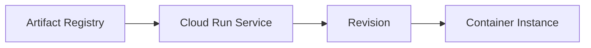
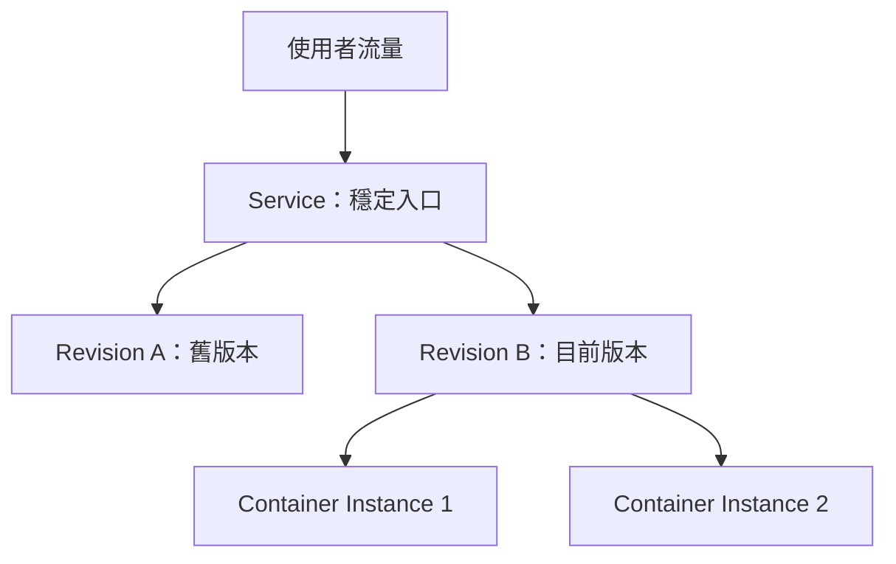

---
authors:
  - name: Charles Cao
tags:
  - Cloud Run
  - Revision
  - Container
---

# 第 7 章：Cloud Run 的 Service、Revision、Instance

GitHub Actions 把 Image 推送到 Artifact Registry 後，會執行 `gcloud run deploy`。從這一步開始，程式版本會由 Cloud Run 負責執行與擴縮。

## 學習目標

- [ ] 分辨 Service、Revision 與 Instance。
- [ ] 理解部署、流量、擴縮與 Cold Start 的關係。
- [ ] 使用唯讀指令查看兩支 API 的部署狀態。

## 本章在整體架構的位置



本章從 Image 已經進入 Artifact Registry 的位置開始，說明 Cloud Run 如何把它變成可接收 HTTPS 請求的服務。

## 前置知識

建議先閱讀[第 6 章](03_cicd_deployment_flow.md)，知道 GitHub Actions 會 build、push Image 並執行 `gcloud run deploy`。

## 7.1 核心問題：部署後到底產生了什麼？

部署目標不是某一台固定主機，而是一個 Cloud Run Service；Service 透過 Revision 保存版本，並由動態建立的 Instance 執行 Container。

## 7.2 基礎觀念

!!! info "基礎觀念"
    Service 是穩定入口，Revision 是不可變版本，Instance 是實際運算單位。Cloud Run 可以將 Service 流量導向不同 Revision，並依請求量調整 Instance 數量。

## 7.3 ai-asst-km 實際做法

!!! example "ai-asst-km 實際做法"
    Model API 與 Data API 各自是一個 Cloud Run Service。每次 deploy workflow 提交新的 Image 與設定時，Cloud Run 建立對應 Revision；兩個 Service 都允許無流量時縮到零。

### Cloud Run 執行模型



| 名詞 | 說明 | 需要記住的重點 |
|---|---|---|
| Service | 對外提供穩定 HTTPS Endpoint 的服務 | 使用者通常呼叫 Service URL |
| Revision | 某一次 Image 與設定組合形成的不可變版本 | 部署 Image或修改設定，都可能建立新 Revision |
| Instance | 真正執行 Container 的運算實例 | Cloud Run 依流量增加或移除 Instance |

## 一次部署會發生什麼？

1. `gcloud run deploy` 指定新的 Image 與部署設定。
2. Cloud Run 建立新的 Revision。
3. 新 Revision 啟動 Container，並確認能接收請求。
4. Service 將流量導向新 Revision。
5. Cloud Run 按照請求量調整 Instance 數量。

Revision 不會被原地修改。這讓每個版本都有明確的 Image 與設定，也讓流量切換及回滾有可追蹤的目標。

## `ai-asst-km` 目前宣告的資源設定

以下數值來自兩個 Repository 現行的 Cloud Run deploy workflow：

| 設定 | Model API | Data API | 代表意義 |
|---|---:|---:|---|
| CPU | 1 | 1 | 每個 Instance 可使用的 CPU |
| Memory | 2 GiB | 512 MiB | 每個 Instance 的記憶體上限 |
| Min instances | 0 | 0 | 無流量時允許縮到零 |
| Max instances | 2 | 3 | 自動擴張的 Instance 上限 |
| Concurrency | 100 | workflow 未設定；正式服務目前為 80 | 每個 Instance 最多接收的同時 Request 數 |
| Request timeout | 300 秒 | 60 秒 | Cloud Run 等待單次請求完成的時間 |
| Startup CPU boost | 有 | workflow 未設定 | 啟動期間是否暫時提供額外 CPU |

Model API 的資源與 Timeout 較高，因為啟動和請求處理較重；Data API 主要處理資料存取，因此設定較小。

!!! note "Cloud Run Timeout 與 Gunicorn Timeout 是兩層限制"
    Cloud Run 控制平台願意等待請求多久；Gunicorn 控制 worker 最長可處理多久。任一層先到期，都可能讓請求失敗。Gunicorn 的設定會在後續專章拆解。

## Scale to zero 與 Cold Start

兩支 API 都把 Min instances 設為 `0`。沒有流量時，Instance 可以縮到零以減少閒置成本；下一次請求進來時，Cloud Run 必須重新建立 Instance，這段等待稱為 Cold Start（冷啟動）。

Model API 啟動時需要載入的應用資源較多，因此冷啟動感受通常比 Data API 明顯。提高 Min instances 可以減少這類等待，但也會產生持續運行成本。

## 實際設定查證

| 查證項目 | 現行結論 | 來源 | 查證日期 |
|---|---|---|---|
| Model API Service | 1 CPU、2 GiB、concurrency 100、min 0、max 2、300 秒 | `ai-asst-model-api/.github/workflows/deploy.yml` | 2026-08-23 |
| Model API startup boost | workflow 有設定 `--cpu-boost` | `ai-asst-model-api/.github/workflows/deploy.yml` | 2026-08-23 |
| Data API Service | 1 CPU、512 MiB、min 0、max 3、60 秒；正式服務 concurrency 80 | deploy workflow；Cloud Run Service 唯讀查詢 | 2026-08-23 |
| Model Gunicorn | 4 gthread workers、每個 25 threads、600 秒 timeout | `ai-asst-model-api/prod/Dockerfile` | 2026-08-23 |
| Data Gunicorn | 1 sync worker、60 秒 timeout | `ai-asst-data-api/Dockerfile` | 2026-08-23 |

## Lab 實作練習

**安全等級**：雲端唯讀

### 目標

確認 Cloud Run Service、目前 Revision、Image 與資源摘要，不修改正式環境。

### 環境需求

Google Cloud CLI 已登入，且目前 Project 指向本系統使用的 GCP Project。

### 1. 確認目前身分與 Project

```bash title="確認 GCP 登入狀態"
gcloud auth list --filter=status:ACTIVE --format="value(account)"
gcloud config get-value project
```

### 2. 列出 Services 與目前 Revision

```bash title="列出 Cloud Run Services"
AI_DEPLOY_PROJECT_ID="$(gcloud config get-value project)"

gcloud run services list \
  --project "$AI_DEPLOY_PROJECT_ID" \
  --region asia-east1 \
  --platform managed \
  --format="table(metadata.name,status.latestReadyRevisionName)"
```

應能找到 `ai-asst-model-api` 與 `ai-asst-data-api`。

### 3. 查看不含機密值的服務摘要

```bash title="查看 Model API 部署摘要"
gcloud run services describe ai-asst-model-api \
  --project "$AI_DEPLOY_PROJECT_ID" \
  --region asia-east1 \
  --platform managed \
  --format="yaml(metadata.name,status.latestReadyRevisionName,spec.template.spec.timeoutSeconds,spec.template.spec.containers[0].image,spec.template.spec.containers[0].resources)"
```

這些都是唯讀指令，不會建立 Revision 或修改流量。

### 驗證結果

- [ ] Service 清單包含 Model API 與 Data API。
- [ ] 每個 Service 都有 `latestReadyRevisionName`。
- [ ] Image tag 可以對應 Git commit SHA 前七碼。

## 常見問題

??? question "Service 和 Revision 最簡單的差別是什麼？"
    Service 是長期存在的入口；Revision 是某一次 Image 與設定形成的版本。

??? question "把 Min instances 設為 1 一定比較好嗎？"
    不一定。它能降低部分 Cold Start，但會增加閒置運行成本，應依延遲需求與預算決定。

## 小結

- Service 是穩定入口，Revision 是版本，Instance 是實際執行的 Container。
- 每次部署新的 Image 或設定都可能建立 Revision。
- Scale to zero 節省閒置成本，但可能帶來 Cold Start。
- Model API 與 Data API 可以依工作特性使用不同資源設定。

下一頁：[設定、環境變數與 Secret](05_configuration_and_secrets.md)。

## 延伸閱讀

- [Google Cloud：What is Cloud Run](https://docs.cloud.google.com/run/docs/overview/what-is-cloud-run)
- [Google Cloud：Manage Cloud Run revisions](https://docs.cloud.google.com/run/docs/managing/revisions)
