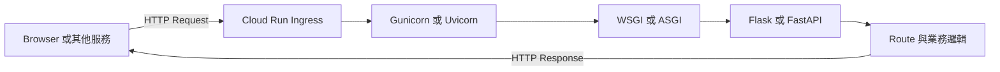

---
authors:
  - name: Charles Cao
tags:
  - API
  - Flask
  - FastAPI
---

# API 與後端服務學習路徑

一支 API 能上線，不只要會寫 Python 函式。還要理解 HTTP 契約、Web Framework、Application Server、worker 模型，以及雲端平台如何把 Request 送進 Container。

## 學習目標

- [ ] 分辨 HTTP、REST、Web Framework 與 Application Server。
- [ ] 知道 Flask／FastAPI 和 Gunicorn／Uvicorn不是同一層工具。
- [ ] 建立從 Request 到 Python Route 的完整心智模型。
- [ ] 知道 workers、threads、async 與 Cloud Run concurrency 的關係。

## API 技術堆疊



| 層次 | 需要回答的問題 | 常見技術 |
|---|---|---|
| HTTP | Client 傳了什麼？Server 回了什麼？ | Method、Path、Header、JSON、Status Code |
| API Design | 資源與操作怎麼表達？ | REST、GET、POST、PUT、DELETE |
| Framework | Route、驗證與 Response 怎麼寫？ | Flask、FastAPI |
| Interface | Server 如何呼叫 Python Application？ | WSGI、ASGI |
| Server | 誰監聽 Port 並管理執行程序？ | Gunicorn、Uvicorn |
| Concurrency | 同一 Instance 能同時安排多少工作？ | workers、threads、async、event loop |

## 建議閱讀順序

1. [HTTP Request、GET、POST 與 REST API](03_http_flask_api.md)：先讀懂對外契約。
2. [Flask、FastAPI、Gunicorn 與 Uvicorn](04_flask_wsgi_gunicorn_uvicorn.md)：理解程式如何成為正式服務。
3. [一次 API 請求如何流動](02_runtime_request_flow.md)：把 Frontend、Model API 與 Data API 串起來。
4. [Cloud Run 學習路徑](cloud_run_overview.md)：理解 Container 上線後的執行環境。

## 實際專案案例

!!! example "實際案例"
    現行 Model API 與 Data API 都使用 Flask + Gunicorn。Model API 使用 `gthread` workers 處理較多外部 I/O 等待；Data API 使用單一 `sync` worker。FastAPI + Uvicorn 則出現在本站的 AI 助理後端，作為 ASGI 實例。

## Lab 實作練習

**安全等級**：本機實作

從 Dockerfile 找出 Application Server 與 Application object：

```bash
git -C ai-asst-model-api show origin/main:prod/Dockerfile | rg '^CMD'
git -C ai-asst-data-api show origin/main:Dockerfile | rg '^CMD'
```

### 驗證結果

- [ ] 能指出哪個名稱是 Framework、哪個是 Server。
- [ ] 能把 `module:app` 拆成 Python module 與 Application object。
- [ ] 沒有把 FastAPI 誤寫成現行 Model API 的 Framework。

## 延伸閱讀

- [Flask 官方文件](https://flask.palletsprojects.com/en/stable/)
- [FastAPI 官方文件](https://fastapi.tiangolo.com/)
- [Gunicorn 官方文件](https://docs.gunicorn.org/en/stable/)
- [Uvicorn 官方文件](https://www.uvicorn.org/)
