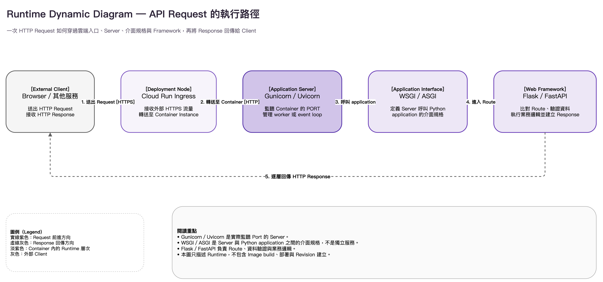

---
authors:
  - name: Charles Cao
tags:
  - API
  - Flask
  - FastAPI
---

# API 與後端技術地圖

Python API 上線後，Client 會透過 HTTPS 將 Request 傳到 Cloud Run。Cloud Run Ingress 把流量送進 Container Instance，再由 Gunicorn 或 Uvicorn 接收 Request。Application Server 依照 WSGI 或 ASGI 規格呼叫 Flask／FastAPI Application，最後執行對應的 Route 與業務邏輯。

這篇是「API 與後端服務」分類的技術地圖：先建立 Framework、Application Interface、Application Server 這幾層的整體概念，再指出通用原理與 `ai-asst-km` 實際案例分別該讀哪一篇。程式碼建置與部署流程請參考 [CI/CD 與雲端交付學習路徑](cicd_overview.md)。

## 學習目標

- 分辨 Framework、Application Interface 與 Application Server。
- 理解 WSGI／ASGI 是介面規格，不是會監聽 Port 的服務。
- 認識常見的 WSGI／ASGI Framework 與 Server 組合。
- 知道通用原理與 `ai-asst-km` 實際架構分別記錄在哪一篇文章。

## API Request 的執行路徑

<figure markdown="span">
  
  <figcaption>一次 API Request 的 Runtime 執行路徑；實線表示 Request，虛線表示 Response。</figcaption>
</figure>

當 Client 發出 HTTPS Request，Cloud Run Ingress 會將請求導向對應的 Container Instance。Container 內的 Gunicorn 或 Uvicorn 接收請求，再依照 WSGI 或 ASGI 規格呼叫 Flask／FastAPI Application。Route 完成資料處理與業務邏輯後，Response 會依相反方向回傳給 Client。

### 各層技術的責任

| 層次 | 負責什麼？ | 常見技術 |
|---|---|---|
| HTTP | 定義 Request 與 Response 的傳輸格式 | Method、Path、Header、JSON、Status Code |
| API 設計 | 表達資源、操作與回應語意 | REST、GET、POST、PUT、DELETE |
| Application Server | 監聽 Port、接收連線並管理執行程序 | Gunicorn、Uvicorn、Waitress、Daphne、Hypercorn |
| Application Interface | 規定 Server 如何呼叫 Python Application | WSGI、ASGI |
| Web Framework | 定義 Route、驗證資料並建立 Response | Flask、FastAPI、Django、Starlette |
| Concurrency | 決定單一 Instance 如何安排同時進行的工作 | workers、threads、async、event loop |

## Python Web API 的執行方式

Flask 或 FastAPI 撰寫的 Python 程式不會直接接收外部的 HTTP Request。服務啟動後，會先由 Gunicorn 或 Uvicorn 監聽 Port 並接收請求，再透過 WSGI 或 ASGI 規格呼叫 Python Application，最後才執行 Framework 中定義的 Route 與業務邏輯。

這個執行過程包含三種不同角色：

| 角色 | 功能 | 常見技術 |
|---|---|---|
| Application Server | 啟動服務、監聽 Port、接收 HTTP Request，並管理程式的執行 | Gunicorn、Uvicorn |
| Application Interface | 規定 Server 如何將 Request 傳給 Python Application，以及如何取得 Response | WSGI、ASGI |
| Web Framework | 提供 Route、資料驗證、Request／Response 處理與業務邏輯開發功能 | Flask、FastAPI |

在 Flask 架構中，Request 的處理路徑通常是：

```text
HTTP Request → Gunicorn → WSGI → Flask Application → Route
```

在 FastAPI 架構中，處理路徑通常是：

```text
HTTP Request → Uvicorn → ASGI → FastAPI Application → Route
```

這裡的 Application，指的是程式碼中使用 Flask 或 FastAPI 建立的 `app` 物件：

```python title="Flask"
app = Flask(__name__)
```

```python title="FastAPI"
app = FastAPI()
```

因此，Gunicorn／Uvicorn、WSGI／ASGI 與 Flask／FastAPI 並不是功能相似的替代工具，而是位於不同執行層次，共同完成一次 API Request 的處理。

### WSGI 與 ASGI 有什麼不同？

| 比較 | WSGI | ASGI |
|---|---|---|
| 全名 | Web Server Gateway Interface | Asynchronous Server Gateway Interface |
| 核心模型 | 一次呼叫對應一次同步 Request／Response | 以非同步事件處理連線與訊息 |
| 常見協定情境 | 傳統 HTTP API 與網站 | HTTP、WebSocket、Lifespan 等事件 |
| 常見 Framework／Application | Flask、Django 的 WSGI 模式、Pyramid | FastAPI、Starlette、Django 的 ASGI 模式、Django Channels、Quart |
| 常見 Server 實作 | Gunicorn、Waitress、uWSGI | Uvicorn、Daphne、Hypercorn |
| 適合先想到的情境 | 一般同步 Web Application；透過 processes／threads 增加併發 | WebSocket、長連線，或有大量可 `await` I/O 的 Application |

[WSGI 的 PEP 3333](https://peps.python.org/pep-3333/) 定義 Server／Gateway 與 Application／Framework 兩側的共同呼叫方式；[ASGI 規格](https://asgi.readthedocs.io/en/stable/specs/)則把模型擴展成 `scope`、`receive`、`send` 事件，能表達 HTTP 與 WebSocket 等不同連線生命週期。這裡只做快速對照，`gthread`／`async` 如何實際利用 I/O 等待時間，請看 [Flask、FastAPI、Gunicorn 與 Uvicorn](flask_fastapi_gunicorn_uvicorn.md)。

### 常見 Server 個別是什麼？

| Server | 主要介面 | 它的特色 | 常見搭配 |
|---|---|---|---|
| [Gunicorn](https://docs.gunicorn.org/en/stable/) | 原生以 WSGI 為主 | 採 pre-fork 模型，由 master 管理多個 workers；可選 `sync`、`gthread` 等 worker class | Flask／Django WSGI；搭配額外 ASGI worker 時也能管理 ASGI Application |
| [Waitress](https://docs.pylonsproject.org/projects/waitress/en/latest/) | WSGI | 純 Python WSGI Server，支援 UNIX 與 Windows，設定相對單純 | Flask／Pyramid 等 WSGI Application |
| [uWSGI](https://uwsgi.readthedocs.io/en/latest/WSGIquickstart.html) | WSGI／uWSGI protocol | 功能與設定面廣，常與 Nginx 搭配 | Django／Flask 等 WSGI Application |
| [Uvicorn](https://www.uvicorn.org/) | ASGI | 以 event loop 驅動 ASGI Application，支援 HTTP 與 WebSocket | FastAPI／Starlette／Django ASGI |
| [Daphne](https://channels.readthedocs.io/en/stable/deploying.html) | ASGI | Django Channels 維護的 ASGI HTTP／WebSocket Server | Django Channels |
| [Hypercorn](https://hypercorn.readthedocs.io/) | ASGI，也支援 WSGI | 支援 asyncio／Trio，並涵蓋 HTTP／1、HTTP／2、WebSocket 等協定 | Quart／FastAPI／其他 ASGI Application |

Gunicorn 和 Uvicorn 都能接收 HTTP Request，但它們的核心執行模型不同：

| 比較 | Gunicorn | Uvicorn |
|---|---|---|
| 主要角色 | Application Server + process manager | ASGI Server；也能啟動多個 worker processes |
| Application 介面 | 原生執行 WSGI | 執行 ASGI |
| 併發方式 | 多 workers；依 worker class 使用同步、threads 或其他模型 | event loop 處理 async 工作；也可增加 workers |
| 適合先評估的情境 | 現有 WSGI／Flask 程式，或需要 processes／threads 併發模型 | 需要 async／await、WebSocket，或原生 ASGI Framework |

`ai-asst-km` 實際選了哪一組、workers／threads 怎麼設定，見 [Gunicorn 與 Uvicorn 架構案例](server_architecture_case.md)。

### 常見產品與平台案例

知名產品通常只公開部分技術架構，而且同一個產品可能包含多種 Backend 服務。下表只整理官方文件明確說明的部分；沒有公開 Application Server 名稱時，不從 Framework 反向推測。

| 產品／平台 | 官方公開的 Python Web 技術 | 可以如何理解？ |
|---|---|---|
| [Instagram](https://engineering.fb.com/2023/08/15/developer-tools/immortal-objects-for-python-instagram-meta/)／[Threads](https://engineering.fb.com/2023/09/07/culture/threads-inside-story-metas-newest-social-app/) | Python + Django；Instagram 採用 pre-fork、多程序 Web Server 架構 | 可以確定使用 Django，也知道 Server 採多程序架構；但 Meta 沒有在這些文章中說明是 Gunicorn 或 uWSGI |
| [Apache Airflow](https://airflow.apache.org/docs/apache-airflow/stable/administration-and-deployment/web-stack.html) | API Server 預設使用 Uvicorn，也可以切換成 Gunicorn | 同一個 ASGI Application 可以依部署需求選擇直接使用 Uvicorn，或使用 Gunicorn 管理 workers |
| [MLflow Tracking Server](https://mlflow.org/docs/latest/api_reference/cli.html) | `mlflow server` 目前預設使用 Uvicorn，也保留 Gunicorn／Waitress 選項 | 產品可以同時支援多種啟動方式，實際採用的 Server 仍取決於版本、作業系統與部署參數 |

這些案例也說明：知道產品使用 Django、Flask 或 FastAPI，並不能直接判斷它一定使用哪一個 Application Server。Framework 與 Server 必須分開確認。

!!! note "Nginx 與 Cloud Run Ingress 位於更前面"
    Nginx、Load Balancer 或 Cloud Run Ingress 處理對外流量、TLS、路由或反向代理；Gunicorn／Uvicorn 則在 Container 或主機內執行 Python Application。它們可能出現在同一條 Request 路徑上，不是互相替代的同層工具。

## 常見搭配方式

| 組合 | 適用說明 |
|---|---|
| Flask + WSGI + Gunicorn | 常見的 Linux 正式部署組合；Gunicorn 可用 workers／threads 執行同步 Flask Application |
| Flask + WSGI + Waitress | 也是 WSGI 組合；需要 Windows 支援或較單純的純 Python Server 時常見 |
| Django + WSGI + Gunicorn／uWSGI | 傳統 Django HTTP 網站與 API 常見部署方式 |
| FastAPI／Starlette + ASGI + Uvicorn | 常見的 ASGI API 組合，適合 type hints、OpenAPI 與 async I/O |
| Django Channels + ASGI + Daphne | 需要 Django WebSocket 或長連線功能時的常見組合 |
| Quart／FastAPI + ASGI + Hypercorn | 需要 ASGI，並希望使用 Hypercorn 所支援協定或 asyncio／Trio 模型時可評估 |

Framework 會限制可直接使用的介面，但不是單純的「新舊替換」：Django 同時提供 WSGI 與 ASGI 入口；Gunicorn 也能搭配相容的 ASGI worker。選擇時仍要看 Framework、依賴套件、協定需求與執行環境。

## `ai-asst-km` 實際採用哪一種組合？

| 服務 | 完整組合 | 一句話 |
|---|---|---|
| Model API | Gunicorn → WSGI → Flask | 多 `gthread` workers，等待外部模型 API 時仍能處理其他 Request |
| Data API | Gunicorn → WSGI → Flask | 單一 `sync` worker，Request 通常較短 |
| 本站 AI 助理後端 | Uvicorn → ASGI → FastAPI | 單一 Uvicorn process，驅動 event loop |

完整的 Application object 命名規則、逐段啟動指令拆解、`gthread` 設定原因，以及 Cloud Run concurrency 與 Gunicorn 容量的對照，都在 [Gunicorn 與 Uvicorn 架構案例](server_architecture_case.md)。

## 建議閱讀順序

1. [HTTP Request、GET、POST 與 REST API](http_get_post_rest_api.md)：先讀懂 Client 與 Server 之間的對外契約。
2. [REST API 設計案例](api_design_case.md)：看這些概念在實際系統中如何取捨。
3. [Flask、FastAPI、Gunicorn 與 Uvicorn](flask_fastapi_gunicorn_uvicorn.md)：深入理解 WSGI／ASGI、workers、threads 與 event loop。
4. [Gunicorn 與 Uvicorn 架構案例](server_architecture_case.md)：看三個服務實際的啟動指令與容量設定。
5. [Cloud Run 學習路徑](cloud_run_overview.md)：理解 Container 上線後的 Instance 與 concurrency。

## 延伸閱讀

- [PEP 3333：WSGI 規格](https://peps.python.org/pep-3333/)
- [ASGI 官方規格](https://asgi.readthedocs.io/en/stable/specs/)
- [ASGI 官方實作清單](https://asgi.readthedocs.io/en/stable/implementations.html)
- [Flask 官方文件](https://flask.palletsprojects.com/en/stable/)
- [FastAPI 官方文件](https://fastapi.tiangolo.com/)
- [Gunicorn 官方文件](https://docs.gunicorn.org/en/stable/)
- [Uvicorn 官方文件](https://www.uvicorn.org/)
