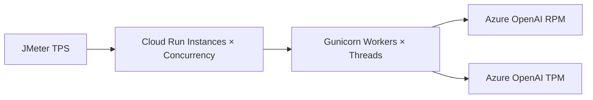

---
authors:
  - name: Charles Cao
tags:
  - Azure OpenAI
  - TPM
  - RPM
  - Rate Limit
---

# Azure OpenAI 的 TPM、RPM 與 HTTP 429

API Server 本身還有空閒 workers，不代表模型呼叫一定能繼續增加。Azure OpenAI Deployment 會受到 Tokens Per Minute（TPM）與 Requests Per Minute（RPM）限制；任一限制先達到，都可能回傳 `429 Too Many Requests`。

## 學習目標

- [ ] 分辨 TPM、RPM、模型 Context Window 與帳單 Token。
- [ ] 說明為什麼短時間突發流量可能提早遇到 429。
- [ ] 把 JMeter TPS、Cloud Run concurrency 與模型配額放在同一條容量鏈路中。
- [ ] 知道 Retry、Backoff、Jitter 與 `max_tokens` 的作用。

## 四個容易混淆的限制

| 名詞 | 限制的對象 | 超過時常見結果 |
|---|---|---|
| TPM | Deployment 每分鐘估算可處理的 Token 量 | HTTP 429 |
| RPM | Deployment 在時間窗口內可接收的 Request 數 | HTTP 429 |
| Context Window | 單次 Request 可容納的輸入與輸出範圍 | Request validation error |
| Billing Tokens | 實際處理完成後用於計費的 Token | 影響成本，不等於即時 rate-limit 估算 |

TPM quota 是依 Subscription、Region、Model 與 Deployment type 分配，再配置到個別 Model Deployment。不同模型的 TPM／RPM 比率可能不同，不能把某一個模型的比例套用到全部模型。

## Azure 如何估算 TPM？

Azure OpenAI 在 Request 到達時會估算最大可能處理量，考慮 Prompt、`max_tokens`，以及特定 API 參數。這個即時估算不等於完成後精確計費的 Token 數，因此即使實際回答很短，過大的 `max_tokens` 仍可能提前占用較多 rate-limit 容量。

!!! info "容量規劃重點"
    `max_tokens` 應設定為符合實際需求的上限，不要為了保險一律設得非常大。它同時影響單次可能輸出長度與 TPM 估算壓力。

## RPM 為什麼不是整分鐘最後才檢查？

Azure 會在較短的評估窗口觀察 Request rate。如果 600 RPM 的流量在一秒內突然送入大量 Requests，即使整分鐘總數尚未超過 600，也可能先收到 429。這就是壓測必須設 Ramp-up、避免第一秒瞬間啟動全部 Threads 的原因之一。

## 整條服務能承受多少 TPS？



整體安全吞吐量通常受最先飽和的一層限制。粗略容量估算可以從平均 Token 形狀開始：

```text
每分鐘 Token 需求 ≈ RPM ×（平均輸入 Tokens + 平均輸出 Tokens）
理論模型 RPS 上限 ≈ min(RPM ÷ 60, TPM ÷ 平均每次估算 Tokens ÷ 60)
```

這只是起始估算。實際還要加入 Prompt 長度分布、`max_tokens`、重試、Embedding 呼叫、模型延遲、短窗口限流與不同 Deployment 的配額。

## 遇到 429 應怎麼處理？

1. 讀取 Provider 回傳的錯誤資訊與可用的 Retry header。
2. 使用 Exponential Backoff，並加入隨機 Jitter，避免所有 workers 同時重試。
3. 設定最大重試次數與整體 deadline，不能無限重試。
4. 降低 `max_tokens`、Request rate 或單次 Prompt 大小。
5. 查看實際 Deployment 的 TPM／RPM 配置與 Metrics。
6. 若需求持續高於容量，再評估調整 quota、分散 Deployment 或改用適合的部署類型。

```text
第 1 次等待：約 1 秒 + jitter
第 2 次等待：約 2 秒 + jitter
第 3 次等待：約 4 秒 + jitter
超過整體 deadline：回傳可觀察、可重試的錯誤
```

!!! warning "Retry 會放大流量"
    如果 100 個 workers 收到 429 後立即一起重試，可能形成 Retry Storm。重試策略本身也要納入 JMeter 測試與容量計算。

## 實際專案案例

!!! example "實際案例"
    Model API 的一次問答可能同時涉及 Embedding 與 LLM Deployment。JMeter 壓測雖然只計算 `/model_predict` 的 TPS，Azure 端實際收到的模型 Requests 與 Tokens 可能更多。因此 API TPS 不能直接當成 Azure RPM，也不能只看 Cloud Run CPU 判斷容量。

目前 Repository 可以確認 Provider 與 Deployment 設定由環境變數及 Secret 注入，但無法從公開程式碼確認正式 Azure Deployment 的實際 TPM／RPM 數值。這些值應在 Azure Portal 或受權限保護的 Management API 中唯讀查詢，不寫進公開文章。

## 實際設定查證

| 查證項目 | 現行結論 | 來源 | 查證日期 |
|---|---|---|---|
| Model Provider | 現行 Cloud Runtime policy 使用 Azure OpenAI | Model API deploy workflow | 2026-08-23 |
| LLM／Embedding | 使用不同 Deployment 設定注入 | Model API workflow／Runtime config | 2026-08-23 |
| 正式 TPM／RPM | 未寫入 Repository，必須由 Azure 唯讀查詢 | 待 Azure Deployment 權限確認 | 2026-08-23 |
| 壓測影響 | JMeter 問答會產生真實模型流量與費用 | Model API load-test Test Plan | 2026-08-23 |

## Lab：做容量紙上估算

**安全等級**：本機實作

假設測試觀察到平均每次模型處理 2,000 個 Tokens，而某測試環境配置 120,000 TPM、120 RPM：

```text
RPM 限制：120 ÷ 60 = 2 requests/second
TPM 限制：120,000 ÷ 2,000 ÷ 60 = 1 request/second
起始估算：模型 Token 容量會先限制在約 1 request/second
```

這是教學示例，不是正式環境配額。實際壓測要使用真實 Token 分布、Deployment quota 與 Metrics 驗證。

### 驗證結果

- [ ] 能分辨 RPM 上限與 TPM 換算上限。
- [ ] 知道最小值只是起始估算，不是 SLA。
- [ ] 沒有查詢或公開正式 API Key、Deployment URL 或 quota 值。

## 常見問題

??? question "TPM 越高，單次回答一定越快嗎？"
    不一定。TPM 是 rate limit／容量配置，不是單次 Request 的延遲保證。模型大小、輸入長度、輸出長度、服務負載與網路都會影響回應時間。

??? question "Cloud Run 增加 Max instances 就能解決 429 嗎？"
    通常不能。更多 Instances 可能更快把流量送到 Azure，反而更容易碰到共享的 TPM／RPM 限制。Autoscaling 與下游 quota 必須一起規劃。

## 延伸閱讀

- [Microsoft Learn：Manage Azure OpenAI quota](https://learn.microsoft.com/en-us/azure/foundry-classic/openai/how-to/quota)
- [Microsoft Learn：Azure OpenAI quotas and limits](https://learn.microsoft.com/en-us/azure/foundry/openai/quotas-limits)
- [Microsoft Learn：Azure OpenAI dynamic quota](https://learn.microsoft.com/en-us/azure/ai-services/openai/how-to/dynamic-quota)
