---
authors:
  - name: Charles Cao
tags:
  - GitHub Actions
  - CI/CD
  - Docker
---

# CI/CD 與雲端交付學習路徑

CI/CD 是把「工程師電腦上的程式碼」穩定變成「雲端正在執行的版本」。這條路徑包含觸發條件、測試、身分驗證、Image 建置、Artifact 儲存與部署。

## 學習目標

- [ ] 說明 CI、Continuous Delivery 與 Continuous Deployment 的差別。
- [ ] 看懂 GitHub Actions 的 event、workflow、job 與 step。
- [ ] 說明 Docker Image、Artifact Registry 與 Cloud Run 的責任。
- [ ] 理解 push 到 `main` 為什麼會建立新的 Cloud Run Revision。

## 一次部署的完整路徑

```mermaid
flowchart LR
    Push["Push / Merge 到 main"] --> Trigger["GitHub Actions trigger"]
    Trigger --> Test["Tests 與 Build Check"]
    Test --> Auth["WIF 取得短效 GCP 身分"]
    Auth --> Build["docker build"]
    Build --> PushImage["docker push"]
    PushImage --> Registry["Artifact Registry"]
    Registry --> Deploy["gcloud run deploy"]
    Deploy --> Revision["Cloud Run Revision"]
```



| 元件 | 主要責任 |
|---|---|
| GitHub event | 決定何時觸發 workflow，例如 push 到 `main` |
| CI job | 測試程式、Lint、Build 或 Container boot check |
| WIF | 讓 GitHub 交換短效 GCP 身分，不保存長期金鑰 |
| Docker | 將程式與依賴封裝成不可變 Image |
| Artifact Registry | 保存與版本化 Image |
| Cloud Run deploy | 用指定 Image 與設定建立新 Revision |

## 建議閱讀順序

1. [GitHub Actions：從程式碼提交到 Cloud Run](github_actions_cloud_run_deployment.md)
2. [Docker Image 與 Artifact Registry](docker_artifact_registry.md)
3. [Cloud Run 學習路徑](cloud_run_overview.md)
4. [環境變數、GitHub Secrets 與 Secret Manager](configuration_and_secrets.md)

## 實際專案案例

!!! example "實際案例"
    Model API 與 Data API 的 deploy workflow 都由 push 到 `main` 觸發。Workflow 透過 WIF 登入 GCP，使用 commit SHA 前七碼標記 Image，推送到 Artifact Registry，再執行 `gcloud run deploy`。

## Lab 實作練習

**安全等級**：雲端唯讀

```bash
gh workflow list -R CaoCharles/ai-asst-model-api
gh run list -R CaoCharles/ai-asst-model-api --workflow deploy.yml --limit 5
```

### 驗證結果

- [ ] 能找到 workflow 的 trigger。
- [ ] 能找到最近一次部署對應的 commit。
- [ ] 沒有執行 `workflow run`、rerun 或任何正式部署。

## 延伸閱讀

- [GitHub Actions：Understanding workflows](https://docs.github.com/actions/about-github-actions/understanding-github-actions)
- [Google GitHub Actions：Authentication](https://github.com/google-github-actions/auth)
