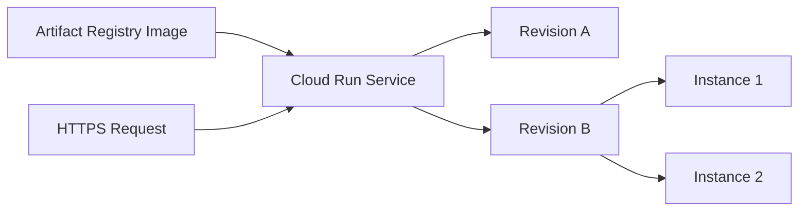

---
authors:
  - name: Charles Cao
tags:
  - Cloud Run
  - Serverless
  - Container
---

# Cloud Run 學習路徑

Cloud Run 是執行 Container 的受管平台。你不需要維護 VM，但仍要理解 Service、Revision、Instance、資源、concurrency、timeout、擴縮與 Secret；這些設定會直接影響延遲、成本與穩定性。

## 學習目標

- [ ] 分辨 Service、Revision、Instance 與 Container Image。
- [ ] 說明 Scale to zero、Cold Start 與 Min instances 的取捨。
- [ ] 知道 Cloud Run concurrency 與 Gunicorn workers 不是同一個設定。
- [ ] 理解每次部署為什麼產生新的不可變 Revision。

## Cloud Run 資源模型

| 名詞 | 最簡單的理解 |
|---|---|
| Service | 穩定的服務入口與流量管理單位 |
| Revision | 某一次 Image + 設定形成的不可變版本 |
| Instance | 真正執行 Container 的運算單位 |
| Concurrency | 每個 Instance 最多接收的同時 Request 數 |
| Min／Max instances | Autoscaler 可以使用的 Instance 數量範圍 |
| Request timeout | Cloud Run 最久等待 Response 的時間 |

## 建議閱讀順序

1. [Service、Revision、Instance 與自動擴縮](cloud_run_core_concepts.md)
2. [環境變數、GitHub Secrets 與 Secret Manager](configuration_and_secrets.md)
3. [Flask、FastAPI、Gunicorn 與 Uvicorn](flask_fastapi_gunicorn_uvicorn.md)
4. [JMeter、TPS、延遲與壓力測試](jmeter_load_testing.md)

## 實際專案案例

!!! example "實際案例"
    Model API 與 Data API 各自是一個 Cloud Run Service。兩者都允許縮到零，但 CPU、Memory、Max instances、timeout 與 concurrency 不同；這些差異來自服務工作負載，而不是因為 Cloud Run 規定所有 API 必須相同。

## 延伸閱讀

- [Google Cloud：What is Cloud Run](https://docs.cloud.google.com/run/docs/overview/what-is-cloud-run)
- [Google Cloud：Cloud Run resource model](https://docs.cloud.google.com/run/docs/resource-model)
