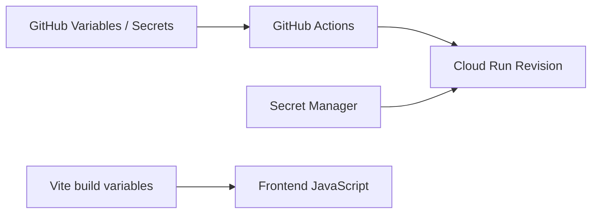
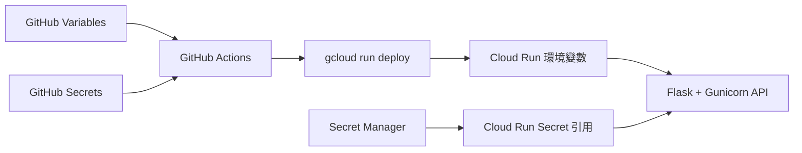

---
authors:
  - name: Charles Cao
tags:
  - Configuration
  - Secret Manager
  - Security
---

# 環境變數、GitHub Secrets 與 Secret Manager

同一份程式碼部署到不同環境時，API URL、Region 或資料庫可能不同。這些差異不應直接寫死在程式碼裡，而是透過設定與 Secret 注入。

## 學習目標

- [ ] 分辨一般設定與機密資料。
- [ ] 知道 GitHub Variables、GitHub Secrets、Cloud Run Environment Variables 與 Secret Manager 的責任。
- [ ] 解釋為什麼前端的 `VITE_*` 不能保存真正的 Secret。
- [ ] 理解什麼是設定漂移（Configuration Drift）。

## 這篇筆記涵蓋的範圍



這篇說明部署流程中的「設定箭頭」：哪些值供 workflow 使用、哪些值進入 Cloud Run，以及哪些前端值最後會被瀏覽器看到。

## 前置知識

建議先理解[GitHub Actions 部署流程](github_actions_cloud_run_deployment.md)與[Cloud Run Revision](cloud_run_core_concepts.md)。

## 核心問題：哪些資料可以公開？

設定不應全部視為 Secret，也不能把所有值都當成普通環境變數。分類的關鍵是：值外洩後是否會產生未授權存取。

## 基礎觀念

!!! info "基礎觀念"
    一般設定描述環境差異，例如 Region 與 API URL；Secret 則可用來驗證身分或存取受保護資源。兩者都可以透過環境變數交給程式，但保存位置與權限必須不同。

## ai-asst-km 實際做法

!!! example "ai-asst-km 實際做法"
    Model API 與 Data API 的一般 Runtime 設定由 deploy workflow 透過 `--set-env-vars` 注入；敏感值則以 `--set-secrets` 引用 Secret Manager。Frontend 的 API Base URL 在 Vite build 時寫入靜態檔。

### 先分成兩類資料

| 類型 | 範例 | 適合的位置 |
|---|---|---|
| 一般設定 | GCP Region、允許的前端網域、API Base URL | GitHub Repository Variables、Cloud Run Environment Variables |
| 機密設定 | API Key、JWT Secret、MongoDB URI | GitHub Secrets、GCP Secret Manager |

一般設定不一定要公開，但它本身不是登入憑證；Secret 一旦外洩，可能讓別人存取 API、偽造身分或連線資料庫。

## 設定如何進入線上服務？



以兩支 API 為例：

- Workflow 從 GitHub Variables 取得 Project、Region、允許網域和 API URL 等部署參數。
- GitHub Secrets 保存 WIF Provider 與部署用 Service Account 等 CI/CD 身分設定。
- `gcloud run deploy --set-env-vars` 寫入一般 Runtime 設定。
- `gcloud run deploy --set-secrets` 建立對 Secret Manager 版本的引用。
- Container 啟動後，應用程式透過環境變數讀取設定；Secret 值不會寫入 Repository 或 Image。

!!! info "Secret 名稱和 Secret 值不同"
    `MONGO_URI` 或 `JWT_SECRET` 這類名稱可以出現在 workflow；真正敏感的是它們對應的值。文章與終端輸出可以顯示名稱，但不要輸出 Secret payload。

## Model API、Data API 與 Frontend 的差別

| 元件 | 一般設定例子 | Secret 例子 | 設定生效時間 |
|---|---|---|---|
| Model API | Allowed Origins、Data API URL、Runtime policy | LLM API Key、JWT Secret | Cloud Run Revision 啟動時 |
| Data API | Database name、Collection name、Allowed Origins | MongoDB URI、JWT Secret | Cloud Run Revision 啟動時 |
| Frontend | Model/Data API Base URL | 不應包含後端 Secret | Vite build 時 |

### 為什麼 `VITE_*` 不是安全的 Secret？

Vite build 會把 `VITE_*` 的值編入瀏覽器下載的 JavaScript。使用者可以透過開發者工具或下載的檔案查看，因此只適合放 API URL 等公開設定，不能放 API Key、密碼或 JWT Secret。

## 什麼是設定漂移？

設定漂移（Configuration Drift）是「程式碼宣告的設定」與「雲端目前實際使用的設定」不一致。

例如：

1. GitHub workflow 寫著 `max-instances=3`。
2. 有人臨時在 GCP Console 把線上服務改成 `max-instances=5`。
3. 此時線上實際值是 `5`，但 Repository 仍寫 `3`，兩邊就產生漂移。
4. 下一次 workflow 再部署時，通常會按照程式碼把設定改回 `3`。

所以 workflow 可以視為「我們希望部署成什麼樣子」，Cloud Run Service 則是「現在實際正在使用什麼」。維運時要對照兩邊，不能只看其中一邊。

## 實際設定查證

| 查證項目 | 現行結論 | 來源 | 查證日期 |
|---|---|---|---|
| Model Runtime 設定 | `--set-env-vars` 與 `--set-secrets` 分開宣告 | `ai-asst-model-api/.github/workflows/deploy.yml` | 2026-08-21 |
| Data Runtime 設定 | MongoDB 一般設定與 Secret 引用分開 | `ai-asst-data-api/.github/workflows/deploy.yml` | 2026-08-21 |
| Frontend API URL | 以 `VITE_*` 於 build 時注入 | `ai-asst-frontend/.github/workflows/deploy.yml` | 2026-08-21 |
| GitHub 到 GCP 身分 | WIF Provider 與 deploy Service Account | Model/Data API `deploy.yml` | 2026-08-21 |

## 安全檢查清單

- [ ] Repository 沒有 `.env`、API Key、Token 或資料庫密碼。
- [ ] Dockerfile 與 Image 沒有寫入 Secret 值。
- [ ] 前端 `VITE_*` 只有可公開的 URL 或顯示設定。
- [ ] GitHub Actions 使用短效 WIF 身分，而非長期 Service Account Key。
- [ ] Cloud Run 一般設定與 Secret 引用分開管理。
- [ ] 查看服務設定時，不輸出 Secret payload。

## Lab 實作練習

**安全等級**：雲端唯讀

### 目標

查看 Cloud Run 環境變數結構，理解一般值與 Secret 引用的差別，不讀取 Secret payload。

### 環境需求

Google Cloud CLI 已登入，且帳號有權讀取目標 Cloud Run Service。

### 步驟

以下格式只列出環境變數的名稱與 Secret 引用，不要求讀取 Secret 的實際內容：

```bash title="查看 Cloud Run 設定結構"
AI_DEPLOY_PROJECT_ID="$(gcloud config get-value project)"

gcloud run services describe ai-asst-data-api \
  --project "$AI_DEPLOY_PROJECT_ID" \
  --region asia-east1 \
  --platform managed \
  --format="yaml(spec.template.spec.containers[0].env)"
```

執行後仍應避免把完整輸出貼到公開 Issue、文章或聊天內容；先確認其中沒有非預期的明文值。

### 驗證結果

- [ ] 能辨識一般 `value` 與 Secret `valueSource` 的結構差別。
- [ ] 沒有執行 Secret payload 讀取指令。
- [ ] 沒有把終端完整輸出貼到公開位置。

## 常見問題

??? question "GitHub Secret 和 Secret Manager 是同一個地方嗎？"
    不是。GitHub Secrets 供 workflow 使用；Secret Manager 保存 GCP Runtime 需要的機密。兩者可以在同一條部署流程中扮演不同角色。

??? question "修改 Secret Manager 的 `latest` 後，正在執行的 Instance 會立刻更新嗎？"
    不應假設所有既有 Instance 都會立即重新載入。較安全的維運方式是確認服務的 Secret 掛載方式，並透過受控部署建立新 Revision 後驗證。

## 小結

- 一般設定與 Secret 必須分開管理。
- GitHub Actions 負責把部署設定交給 Cloud Run；Secret Manager 保存 Runtime 機密。
- `VITE_*` 會進入瀏覽器，不是 Secret 儲存空間。
- 設定漂移就是 Repository 宣告與線上實際狀態不同。

回到學習入口：[雲端架構與 API 部署筆記](index.md)。

## 延伸閱讀

- [Google Cloud：Configure environment variables for services](https://docs.cloud.google.com/run/docs/configuring/services/environment-variables)
- [Google Cloud：Configure secrets for services](https://docs.cloud.google.com/run/docs/configuring/services/secrets)
- [Vite：Env Variables and Modes](https://vite.dev/guide/env-and-mode)
