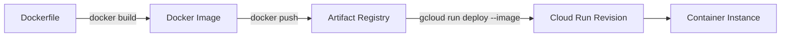

---
authors:
  - name: Charles Cao
tags:
  - Docker
  - Artifact Registry
  - Container
---

# Docker Image 與 Artifact Registry

Cloud Run 不直接執行 GitHub Repository。部署前，程式碼、Python Runtime、套件與啟動命令必須先被封裝成 Docker Image，再推送到 Artifact Registry。

## 學習目標

- [ ] 分辨 Dockerfile、Image 與 Container。
- [ ] 看懂 Python API Dockerfile 的常見指令。
- [ ] 說明 Artifact Registry 為什麼不是執行環境。
- [ ] 知道 Image tag 如何連回 Git commit。

## 從 Dockerfile 到 Cloud Run



| 名詞 | 說明 |
|---|---|
| Dockerfile | 建立 Image 的文字配方 |
| Image | 唯讀、可版本化的應用程式包 |
| Container | Image 啟動後形成的執行程序與隔離環境 |
| Registry | 儲存及提供 Image 的遠端服務 |

## Python API Dockerfile 常見結構

```dockerfile title="簡化範例"
FROM python:3.12-slim
WORKDIR /app

COPY requirements.txt .
RUN pip install --no-cache-dir -r requirements.txt

COPY . .
CMD ["gunicorn", "-b", "0.0.0.0:8080", "app:app"]
```

| 指令 | 作用 | 常見風險 |
|---|---|---|
| `FROM` | 選擇 Base Image 與 Runtime | 使用浮動 tag 可能讓日後 build 結果不同 |
| `WORKDIR` | 設定後續指令的工作目錄 | 路徑與 Application import 必須一致 |
| `COPY requirements.txt` | 先複製依賴描述 | 有助於利用 Build Cache |
| `RUN pip install` | 在 Image 內安裝套件 | 版本未鎖定會降低可重現性 |
| `COPY . .` | 複製 Application 程式 | `.dockerignore` 應排除 Secret、Git 與測試產物 |
| `CMD` | Container 啟動時執行 Server | Cloud Run 必須監聽 `0.0.0.0:$PORT` |

## Artifact Registry 的責任

Artifact Registry 保存 Image layer、tag 與 digest，但不會執行 API。Cloud Run Revision 只記住要使用哪個 Image；Instance 啟動時才實際拉取並執行它。

Tag 方便人類閱讀，例如 Git commit SHA 前七碼；digest 則是內容位址，同一個 digest 對應完全相同的 Image 內容。正式部署應避免只使用會移動的 `latest` 而失去版本追蹤能力。

## 實際專案案例

!!! example "實際案例"
    Model API 與 Data API 都以 Python 3.12 slim Image 為基礎。GitHub Actions 將 commit SHA 前七碼當作 Image tag，推送到 Artifact Registry，再把該 Image 交給 Cloud Run。Model API 從 `prod/` 目錄 build，Data API 則從 Repository 根目錄 build。

## 實際設定查證

| 查證項目 | 現行結論 | 來源 | 查證日期 |
|---|---|---|---|
| Python Runtime | 兩支 API 都使用 Python 3.12 slim | Model/Data API Dockerfile | 2026-08-23 |
| Image tag | Git commit SHA 前七碼 | Model/Data API deploy workflow | 2026-08-23 |
| Registry | GCP Artifact Registry Docker Repository | Model/Data API deploy workflow | 2026-08-23 |
| Runtime | Image 由 Cloud Run Service 部署 | `gcloud run deploy --image` | 2026-08-23 |

## 常見問題

??? question "Docker Image 和 Cloud Run Revision 是同一個東西嗎？"
    不是。Image 是應用程式產物；Revision 是 Image 加上 CPU、Memory、環境變數、Secret、concurrency 等執行設定形成的 Cloud Run 版本。

## 延伸閱讀

- [Docker：Images](https://docs.docker.com/get-started/docker-concepts/the-basics/what-is-an-image/)
- [Google Cloud：Artifact Registry Docker quickstart](https://docs.cloud.google.com/artifact-registry/docs/docker/store-docker-container-images)
