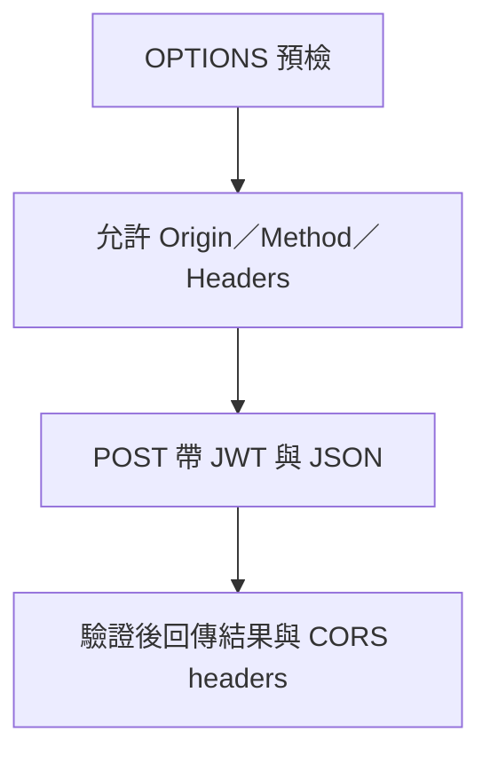

---
authors:
  - name: Charles Cao
tags:
  - Firebase Hosting
  - CORS
  - API
---

# Firebase Hosting、rewrite、CORS 與請求路徑

網頁的網址與 API 的網址可以不同。看懂請求路徑，需要同時讀前端 API Client、Firebase rewrite 與後端 route，不能只看瀏覽器網址列。

## 學習目標

- [ ] 分辨靜態檔、SPA fallback、Cloud Run rewrite 與直接 API 呼叫。
- [ ] 依 Origin 判斷哪一段需要 CORS。
- [ ] 說明 API base URL、rewrite 次序與 timeout 改動的影響。

## 這篇筆記涵蓋的範圍

聚焦 Browser、Firebase Hosting、Model／Data／Monitor／Eval API 的入口關係。一次回答如何保存見 [Runtime 請求流程](runtime_request_flow.md)，後端內部執行見 [Application Server 案例](server_architecture_case.md)。

## 前置知識

先理解 HTTP Method、Path、Header，以及 [JWT 與雲端權限](iam_service_accounts_wif_jwt.md) 是兩層。

## 基礎觀念：Hosting 負責發送網頁，不會自動接管 API

靜態網站包含 HTML、JavaScript、CSS。Hosting 把這些檔案傳給 Browser，React 程式在 Browser 執行，再依 API URL 發送另一個 Request。rewrite 是伺服器內部改由其他內容或服務處理，通常不改變瀏覽器網址；redirect 則告訴 client 改去另一個網址。

單頁應用（Single-page Application，SPA）的 `/chat` 或 `/monitor/...` 常由同一份 HTML 啟動前端路由。這種 fallback 只回傳 HTML，與把 Request 交給 Cloud Run 的 dynamic rewrite 不同。Firebase 先依回應優先順序處理保留路徑、redirect、已存在靜態檔，再匹配 rewrites；同一 rewrites 陣列中第一個匹配的規則生效。[Firebase Hosting 設定](https://firebase.google.com/docs/hosting/full-config)

## 三條容易混淆的路徑

| 路徑類型 | 誰處理、傳送什麼 | 瀏覽器看到的 Origin |
|---|---|---|
| 取網頁／資源 | Browser → Hosting → HTML／JS／CSS | Hosting 網站來源 |
| 動態 rewrite | Browser → Hosting → 指定 Cloud Run → 回應 | 對 Browser 仍是 Hosting 來源 |
| API Client 直接呼叫 | Browser → base URL 指向的 API → JSON／SSE | 若 API 網域或埠不同，就是跨來源 |

Origin 是 scheme、host、port 的組合；不同 path 本身不造成跨來源。例如同網站 `/eval` 與 `/monitor` 是同來源，但同 hostname 的 `:6001` 與 `:6002` 是不同來源。[Fetch 規範的 CORS 協定](https://fetch.spec.whatwg.org/#http-cors-protocol)

## 本專案採用方式：先解析設定，再組合 URL

以下來自 Frontend `beeed79` 的程式與 workflow，**沒有重新確認 Firebase live release 或瀏覽器載入設定**。

| 設定位置 | KM 的程式契約 | 設定解讀 |
|---|---|---|
| `firebase.json` | `public: dist` | Vite build 產物由 Hosting 發送 |
| rewrites 前兩項 | `/eval` 與 `/eval/**` → Eval Cloud Run，區域 `asia-east1` | Backend 必須接受轉送的路徑；rewrite 不是自動刪掉 `/eval` |
| rewrites 中間兩項 | `/monitor` 與 `/monitor/**` → `/monitor/index.html` | 啟動 Monitor SPA，不是轉送 Monitor API |
| 最後的 `**` | → `/index.html` | 主站 SPA fallback；應放在具體規則後 |
| `src/services/api.ts` | Runtime `AGIA_CONFIG.API_BASE_URL` 優先，其次 `VITE_API_BASE_URL`，最後本機預設 | Model 完整 URL = base URL + `/model_predict`；base 預設含 `/datastack/ai-asst-km-hr` |
| `src/services/dataApi.ts` | Runtime `AGIA_CONFIG.DATA_API_BASE_URL` 優先，其次 `VITE_DATA_API_BASE_URL` | Data API 必須對上 `/data-api/...`，不能套用 Model prefix |
| Monitor `web/src/api.ts` | `VITE_MONITOR_API_URL` 決定 live API；沒有設定時可使用 snapshot | `/monitor` 頁面位置不能證明它呼叫哪個後端 |
| Frontend deploy workflow | build KM 與另一 Repository 的 Monitor，合併至 `dist/monitor` | Frontend 重新發布可能帶入不同的 Monitor commit，須一起記錄 |

```text title="用符號解讀 Model URL；不是正式網址"
MODEL_BASE = https://model.example.invalid/datastack/ai-asst-km-hr
POST MODEL_BASE + /model_predict
POST MODEL_BASE + /model_predict/stream  （需相容後端與串流開關）
```

現有 `firebase.json` 沒有把 Model 或 Data API path rewrite 到對應 Cloud Run。若把 API URL 誤設成 Hosting 網址，POST 可能收到 404 或 SPA HTML，呈現 JSON 解析錯誤；不能因為 HTTP 有回應就判定 API 正常。

## CORS：瀏覽器允許讀回應的條件

跨來源 JSON POST 加上 `Authorization`，通常會先觸發預檢（Preflight）。Browser 發送 `OPTIONS`，告知 Origin、Method、Headers；Server 回傳允許的來源與方法後，Browser 才送實際請求。實際回應也需有適當 CORS Header，並且仍須通過 JWT 驗證。[Fetch CORS 規範](https://fetch.spec.whatwg.org/#http-cors-protocol)



KM Model／Data `app.py` 有 OPTIONS 與 CORS 處理；`ALLOWED_ORIGINS` 是後端來源設定。Server-to-server 的 Model → Data 請求不受瀏覽器 CORS 強制限制，但仍受認證、網路及 timeout 約束。帶 credentials 的跨來源回應也不能一律用 `Access-Control-Allow-Origin: *`；允許來源不等於授權該使用者。

## 修改路徑與快取會發生什麼？

| 改動 | 直接影響 | 連帶要理解的邊界 |
|---|---|---|
| 換 `VITE_*` API URL | 改變 build 後的 JavaScript 目標 | 已 build 的檔案不會因 Cloud Run 環境變數改動而更新；Runtime override 另有優先權 |
| 把 `**` 放到具體 rewrite 前 | 深層路徑可能被主站 HTML 接走 | `/eval` 動態回應或 Monitor 前端路由會失常 |
| 加入 API 同源 rewrite | Browser 端可減少跨來源限制 | 要同時確認路徑、認證、快取、串流與代理 timeout |
| 放寬 `ALLOWED_ORIGINS` | 更多瀏覽器來源可以讀 API 回應 | 不會修復 JWT 401 或 GCP IAM 403 |
| 延長 HTML 快取 | 使用者可能持續拿到舊 JS 入口 | API 改版後更容易發生前後端契約不一致 |

Frontend 對 `/` 與 `/index.html` 宣告不快取，對 `/assets/**` 宣告一年 immutable，適合具有內容雜湊的資源。這些 pattern 並不自動涵蓋 `/monitor/index.html` 的同等策略；不能把主站 headers 當成所有子路徑都已套用。

Firebase Hosting 的動態請求有 **60 秒 timeout**，即使後方 Cloud Run 設成 300 秒，也不會讓這段代理等滿 300 秒。因此不能為了同源就直接把長問答或 SSE 搬進 rewrite，並假定行為不變。[Firebase 與 Cloud Run](https://firebase.google.com/docs/hosting/cloud-run)

??? question "`/monitor/health` 是網頁還是 API？"
    要連同 host 看。對 Monitor API host，它是健康 route；對目前 Frontend Hosting 設定，它可能由 `/monitor/**` fallback 回傳 HTML。相同 path 不保證相同處理者。

## 小結

路徑判讀的順序是：前端決定 URL、Hosting 規則決定是否代理、後端 route 決定如何處理，最後由 Origin 決定瀏覽器是否需要 CORS。每一段都有自己的 timeout 與身分要求。

## 延伸閱讀

- [Firebase：完整 Hosting 設定與優先順序](https://firebase.google.com/docs/hosting/full-config)
- [Firebase：Cloud Run 動態內容](https://firebase.google.com/docs/hosting/cloud-run)
- [WHATWG Fetch：CORS protocol](https://fetch.spec.whatwg.org/#http-cors-protocol)
- [一次 API 請求如何流動](runtime_request_flow.md)
