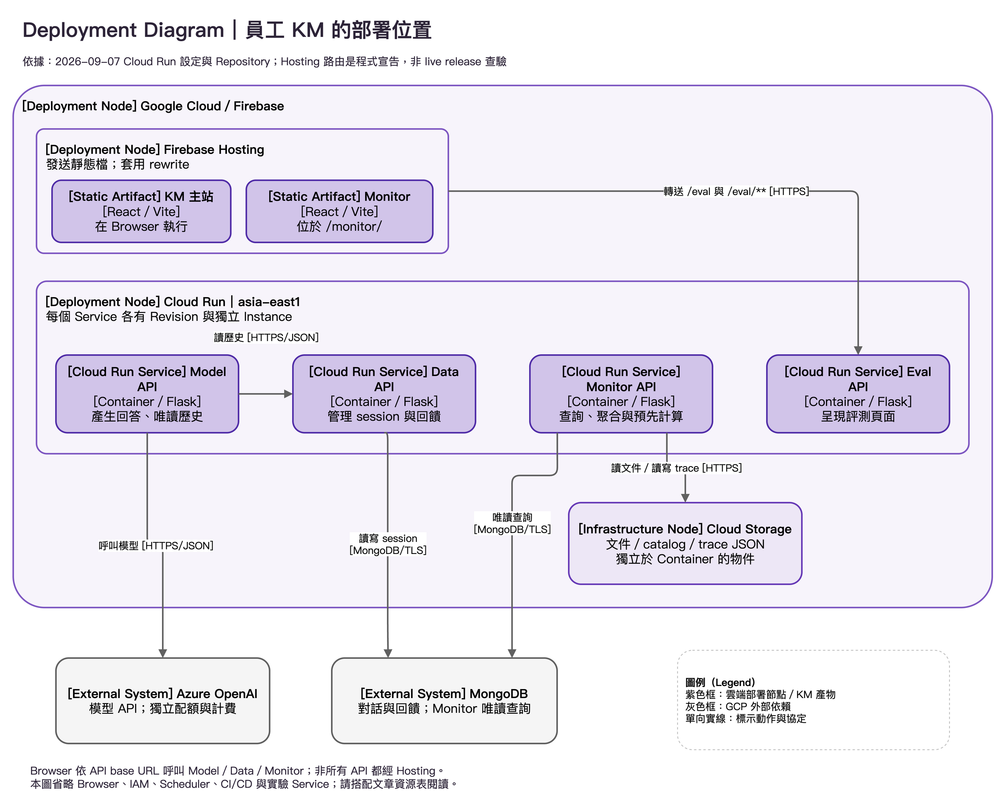

---
authors:
  - name: Charles Cao
tags:
  - GCP
  - Architecture
  - Operations
---

# GCP 資源全貌與員工 KM 元件對照

理解 GCP，先把「程式在哪裡執行、資料在哪裡保存、誰有權限、誰負責觀察」分開。員工 KM 不是單一 Cloud Run 服務，而是一組前端、API、資料儲存與維運元件；它也依賴 GCP 以外的 MongoDB 與 Azure OpenAI。

## 學習目標

- [ ] 將員工 KM 元件對應到入口、運算、儲存、身分與維運層。
- [ ] 區分 Repository 設定、歷史實驗與已確認的雲端設定。
- [ ] 能從一項設定變更追到受影響的上下游。

## 這篇筆記涵蓋的範圍

這是 GCP 與維運分類的技術地圖。以員工 KM 的 API、雲端基礎設施與資料生命週期為主，知識檢索與 Prompt 的內部演算法不在本輪範圍。[系統邊界](system_boundaries_and_deployment_flow.md)講應用程式分工，本篇補上它們所在的雲端資源。

## 前置知識

認得 [HTTP Request](http_get_post_rest_api.md) 與 [Cloud Run Service](cloud_run_core_concepts.md) 即可。以下「KM Monitor」是團隊寫的管理應用；「Cloud Monitoring」是 Google 的監控產品，兩者不同。

## 基礎觀念：Project、Region 與資源不是同一層

專案（Project）是 GCP 資源管理、API 啟用、配額與 IAM 政策的重要邊界；帳單帳戶可以連結多個 Project。區域（Region）是資源的地理部署位置，影響延遲、可用服務與價格。Cloud Run Service、Storage Bucket、Scheduler Job 才是各產品中實際管理的資源。Firebase Project 使用底層 Google Cloud Project，Hosting 也不代表該專案的所有 API 都由 Hosting 代理。[Google Cloud 資源階層](https://docs.cloud.google.com/resource-manager/docs/cloud-platform-resource-hierarchy)、[Firebase 與 Google Cloud](https://firebase.google.com/docs/projects/learn-more)

| 層次 | 資源是什麼、為什麼需要 | KM 如何使用、和誰互動 | 改動主要影響 |
|---|---|---|---|
| 網頁入口 | Firebase Hosting 發送靜態檔與套用 rewrite | React 主站、整合的 `/monitor`；`/eval` 轉送 Eval API | 前端版本、路徑、快取與跨來源請求 |
| 運算 | Cloud Run 執行 Container | Model 產生回答、Data 保存 session、Monitor 查閱與預先計算、Eval 呈現評測 | 延遲、權限、記憶體、並行量與逾時 |
| 交付 | Artifact Registry 保存 Image；GitHub Actions 執行部署 | API workflow build、push、deploy | 上線版本與可重建性 |
| 檔案儲存 | Cloud Storage 保存物件 | Monitor 讀文件／catalog、讀寫 trace JSON | 可見資料版本、下載量與重算量 |
| 業務資料 | MongoDB 保存可查詢與更新的文件 | Data API 寫對話；Monitor 直接唯讀查詢 | 歷史、回饋、報表新鮮度與資料庫容量 |
| 身分與機密 | IAM／Service Account 管雲端權限；Secret Manager 保存機密 | deploy 身分、Runtime 身分、Scheduler 身分各有責任 | 部署、讀檔、Secret 載入與定時呼叫是否成功 |
| 排程 | Cloud Scheduler 定時發出請求 | 呼叫 Monitor refresh 與 health | 計算頻率、冷啟動、資料負載 |
| 可觀測性 | Logging 保存事件；Monitoring 統計時間序列 | 判讀各 Service／Revision 的錯誤、延遲與資源 | 故障偵測、留存量、告警與成本 |
| 外部模型 | Azure OpenAI 提供模型 API | Model API 在請求中等待模型結果 | 生成延遲、TPM／RPM、費用與 429 |

## 部署節點圖：先看資源承載誰

<figure markdown="span">
  
  <figcaption>員工 KM 部署位置；聚焦入口、運算與資料依賴，不把 CI/CD 混成使用者請求。</figcaption>
</figure>

點擊圖片可放大閱讀；也可[下載 draw.io 可編輯原始檔](assets/diagrams/source/gcp_km_deployment.drawio)修改。

這是 Deployment Diagram。先讀上方 Hosting，再看 Cloud Run 區域中四個 Service，最後讀下方資料與模型依賴。紫色外框表示部署節點，不表示同一程序；灰色元件是 GCP 外部服務。Model、Data、Monitor 的瀏覽器 API 請求由前端設定決定，不能因網頁由 Firebase 發送，就假設所有箭頭都經過 rewrite。排程、IAM 與交付責任由上表及各專題說明，圖中不展開它們。

## 實際設定查證

本輪於 **2026-09-07** 讀取本機乾淨工作目錄與 GCP Service／Scheduler 設定；未發送問答、觸發排程或改動雲端資源。雲端查詢證明的是當時的設定，並非整段期間的可用性或用量。

| 查證項目 | 現行結論 | 來源 | 查證日期 |
|---|---|---|---|
| Model API | `00057-hd5` 接收該 Service 100% 流量；Image tag `2aed566` | Cloud Run Service 唯讀查詢 | 2026-09-07 |
| Data API | `00008-5f8` 接收 100%；Image tag `f208ae5` | Cloud Run Service 唯讀查詢 | 2026-09-07 |
| KM Monitor API | `00038-b55` 接收 100%；Image tag `4881dab` | Cloud Run Service 唯讀查詢 | 2026-09-07 |
| Eval API | `00054-wbw` 接收 100%；作為 `/eval` rewrite 的程式設定目標 | Cloud Run Service；Frontend `firebase.json` | 2026-09-07 |
| 區域 | 上述四個 Service 都在 `asia-east1` | Cloud Run Service labels | 2026-09-07 |
| 實驗服務 | 另有 ASGI、Flask experiment 與 ablation Service；不能併入正式 Model Service 的流量百分比 | Cloud Run Service 清單；壓測報告 | 2026-09-07 |
| 排程 | refresh 每小時、health 每五分鐘；兩者 ENABLED | Cloud Scheduler Job 唯讀查詢 | 2026-09-07 |
| Storage 使用 | Monitor 已設定文件 bucket／prefix 與 trace bucket | Cloud Run 環境設定，只確認引用存在，未讀取物件內容 | 2026-09-07 |

本機來源版本為 Model `5c7064c`、Data `f208ae5`、Frontend `beeed79`、Monitor `92c0695`。Model 本機已含 ASGI／SSE，主部署 workflow 仍使用 `prod/Dockerfile` 的 Flask + Gunicorn；這份 Dockerfile 與 tag 對應的 `2aed566` 原始碼一致。Image tag 是追溯線索，完整產物稽核還需要 digest 與建置紀錄。Monitor 本輪引用的 API、Dockerfile 與 deploy workflow，在 `4881dab` 與本機 HEAD 間沒有差異。

!!! note "現況的證據邊界"
    本輪未查 Firebase live release、前端實際載入的設定、IAM 完整政策、Bucket 留存政策、MongoDB 備份、Azure 配額或帳單。相關文章會標成「Repository 宣告」或「待確認」，不以 workflow 或檔名替代部署證據。2026-08-23／28 報告保留為歷史觀測，不代表今天的容量。

## 員工 KM 與本站 Chatbot 的邊界

| 比較 | 員工 KM | ai-deploy-docs 自己的 Chatbot |
|---|---|---|
| 程式來源 | `ai-asst-model-api`、`ai-asst-data-api`、`ai-asst-frontend`、`ai-asst-monitor` 等 | 本文件專案 `backend/chat_server.py` |
| 網頁 | Firebase Hosting 的 KM／Monitor 頁面 | GitHub Pages 的 MkDocs 文件 |
| 後端 | 主 Model／Data／Monitor 使用 Flask + Gunicorn；ASGI 有獨立實驗服務 | FastAPI + Uvicorn，參考 `backend/Dockerfile` |
| 模型與資料 | Model workflow 宣告 Azure；對話經 Data API 保存到 MongoDB | Gemini 文件問答；文件索引由 `hooks/generate_content.py` 建立 |
| 部署設定 | 各 KM Repository 的 workflow | `.github/workflows/deploy-chatbot.yml` |

因此本站的 Uvicorn、Gemini 配額或 concurrency 不能拿來說明員工 KM 的正式容量；KM Monitor 也不是本站 Chatbot 的後台。

## 建議閱讀順序

1. [IAM、Service Account、WIF 與 JWT](iam_service_accounts_wif_jwt.md)：先分清楚誰以什麼身分做事。
2. [Firebase Hosting、rewrite 與 CORS](firebase_hosting_request_paths.md)：釐清瀏覽器真正呼叫的入口。
3. [Cloud Storage、暫存空間與 MongoDB](storage_data_boundaries.md)：判斷資料何時會消失。
4. [Cloud Scheduler 與 KM Monitor](scheduler_monitor.md)：理解定期工作與快取。
5. [Logging、Monitoring 與故障判讀](logging_monitoring_troubleshooting.md)：從症狀定位失敗層。
6. [Image、Revision、回滾與設定漂移](revisions_rollbacks_drift.md)：理解版本與狀態的恢復邊界。
7. [GCP 成本與整體容量](gcp_cost_capacity.md)，搭配 [JSON／SSE 與多輪測試](jmeter_load_testing.md)：把資源設定轉成可衡量的容量問題。

## 小結

雲端資源地圖的用途，是讓每個設定都有位置與責任。先找它管理的是入口、運算、資料還是身分，再沿著上下游推論改動的影響；時間與來源決定這個推論能否稱為現況。

## 延伸閱讀

- [Google Cloud：資源階層](https://docs.cloud.google.com/resource-manager/docs/cloud-platform-resource-hierarchy)
- [Firebase：了解 Firebase Projects](https://firebase.google.com/docs/projects/learn-more)
- [Cloud Run：服務概觀](https://docs.cloud.google.com/run/docs/overview/what-is-cloud-run)
