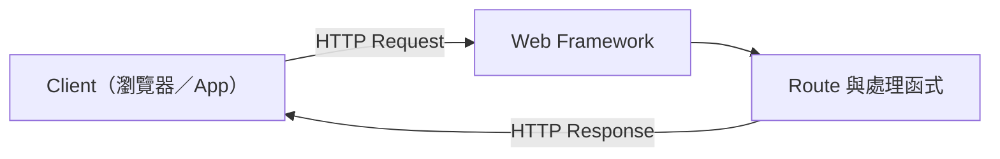
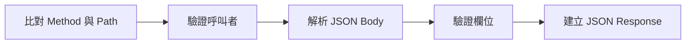

---
authors:
  - name: Charles Cao
tags:
  - HTTP
  - Flask
  - API
  - REST
---

# HTTP Request、GET、POST 與 REST API

使用者在網頁按下「送出」後，瀏覽器不是直接呼叫 Python 函式，也不是直接操作資料庫。它先組成一個 HTTP Request，送到指定的 API；Web Framework 再依照 Method 與 Path，把 Request 交給正確的處理函式。

這篇是通用講義：先看懂 Request 長什麼樣子、Method 語意怎麼決定、Framework 如何分派到函式。Request 進入 Framework 之前先經過哪一層 Application Server，留給下一篇[Flask、FastAPI、Gunicorn 與 Uvicorn](flask_fastapi_gunicorn_uvicorn.md)拆解；實際的 API 設計與取捨，見案例文章[REST API 設計案例](api_design_case.md)。

## 學習目標

- [ ] 從一個 HTTP Request 中辨認 Method、Path、Header 與 Body。
- [ ] 說明 GET、POST、PUT、PATCH、DELETE 與 OPTIONS 的主要用途。
- [ ] 用副作用與冪等性判斷一個操作該用哪個 Method。
- [ ] 看懂 Flask route 如何把 URL 對應到 Python 函式。
- [ ] 分辨 HTTP Status Code 與應用層自訂結果欄位。

## 這篇筆記涵蓋的範圍



這篇聚焦在 HTTP Request 進入 Framework、再形成 HTTP Response 的過程。Request 進入 Framework 之前先經過哪一層 Application Server，屬於下一篇主題。

## 前置知識

不需要先會寫 Flask，能看懂 URL 與 JSON 即可。

## 一個 API Request 到底包含什麼？

以下是一個簡化後的請求：

```http title="Client 呼叫 API"
POST /tasks HTTP/1.1
Content-Type: application/json
Authorization: Bearer <token>

{
  "title": "寫一份週報",
  "status": "open"
}
```

它可以拆成四個主要部分：

| 部分 | 範例 | 用途 |
|---|---|---|
| Method | `POST` | 表達這次想進行哪一類操作 |
| Path | `/tasks` | 指定要呼叫的 API 資源或功能 |
| Header | `Authorization`、`Content-Type` | 傳遞身分、內容格式等附加資訊 |
| Body | JSON object | 傳遞欄位資料 |

!!! info "基礎觀念"
    URL 不只是一段字串。完整 URL 通常還包含 Scheme、Host、Path 與 Query String。例如 `https://api.example.com/tasks?limit=20` 中，`https` 是 Scheme、`api.example.com` 是 Host、`/tasks` 是 Path、`limit=20` 是 Query String。

### Request 與 Response 是一來一回

API 收到 Request 後會回傳 Response：

```http title="簡化後的 HTTP Response"
HTTP/1.1 201 Created
Content-Type: application/json

{
  "id": "task-123",
  "title": "寫一份週報",
  "status": "open"
}
```

Response 也有 Header 與 Body，另外包含 HTTP Status Code。Client 通常會同時依 Status Code 與 Body 內容判斷結果。

## GET、POST、PUT、DELETE 有什麼差別？

HTTP Method 表達「希望 Server 對目標資源做什麼」。它不是函式名稱，也不直接等於資料庫指令。

| Method | 一般語意 | 常見情境 | 是否通常改變資料 |
|---|---|---|---|
| `GET` | 取得目前的資源表示 | 查詢清單、查詢單一資源 | 否 |
| `POST` | 交付內容，由目標資源依自身規則處理 | 建立資源、觸發運算、附加資料 | 通常會，但不一定 |
| `PUT` | 建立或完整取代指定資源的狀態 | 用完整內容覆蓋一筆資源 | 是 |
| `PATCH` | 部分更新指定資源 | 只更新資源中的某幾個欄位 | 是 |
| `DELETE` | 移除指定資源 | 刪除一筆資源 | 是 |
| `OPTIONS` | 詢問 Server 支援的通訊選項 | 瀏覽器的 CORS Preflight | 否 |

!!! warning "Method 是語意，不是安全機制"
    使用 `GET` 不代表任何人都能讀取，使用 `POST` 也不代表一定安全。API 仍需驗證身分、檢查資料擁有者、驗證 Body，並限制允許的來源。

### 怎麼決定用哪一個 Method？

選 Method 不是背對照表，而是回答三個問題：

1. **這個操作有沒有副作用？** 只是讀取、不改變 Server 狀態，優先用 `GET`（連同 `HEAD`、`OPTIONS` 合稱 Safe Methods）。
2. **重複呼叫兩次，結果會不會一樣？（Idempotent）** `GET`、`PUT`、`DELETE` 理論上都是冪等的：呼叫一次和呼叫十次，Server 最終狀態相同。`POST` 通常不是冪等的：呼叫十次可能建立十筆資源。
3. **要送出完整內容還是局部欄位？** 完整覆蓋用 `PUT`；只改一兩個欄位用 `PATCH`；語意上更接近「新增或觸發」則用 `POST`。

| 情境 | 建議 Method | 理由 |
|---|---|---|
| 查詢清單或單一資源 | `GET` | 無副作用，可被快取，可重複呼叫 |
| 建立一筆新資源，Server 決定 ID | `POST` | 每次呼叫都可能建立新的一筆，不冪等 |
| 用完整內容覆蓋既有資源 | `PUT` | 冪等，呼叫多次結果相同 |
| 只更新資源中的某個欄位 | `PATCH` | 局部更新，語意比 `PUT` 精確 |
| 刪除一筆資源 | `DELETE` | 冪等，刪除後再刪一次結果仍是「不存在」 |
| 需要結構化輸入，但語意上是查詢 | 優先評估能否改用 `GET` + Query String；不行才用 `POST` | Method 語意會影響快取、瀏覽器行為與 API 可預期性 |

!!! info "基礎觀念"
    冪等性（Idempotency）只保證「重複呼叫的最終狀態相同」，不保證「Server 完全沒有執行任何動作」，例如記錄多一筆存取 Log 通常不算破壞冪等性。

## Flask route 如何找到正確的 Python 函式？

Flask 使用 Route 將「Path + Method」對應到 View Function：

```python title="Flask route 概念範例"
@app.route("/tasks/<task_id>", methods=["GET", "OPTIONS"])
def get_task(task_id: str):
    ...


@app.route("/tasks/<task_id>", methods=["PUT", "OPTIONS"])
def update_task(task_id: str):
    ...


@app.route("/tasks/<task_id>", methods=["DELETE", "OPTIONS"])
def delete_task(task_id: str):
    ...
```

三個 Route 的 Path 相同，但 Method 不同，因此會進入不同函式。`<task_id>` 是動態 Path Parameter：當 Request Path 是 `/tasks/abc`，Flask 會把 `abc` 傳入 `task_id` 參數。

除了原生 decorator，Flask 生態也常見 class-based 寫法（例如 Flask-RESTX 的 `Resource`）：

```python title="Flask-RESTX Resource 概念範例"
@api.route("/tasks")
class TaskList(Resource):
    def post(self):
        ...
```

這裡的 `post()` 仍然代表 HTTP POST。兩種寫法核心都是把 Method 與 Path 對應到 Python 處理邏輯，差別在程式組織風格，以及是否需要額外的 Schema／自動文件功能。

## Flask 如何讀取 JSON Request？

常見流程可拆成五步：



```python title="簡化的 JSON 處理概念"
if not request.is_json:
    return jsonify({"error": "invalid content type"}), 400

body = request.get_json(silent=True)
if not isinstance(body, dict):
    return jsonify({"error": "invalid json"}), 400
```

需要注意：

- `Content-Type: application/json` 用來聲明 Body 格式。
- `request.get_json()` 將 JSON 解析成 Python object。
- 解析成功不等於資料有效，仍要檢查必填欄位、型別與長度。
- `jsonify()` 將 Python 資料序列化成 JSON Response。
- 資料庫回傳的型別（例如 datetime、ObjectId）通常要先轉成 JSON 可以表達的格式。

### Header 與 Body 各放什麼？

| 位置 | 適合內容 |
|---|---|
| Header | 身分、內容格式、瀏覽器來源 |
| Path Parameter | 指定單一資源 |
| Query String | 篩選、排序、分頁 |
| JSON Body | 結構化輸入 |

不要把 Token 放在 Query String。URL 可能出現在瀏覽器紀錄、Proxy 或 Server Logs；身分憑證應放在 `Authorization` Header。

## HTTP Status Code 與應用層結果是兩層結果

HTTP Status Code 描述這次 HTTP 交換的結果；Response Body 裡的自訂欄位（例如 `return_code`、`error_code`）則是應用程式自己的業務語意。

| HTTP Status | 意義 | 常見情境 |
|---:|---|---|
| `200 OK` | Request 已成功處理 | 查詢成功、寫入成功 |
| `201 Created` | 成功建立新資源 | `POST` 建立資源後回傳 |
| `204 No Content` | 成功，但沒有 Response Body | OPTIONS Preflight |
| `400 Bad Request` | 輸入格式或欄位有問題 | JSON 錯誤、缺少必填欄位 |
| `401 Unauthorized` | 尚未通過有效身分驗證 | Token 無效或過期 |
| `403 Forbidden` | 已辨識呼叫者，但沒有權限 | 讀取他人資料 |
| `404 Not Found` | 找不到目標資源 | 資源不存在 |
| `500 Internal Server Error` | Server 處理時發生未預期錯誤 | 資料庫連線或後端執行失敗 |

排錯時應同時記錄 HTTP Status 與 Response Body，不能只看其中一個；同一個 HTTP Status（例如 `200`）底下，應用層仍可能用自訂欄位表達不同的處理結果。HTTP Method 與 Status Code 都是 Client 與 API 之間的協定，不直接等於資料庫操作；Server 端會把它轉換成實際的資料庫呼叫。

## 常見問題

??? question "GET 可以帶 JSON Body 嗎？"
    HTTP 訊息格式可以容納內容，但 GET Request Body 沒有一般定義的語意，部分 Server、Proxy 或 Client 可能拒絕或忽略。需要結構化輸入時，應優先使用 Path、Query String，或依 API 語意改用 POST。

??? question "POST 成功一定要回 201 嗎？"
    不一定。`201 Created` 適合明確建立新資源；POST 也可能執行運算、附加資料或觸發流程，這類情況回 `200 OK` 也合理，重點是同一個 API 的行為要一致並在文件中說明。

??? question "Flask 是 API Server 嗎？"
    Flask 是 Web Framework，也是 WSGI Application；正式環境還需要能接收連線並呼叫 Flask 的 WSGI Server，例如 Gunicorn。這部分留給 [Flask、FastAPI、Gunicorn 與 Uvicorn](flask_fastapi_gunicorn_uvicorn.md) 拆解。

??? question "Flask 和 FastAPI 是同一個東西嗎？"
    不是。Flask 與 FastAPI 是不同 Web Framework，介面規格（WSGI／ASGI）也不同。[下一篇](flask_fastapi_gunicorn_uvicorn.md)會完整比較兩者，以及常搭配的 Gunicorn／Uvicorn。

## 小結

- HTTP Request 由 Method、Path、Headers 與可選的 Body 組成。
- Web Framework 依 Method + Path 將 Request 交給正確的處理函式。
- 選 Method 看副作用、冪等性與資料完整／局部更新的需求，而不是死背對照表。
- HTTP Status Code 與應用層自訂結果欄位是兩層不同的結果。
- HTTP Method 是 Client 與 API 之間的協定，不直接等於資料庫操作。

接著閱讀：

- [REST API 設計案例](api_design_case.md)：看這些概念在實際系統中如何取捨。
- [Flask、FastAPI、Gunicorn 與 Uvicorn](flask_fastapi_gunicorn_uvicorn.md)：往下一層看 Request 怎麼被接住。

## 延伸閱讀

- [Flask：Quickstart 與 HTTP Methods](https://flask.palletsprojects.com/en/stable/quickstart/)
- [Flask：Application Structure and Lifecycle](https://flask.palletsprojects.com/en/stable/lifecycle/)
- [MDN：HTTP Request Methods](https://developer.mozilla.org/en-US/docs/Web/HTTP/Reference/Methods)
- [MDN：HTTP Status Codes](https://developer.mozilla.org/en-US/docs/Web/HTTP/Reference/Status)
- [RFC 9110：HTTP Semantics](https://www.rfc-editor.org/rfc/rfc9110.html)
