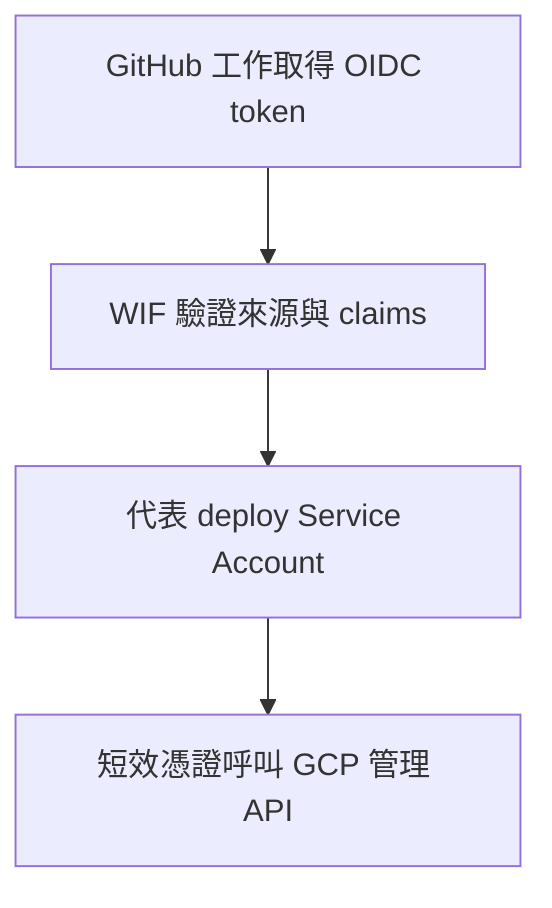

---
authors:
  - name: Charles Cao
tags:
  - IAM
  - WIF
  - JWT
---

# IAM、Service Account、WIF 與應用程式 JWT

「我能部署 API」「API 能讀 Secret」「員工能讀自己的對話」是三個不同的授權問題。它們都與身分有關，但驗證者、憑證與權限範圍各不相同。

## 學習目標

- [ ] 分辨雲端資源權限與應用程式資料權限。
- [ ] 說出 deploy、Runtime、Scheduler 三種 Service Account 責任。
- [ ] 解釋 WIF、Google OIDC ID token 與 KM JWT 為何不能互換。

## 這篇筆記涵蓋的範圍

從 GitHub 部署身分，到 Cloud Run 存取 Secret／Storage，再到 Browser 與 API 的 JWT。Secret 的保存方式見[環境變數與 Secrets](configuration_and_secrets.md)，本篇只處理「誰可以使用」。

## 前置知識

先認得 [GCP 資源地圖](gcp_resource_map.md) 的部署層與執行層，以及 HTTP `Authorization` Header。

## 基礎觀念：IAM 回答誰能對哪個資源做什麼

身分與存取管理（Identity and Access Management，IAM）透過政策把主體（Principal）與角色（Role）綁定在資源範圍上。角色是一組權限；在 Project 授權，影響範圍通常比單一 Secret 或 Bucket 大。認證先證明身分，授權再決定是否允許操作。[IAM 概觀](https://docs.cloud.google.com/iam/docs/overview)

服務帳戶（Service Account）是給工作負載使用的 Google Cloud 身分，不是員工登入 KM 的帳號。Cloud Run 執行期透過服務身分與 Application Default Credentials 取得存取 Google API 的憑證，Google SDK 不必在 Image 裡放帳戶私鑰。[Cloud Run Service identity](https://docs.cloud.google.com/run/docs/securing/service-identity)

| 身分角色 | 位於哪一層、和誰互動 | 通常需要的能力（概念示例，非已查到的 IAM 清單） |
|---|---|---|
| Deploy Service Account | CI/CD 呼叫 Artifact Registry、Cloud Run 管理 API | 寫入 Image、部署服務、以指定 Runtime SA 執行；例如 Registry Writer、Run Developer 與 SA User 的適當組合 |
| Runtime Service Account | Cloud Run 程式呼叫 Secret Manager／Storage | 指定 Secret 的 Secret Accessor、指定 Bucket 的物件讀取或寫入能力 |
| Scheduler client Service Account | 排程請求的 Google 身分 | 私有 Cloud Run 入口需要 Invoker；應用程式另可能限定指定 SA |
| 員工應用身分 | Browser 呼叫 Model／Data API | 由 KM JWT 與 session 擁有者檢查決定，不是 IAM Role |

Service Account User 的 `actAs` 能力讓部署者使用指定執行身分，不等於取得該身分的所有權限。IAM 政策、WIF 信任條件與 KM JWT 驗證是不同的授權邊界；表中角色僅解釋責任，本輪沒有查驗完整 bindings。

## WIF 為什麼能讓 GitHub 部署到 GCP？

工作負載身分聯盟（Workload Identity Federation，WIF）讓外部身分提供者的憑證換取短效 Google 憑證。Pool 管理外部身分集合，Provider 宣告信任誰、如何映射 claims 與限制來源。Repository／分支等條件限制「哪一個 GitHub 工作」可以進來；進來以後能做什麼，仍由 IAM 決定。[部署 pipeline 的 WIF](https://docs.cloud.google.com/iam/docs/workload-identity-federation-with-deployment-pipelines)

這張小型流程只代表部署認證。`id-token: write` 允許 GitHub 工作取得 OIDC token，並不直接授予 GCP 權限。KM 的 Model、Data、Monitor API workflows 使用 `google-github-actions/auth`，同時提供 `workload_identity_provider` 與 `service_account`，屬於透過 SA 的 WIF 路徑。前端 workflow 則使用 `firebaseServiceAccount` Secret；不能把所有 KM 部署都描述成無長效金鑰的 WIF。

## JWT 是格式，Google OIDC 與 KM token 是不同信任系統

JSON Web Token（JWT）是一種 claims 格式；簽章讓接收者驗證內容與發行來源，不會自動把內容加密。OpenID Connect（OIDC）ID token 可使用 JWT，但「長得像 JWT」不代表它能通過另一個系統的驗證。[JWT 規範](https://www.rfc-editor.org/rfc/rfc7519)、[OIDC Core](https://openid.net/specs/openid-connect-core-1_0.html)

| 使用情境 | 誰發行／驗證 | KM 中的用途 |
|---|---|---|
| GitHub OIDC | GitHub 發行；GCP WIF 驗證 | 讓 CI/CD 取得部署憑證 |
| Scheduler Google ID token | Google 簽發；Google 入口或 Monitor 驗證 | 證明排程 client SA 與預期 audience |
| KM user JWT | Model 登入端點簽發；Model／Data／Monitor 應用驗證 | 員工身分、session 擁有者與 Monitor allowlist |
| KM service JWT | Model 程式用共享或專用 Secret 簽署；Data API 驗證 | 以 `typ=service` 唯讀歷史；與 GCP Service Account 無關 |

`aud`（Audience）回答 token 預期交給誰，`sub`（Subject）回答它代表誰，`exp` 是有效期限。Google token 有 Google 的驗證鏈；KM Data API 的 `auth.py` 以 HS256 Secret、演算法與期限驗證，並由 `typ`／`sub` 決定呼叫身分。不能假設本地 HS256 token 擁有 Google 的 issuer／audience 契約。

## 本專案採用方式

以下程式依據版本見 [GCP 資源地圖](gcp_resource_map.md)。

| 邊界 | 已核對的 KM 行為 | 設定依據 |
|---|---|---|
| 雲端入口與應用登入 | API workflows 宣告 `--allow-unauthenticated`；應用仍驗證 Bearer JWT | Model／Data／Monitor deploy workflows；各 API auth 程式。未另查服務 IAM policy |
| 雲端執行身分 | 三個 Service 都有 Runtime SA 設定；帳號名稱不公開 | 2026-09-07 Cloud Run 唯讀設定 |
| 員工資料權限 | Data append 使用驗證後的 `sub`；不讓 Body 任意冒充使用者；service token 不可寫入 | Data `auth.py`、`app.py` |
| 本機退路 | Data 缺少 `JWT_SECRET` 時進入匿名開發模式 | Data `auth.py`；正式 workflow 有 Secret 引用，不能把本機行為搬到正式設定 |
| 排程驗證 | Monitor 驗證 Google token、`SCHEDULER_AUDIENCE` 與指定 SA email | Monitor `api/app.py::_require_scheduler` |
| Monitor 呼叫 Model | 另外建立 HS256、`typ=user` 的短效應用 token | Monitor `api/app.py::_model_service_token`；函式名稱中的 service 不代表 Google SA 或 Data 的 `typ=service` |

## 設定改變會有什麼影響？

把 Cloud Run 改成 IAM 私有入口，原本只有 KM JWT 的瀏覽器呼叫可能在進入 Flask 前就被拒絕；調整 CORS 無法修復它。反過來，允許匿名通過平台入口，也沒有取消程式中的登入與資料擁有者限制。

撤銷 Runtime SA 的 Secret 讀取權，可能讓新 Instance 啟動失敗；撤銷 Bucket 讀取權，則可能只在下載文件時暴露錯誤。更換 `JWT_SECRET` 會影響既有登入 token 與服務間驗證，必須考慮所有驗證端的一致性。修改 WIF 的 repository／branch 條件通常影響下一次部署，不直接撤銷員工現有登入。

??? question "有了 CORS allowlist，還需要 JWT 嗎？"
    需要。CORS 是瀏覽器的跨來源讀取規則，無法限制任意 HTTP client；JWT 與資源權限才處理身分和資料存取。

## 小結

先找驗證者：GCP 管理 API 看 Google 憑證與 IAM；KM API 看自己的 token 與資料權限。Service Account、WIF 和 JWT 會互動，但不是互相替換的登入方法。

## 延伸閱讀

- [Google：WIF 部署 pipeline](https://docs.cloud.google.com/iam/docs/workload-identity-federation-with-deployment-pipelines)
- [Google：Scheduler HTTP 認證](https://docs.cloud.google.com/scheduler/docs/http-target-auth)
- [Cloud Run：Service identity](https://docs.cloud.google.com/run/docs/securing/service-identity)
- [設定與 Secret 的生命週期](configuration_and_secrets.md)
