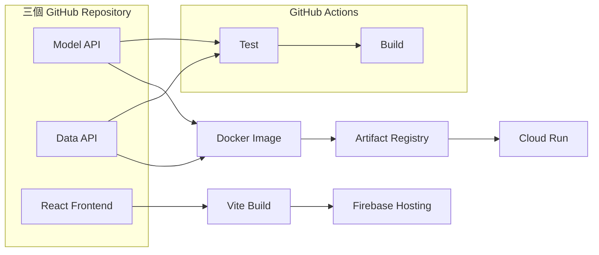

# AI 應用部署實戰筆記

以 `ai-asst-km` 的真實部署為主案例，逐步理解 Flask、Gunicorn、Docker、GitHub Actions、Artifact Registry、Google Cloud Run 與 Firebase Hosting，最後把每個部署步驟串成一條看得懂、能驗證、也能維護的流程。

[:material-rocket-launch: 開始第一章](01_ai_asst_deployment_overview.md){ .md-button .md-button--primary }

!!! info "這份筆記的範圍"
    本站聚焦於 **AI 應用如何開發、測試與部署**。內容會對照 `ai-asst-km` 的實際架構，但不討論員工知識庫、RAG、Prompt 或內部資料。

## 這套系統如何交付

## 學習地圖

-   :material-map-outline:{ .lg .middle } **部署架構總覽**

    ---

    先分清 Runtime 與 Deployment，認識三個 Repository 和各項雲端服務的責任。

-   :material-api:{ .lg .middle } **Flask 與 HTTP API**

    ---

    從實際 route 理解 GET、POST、Request、Response、JSON 與狀態碼。

-   :material-server:{ .lg .middle } **Gunicorn 與 Docker**

    ---

    理解正式環境為何使用 Gunicorn，再看 API 如何包成 Container Image。

-   :material-cloud-upload:{ .lg .middle } **CI/CD 與 Cloud Run**

    ---

    看懂 GitHub Actions、WIF、Artifact Registry、Revision、流量切換與回滾。

## 現行系統對照

| 元件 | 現行技術 | 部署位置 |
|---|---|---|
| Model API | Flask + Gunicorn | Google Cloud Run |
| Data API | Flask + Gunicorn | Google Cloud Run |
| Web Frontend | React + Vite | Firebase Hosting |
| Container Image | Docker Image | Artifact Registry |
| CI/CD | GitHub Actions | GitHub |
| 機密設定 | API Key、JWT、資料庫連線 | Secret Manager |

!!! tip "學習方式"
    我們不會一次產生大量文章。每完成一章，就先在本機實作、驗證並確認內容，再加入下一章。

## 目前進度

- [x] 第一章：AI Assistant 部署架構總覽
- [ ] 第二章：HTTP、GET、POST 與 Flask API
- [ ] 第三章：Gunicorn 與 Cloud Run 執行環境
- [ ] 第四章：Docker Image 與 Artifact Registry
- [ ] 第五章：GitHub Actions CI/CD 實際流程

!!! note "一章一章完成"
    首頁只把後續主題當作學習方向，不會先生成大量 Markdown。每完成一章，我們會先在本機檢視與修正，再決定下一章。
