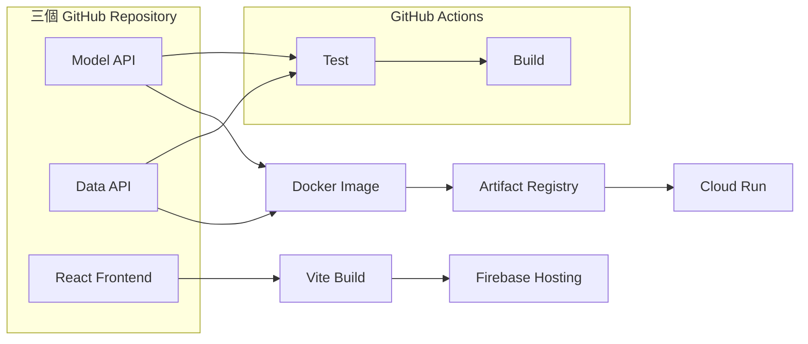

# AI KM 系統實戰筆記

以 `ai-asst-km` 的真實系統為主案例，從系統邊界、HTTP API 與服務啟動開始，逐步理解 Flask、Gunicorn、MongoDB、CI/CD、Google Cloud Run 與 Firebase Hosting，最後把 Runtime、Deployment 與維運流程串起來。

[:material-rocket-launch: 從系統全貌開始](01_ai_asst_deployment_overview.md){ .md-button .md-button--primary }

!!! info "這份筆記的範圍"
    本站聚焦於 **AI KM 系統的工程實作與維運知識**，包含 API、服務啟動、資料邊界、部署與 GCP。內容會對照 `ai-asst-km` 的實際架構，但不討論員工知識內容、RAG、Prompt 或內部資料。

## 這套系統如何交付

## 學習地圖

-   :material-map-outline:{ .lg .middle } **AI KM 系統全貌**

    ---

    先分清系統邊界、Runtime 與 Deployment，認識三個 Repository 和外部服務的責任。

-   :material-server:{ .lg .middle } **服務啟動基礎**

    ---

    從 HTTP、Flask route、WSGI 與 Gunicorn，理解 Python API 如何成為可接收請求的服務。

-   :material-source-branch:{ .lg .middle } **CI/CD 與交付**

    ---

    看懂 GitHub Actions、Docker Image、Artifact Registry 與 Firebase Hosting 的交付路徑。

-   :material-google-cloud:{ .lg .middle } **GCP Cloud Run**

    ---

    理解 Service、Revision、Instance、擴縮、Secret、流量切換與回滾。

-   :material-database:{ .lg .middle } **資料與維運**

    ---

    後續會補上 Data API、MongoDB 資料模型、Index、Logs、Health Check 與故障排查。

## 現行系統對照

| 元件 | 現行技術 | 部署位置 |
|---|---|---|
| Model API | Flask + Gunicorn | Google Cloud Run |
| Data API | Flask + Gunicorn | Google Cloud Run |
| Web Frontend | React + Vite | Firebase Hosting |
| Container Image | Docker Image | Artifact Registry |
| CI/CD | GitHub Actions | GitHub |
| 機密設定 | API Key、JWT、資料庫連線 | Secret Manager |

!!! tip "學習方式"
    我們不會一次產生大量文章。每完成一章，就先在本機實作、驗證並確認內容，再加入下一章。

## 目前進度

- [x] 第 1 章：系統邊界與 Runtime／Deployment
- [x] 第 2 章：Runtime 使用者請求如何流動
- [x] 第 3 章：HTTP、GET、POST 與 Flask API
- [ ] 第 4 章：Flask、WSGI、Gunicorn 與 Uvicorn
- [ ] 第 5 章：Data API 與 MongoDB
- [x] 第 6 章：GitHub Actions CI/CD 實際流程
- [x] 第 7 章：GCP Cloud Run 核心概念
- [x] 第 8 章：設定、環境變數與 Secret

!!! note "一章一章完成"
    首頁只把後續主題當作學習方向，不會先生成大量 Markdown。每完成一章，我們會先在本機檢視與修正，再決定下一章。
