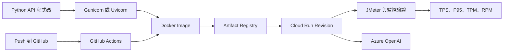

# 雲端架構與 API 部署筆記

這裡整理一套 Web API 從程式碼變成雲端服務時會遇到的知識：HTTP、Flask、FastAPI、Gunicorn、Uvicorn、Docker、GitHub Actions、Cloud Run、Secret、負載測試，以及 Azure OpenAI 的 TPM／RPM 容量限制。

[:material-api: 從 API 基礎開始](api_overview.md){ .md-button .md-button--primary }

!!! info "這份筆記怎麼使用"
    每個分類都可以獨立閱讀。通用觀念先講清楚，再用實際專案設定做案例；不必按照固定編號依序讀完，也不討論 RAG、Prompt 或內部知識內容。

## 學習分類

-   :material-api:{ .lg .middle } **API 與後端服務**

    ---

    HTTP Request／Response、GET／POST、REST、Flask、FastAPI、WSGI、ASGI、Gunicorn workers 與 Uvicorn。

    [:octicons-arrow-right-24: 開始學習](api_overview.md)

-   :material-source-branch:{ .lg .middle } **CI/CD 與交付**

    ---

    GitHub Actions trigger、job、step、Docker build、Artifact Registry、WIF 與 `gcloud run deploy`。

    [:octicons-arrow-right-24: 查看部署流程](cicd_overview.md)

-   :material-google-cloud:{ .lg .middle } **Cloud Run**

    ---

    Service、Revision、Instance、concurrency、自動擴縮、Cold Start、timeout、環境變數與 Secret Manager。

    [:octicons-arrow-right-24: 認識 Cloud Run](cloud_run_overview.md)

-   :material-speedometer:{ .lg .middle } **效能與容量**

    ---

    JMeter threads、Ramp-up、TPS、Latency、P95／P99、錯誤率，以及 Azure OpenAI TPM／RPM 與 HTTP 429。

    [:octicons-arrow-right-24: 開始效能測試](performance_overview.md)

-   :material-sitemap-outline:{ .lg .middle } **實際架構案例**

    ---

    用一套 React、Flask、Cloud Run、Firebase Hosting 與 MongoDB 組成的系統，對照 Runtime 和 Deployment 如何銜接。

    [:octicons-arrow-right-24: 查看架構案例](01_ai_asst_deployment_overview.md)

## 從一段程式碼到正式服務

這張圖就是本站的學習主線：先理解 API 怎麼接住 Request，再理解 Container 如何交付到 Cloud Run，最後用壓測與模型配額確認整條鏈路能承受多少流量。

## 已整理的主題

| 分類 | 目前文章 |
|---|---|
| API 與後端服務 | HTTP／REST、Flask／FastAPI、WSGI／ASGI、Gunicorn／Uvicorn |
| CI/CD 與交付 | GitHub Actions、WIF、Docker Image、Artifact Registry、Cloud Run deploy trigger |
| Cloud Run | Service、Revision、Instance、自動擴縮、concurrency、timeout、Secrets |
| 效能與容量 | JMeter、TPS、Latency、Percentile、Azure OpenAI TPM／RPM／429 |
| 實際架構案例 | 系統邊界、Runtime Request Flow、Frontend／Model API／Data API 分工 |

## 建議閱讀方式

- 第一次接觸 Web API：從 [API 學習路徑](api_overview.md)開始。
- 想知道 GitHub 為什麼能自動部署：閱讀 [CI/CD 學習路徑](cicd_overview.md)。
- 正在操作 GCP：閱讀 [Cloud Run 學習路徑](cloud_run_overview.md)。
- 想知道服務能承受多少流量：閱讀 [效能測試學習路徑](performance_overview.md)。
- 想把所有元件串起來：最後看[實際架構案例](01_ai_asst_deployment_overview.md)。
