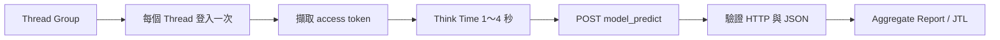

---
authors:
  - name: Charles Cao
tags:
  - JMeter
  - Load Testing
  - TPS
---

# JMeter、TPS、延遲與壓力測試

JMeter 用多個 Threads 模擬虛擬使用者，依 Test Plan 發送 HTTP Request。它能幫我們回答「服務在指定負載下的 TPS、延遲與錯誤率是多少」，但前提是測試情境、成功條件與成本邊界都定義清楚。

## 學習目標

- [ ] 分辨 Threads、Ramp-up、Loops、Think Time 與 Throughput。
- [ ] 正確解讀 Elapsed、Latency、P95／P99 與 Error Rate。
- [ ] 說明 concurrent users 不等於 TPS。
- [ ] 看懂目前 Model API JMeter Test Plan 的主要流程。

## JMeter Test Plan 結構



| 元件 | 它控制什麼？ |
|---|---|
| Threads | 同時活動的虛擬使用者數量 |
| Ramp-up | 啟動全部 Threads 所花的時間 |
| Loop Count | 每個 Thread 重複執行流程的次數 |
| Timer／Think Time | 模擬使用者停頓，避免不自然地連續轟炸 |
| Sampler | 真正送出的 HTTP Request |
| Assertion | 判斷 HTTP 或 JSON 是否符合成功條件 |
| Listener／JTL | 收集樣本並產生統計結果 |

## TPS、RPS 與 Concurrent Users

TPS（Transactions Per Second）與 RPS（Requests Per Second）常被混用，但 Transaction 可能包含多個 Requests。例如「登入 + 六輪問答」可以視為一個業務 Transaction，也可以把每次 `/model_predict` 當成單一 Transaction；報告前一定要先定義分母。

```text
平均 TPS = 成功完成的 Transaction 數 ÷ 測試有效秒數
Error Rate = 失敗樣本數 ÷ 全部樣本數 × 100%
```

100 個 concurrent users 不代表 100 TPS。如果每次問答平均需要 20 秒，即使 100 人同時等待，理論完成速率也可能只有約 5 次／秒，還會受到 Think Time、下游容量與錯誤重試影響。

## 回應時間指標怎麼看？

| 指標 | JMeter 定義與用途 |
|---|---|
| Connect Time | 建立 TCP／TLS 連線所花時間 |
| Latency | 送出 Request 到收到第一部分 Response 的時間 |
| Elapsed Time | 送出 Request 到完整收到最後一部分 Response 的時間 |
| Average | 全部樣本平均值，容易被少量極慢值影響 |
| P95 | 95% 樣本在這個時間內完成 |
| P99 | 99% 樣本在這個時間內完成，適合觀察尾端延遲 |
| Max | 最慢單筆，需搭配 Logs 判斷是否具代表性 |

只報 Average 容易掩蓋少數使用者的嚴重等待。正式容量結論至少要一起看 Throughput、P95、P99、Error Rate、HTTP 429／5xx，以及 Cloud Run CPU、Memory、Instance count。

## 現行 Model API Test Plan

!!! example "實際案例"
    Repository 內的 `model_api_external_loadtest.jmx` 使用 JMeter 5.6.3，預設 100 Threads、60 秒 Ramp-up、每個 Thread 6 Loops，並為每個 Thread 產生獨立 session。每個 Thread 登入一次，之後從 CSV 題庫取得問題、等待 1～4 秒，再呼叫真正的 Model API。

| 設定 | 現行值 | 代表意義 |
|---|---:|---|
| Threads | 100 | 最多模擬 100 個獨立 session |
| Ramp-up | 60 秒 | 約在一分鐘內逐步啟動全部 Threads |
| Loops | 6 | 每個 session 進行六輪問答 |
| Think Time | 1～4 秒 | 模擬使用者閱讀與輸入間隔 |
| Connect timeout | 5 秒 | 建立連線的等待上限 |
| Response timeout | 60 秒 | 單次 HTTP Response 的等待上限 |
| Assertion | HTTP 200、JSON `return_code` 成功 | 避免只把有 Response 的錯誤當成功 |

這個 Test Plan 會實際呼叫 Azure OpenAI，也可能觸發 Cloud Run 擴張，因此測試量同時受到 Gunicorn、Cloud Run、Azure OpenAI TPM／RPM 與成本影響。

## 實際設定查證

| 查證項目 | 現行結論 | 來源 | 查證日期 |
|---|---|---|---|
| Test Plan | JMeter 5.6.3；100 Threads／60 秒 Ramp-up／6 Loops | Model API load-test `.jmx` | 2026-08-23 |
| Session 隔離 | 每個 Thread 產生獨立 UUID | JSR223 PreProcessor | 2026-08-23 |
| 認證 | 每個 Thread 登入一次並擷取 access token | Once Only Controller／JSON Extractor | 2026-08-23 |
| 成功判斷 | HTTP Status 與 JSON 結果都要通過 | Response／JSON Assertions | 2026-08-23 |

## 正式壓測的風險邊界

執行正式 `.jmx` 會產生真實 API 流量、Azure OpenAI 費用、Cloud Run Instance 與 Logs；必須先獲得團隊同意，並透過 JMeter properties 注入帳密，不能直接寫回 Test Plan。

### 可能影響

- 可能消耗 Azure OpenAI TPM／RPM 並收到 HTTP 429。
- 可能將 Cloud Run 擴張到 Max instances，增加費用。
- 可能影響同時間的正式使用者與資料庫 Connection Pool。

### 測試後恢復觀察

停止 JMeter 後不需修改正式設定；等待進行中的 Request 完成，確認 Cloud Run Instance 回落、錯誤率恢復，再保存 JTL、Cloud Run Metrics 與測試版本供比較。若測試引發持續異常，依維運流程回滾 Revision 或暫停測試來源。

## 常見問題

??? question "Threads 設成 100，是否就代表 Cloud Run concurrency 應設成 100？"
    不一定。Threads 是 Client 負載模型；Cloud Run concurrency 是每個 Instance 的平台上限。還要考慮 Gunicorn 工作槽、Request 時間、CPU、Memory 與下游服務容量。

??? question "JMeter 顯示 200 就算成功嗎？"
    不一定。HTTP 200 的 JSON 仍可能包含應用程式錯誤，因此 Test Plan 應同時使用 Response Assertion 與 JSON Assertion。

## 延伸閱讀

- [Apache JMeter：Thread Group](https://jmeter.apache.org/usermanual/component_reference.html#Thread_Group)
- [Apache JMeter：Aggregate Report](https://jmeter.apache.org/usermanual/component_reference.html#Aggregate_Report)
- [Apache JMeter：Elapsed、Latency 與 Connect Time](https://jmeter.apache.org/usermanual/glossary)
- [Apache JMeter：Best Practices](https://jmeter.apache.org/usermanual/best-practices.html)
