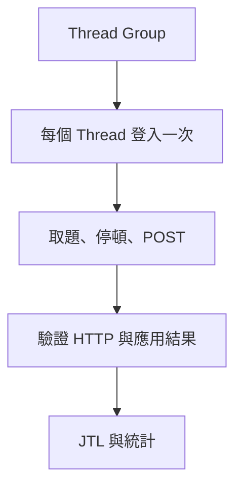
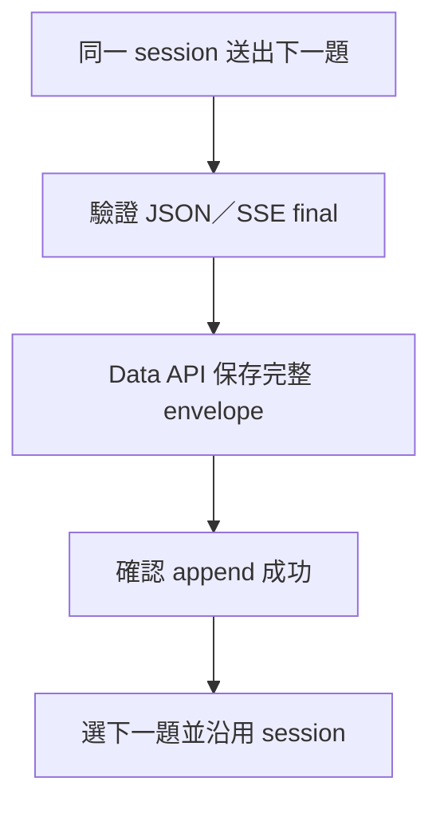

---
authors:
  - name: Charles Cao
tags:
  - JMeter
  - Load Testing
  - TPS
---

# JMeter、TPS、延遲與壓力測試

JMeter 用多個 Threads 模擬虛擬使用者，依 Test Plan 發送 HTTP Request。它能幫我們回答「服務在指定負載下的 TPS、延遲與錯誤率是多少」，但前提是測試情境、成功條件與成本邊界都定義清楚。

## 學習目標

- [ ] 分辨 Threads、Ramp-up、Loops、Think Time 與 Throughput。
- [ ] 正確解讀 Elapsed、Latency、P95／P99 與 Error Rate。
- [ ] 說明 concurrent users 不等於 TPS。
- [ ] 看懂目前 Model API JMeter Test Plan 的主要流程。
- [ ] 分開衡量 JSON 完成、SSE 首個內容與 Data append，辨認持久化多輪是否真的成立。

## 這篇筆記涵蓋的範圍

從 Client 負載模型、API 回應傳輸到保存歷史的成功條件。以員工 KM 的 loadtest 專案為例，區分 2026-08-23 舊計畫、2026-08-28 隔離服務實驗，以及本機 mock 契約測試；這些都不是本站 Gemini Chatbot 的壓測。

## 前置知識

理解 [HTTP 與應用結果](http_get_post_rest_api.md)、[Frontend 保存回答](runtime_request_flow.md)，以及 [Flask／ASGI 執行模型](flask_fastapi_gunicorn_uvicorn.md)。

## JMeter Test Plan 結構


```mermaid
flowchart TB
    ThreadGroup["Thread Group"] --> Login["每個 Thread 登入一次"]
    Login --> Predict["取題、停頓、POST"]
    Predict --> Assert["驗證 HTTP 與應用結果"]
    Assert --> Report["JTL 與統計"]
```

| 元件 | 它控制什麼？ |
|---|---|
| Threads | 同時活動的虛擬使用者數量 |
| Ramp-up | 啟動全部 Threads 所花的時間 |
| Loop Count | 每個 Thread 重複執行流程的次數 |
| Timer／Think Time | 模擬使用者停頓，避免不自然地連續轟炸 |
| Sampler | 真正送出的 HTTP Request |
| Assertion | 判斷 HTTP 或 JSON 是否符合成功條件 |
| Listener／JTL | 收集樣本並產生統計結果 |

## TPS、RPS 與 Concurrent Users

TPS（Transactions Per Second）與 RPS（Requests Per Second）常被混用，但 Transaction 可能包含多個 Requests。例如「登入 + 六輪問答」可以視為一個業務 Transaction，也可以把每次 `/model_predict` 當成單一 Transaction；報告前一定要先定義分母。

```text
平均 TPS = 成功完成的 Transaction 數 ÷ 測試有效秒數
Error Rate = 失敗樣本數 ÷ 全部樣本數 × 100%
```

100 個 concurrent users 不代表 100 TPS。如果每次問答平均需要 20 秒，即使 100 人同時等待，理論完成速率也可能只有約 5 次／秒，還會受到 Think Time、下游容量與錯誤重試影響。

## 回應時間指標怎麼看？

| 指標 | JMeter 定義與用途 |
|---|---|
| Connect Time | 建立 TCP／TLS 連線所花時間 |
| Latency | 送出 Request 到收到第一部分 Response 的時間 |
| Elapsed Time | 送出 Request 到完整收到最後一部分 Response 的時間 |
| Average | 全部樣本平均值，容易被少量極慢值影響 |
| P95 | 95% 樣本在這個時間內完成 |
| P99 | 99% 樣本在這個時間內完成，適合觀察尾端延遲 |
| Max | 最慢單筆，需搭配 Logs 判斷是否具代表性 |

只報 Average 容易掩蓋少數使用者的嚴重等待。正式容量結論至少要一起看 Throughput、P95、P99、Error Rate、HTTP 429／5xx，以及 Cloud Run CPU、Memory、Instance count。

## 歷史 Model API Test Plan：重複提問不等於持久化多輪

!!! example "實際案例"
    `ai-asst-model-api-loadtest/model_api_external_loadtest.jmx` 是 2026-08-23 的歷史基準。它使用 JMeter 5.6.3，預設 100 Threads、60 秒 Ramp-up、6 Loops，為每個 Thread 產生獨立 session 並登入一次。此計畫沒有把回答 append 到 Data API；相同 session ID 重複六次，不代表歷史已保存並被下一輪讀取。

| 設定 | 現行值 | 代表意義 |
|---|---:|---|
| Threads | 100 | 最多模擬 100 個獨立 session |
| Ramp-up | 60 秒 | 約在一分鐘內逐步啟動全部 Threads |
| Loops | 6 | 每個 session ID 重複六次請求，不驗證持久歷史 |
| Think Time | 1～4 秒 | 模擬使用者閱讀與輸入間隔 |
| Connect timeout | 5 秒 | 建立連線的等待上限 |
| Response timeout | 60 秒 | 單次 HTTP Response 的等待上限 |
| Assertion | HTTP 200、JSON `return_code` 成功 | 避免只把有 Response 的錯誤當成功 |

這個 Test Plan 會實際呼叫 Azure OpenAI，也可能觸發 Cloud Run 擴張，因此測試量同時受到 Gunicorn、Cloud Run、Azure OpenAI TPM／RPM 與成本影響。

## JSON 與 SSE：傳輸形式和執行模型是兩個變因

一般 JSON response 在完成後交付完整結果；伺服器傳送事件（Server-Sent Events，SSE）用 `text/event-stream` 在同一個 HTTP 回應中持續送出事件，事件間以空行分隔。SSE 不要求把每個上游 token 當成一個事件，也不保證第一個 byte 就是使用者可見的答案。[HTML SSE 規範](https://html.spec.whatwg.org/multipage/server-sent-events.html)

KM Frontend 使用 `fetch` 發送帶 JSON 與 Bearer JWT 的 POST，再解析 stream；不是直接用原生 `EventSource` 的 GET 介面。後端 ASGI 路徑在 `prod/asgi_app.py`，串流端點為 `/model_predict/stream`，API prefix 仍需組合進完整 URL。

| 觀測點 | 是什麼、位於哪一層 | 為什麼需要、與誰互動 |
|---|---|---|
| JSON elapsed | Client 收完完整 JSON 的時間 | 衡量完整回答等待；包含網路、排隊與生成 |
| 首個內容時間／TTFT | Client 收到第一個可見 token event | 衡量何時能開始閱讀；不能以 HTTP headers／meta 代替 |
| SSE final elapsed | Client 收到完整 final envelope | 決定何時完成回答，並將結果交給 Data API |
| Data append elapsed | 另一支 API 保存本輪的耗時 | 驗證下一輪可讀到歷史；不能併入 Model elapsed 後又重複計算 |
| 完整交易 elapsed | 從本輪開始到 final 與 append 都成功 | 真正持久化問答的端到端時間 |

`meta` 是輔助資訊，`token` 是暫時顯示內容，`final` 才是完整回答契約。HTTP 200 後也可能收到 `error`、連線中斷或缺少 final；收到文字不能直接算成功。只有驗證成功的完整 envelope 才可保存為 `sys_answer`。

!!! note "本專案 TTFT 欄位的計時限制"
    `jmeter/sse_sampler.groovy` 的 `ttft_ms` 計時起點在取得 HTTP response code 之後，因此沒有完整涵蓋送出請求、連線和等待 headers 的時間。報告雖稱 TTFT，本篇保留它為「headers 後首個 token 等待」；不能直接當嚴格的端到端 TTFT，也不能用 final elapsed 減它精確推算提早可見的秒數。`token_events` 是事件數，`streamed_chars` 是字元數，都不是模型帳單 tokens。

FastAPI、native async 與 SSE 也要分開比較。ASGI JSON 可以測執行模型差異，ASGI JSON／SSE 才比較傳輸形式。Model `asgi_app.py` 甚至有相容路徑只回 final；使用 SSE Content-Type 本身不保證逐 token 生成。Frontend 的串流開關由 `AGIA_CONFIG.ENABLE_MODEL_STREAMING` 或 `VITE_ENABLE_MODEL_STREAMING` 決定；主要 deploy workflow 未明列開啟，不能把程式支援寫成全站已啟用。

## 真正持久化多輪的測試契約


```mermaid
flowchart TB
    Ask["同一 session 送出下一題"] --> Final["驗證 JSON／SSE final"]
    Final --> Append["Data API 保存完整 envelope"]
    Append --> Confirm["確認 append 成功"]
    Confirm --> Next["選下一題並沿用 session"]
```

每個使用者應有獨立 session，session 內必須循序。新版 preparation 先真實生成 q1–q5，每輪 append 成功後才進下一題；測量階段從 q6 開始，再選回答中的推薦問題。JSON 與 SSE 使用不同 session，避免另一條測試污染相同歷史。

| 情境 | 負載與持久化界線 | 原始碼依據（均在 loadtest 專案） |
|---|---|---|
| 本機 mock | 假 Model／Data API 檢查協定與腳本，不證明 GCP 或真實模型效能 | `tests/mock_api_server.py`、`scripts/run_local_contract_smoke.sh` |
| Runtime JSON A/B | 空 session；不 append，隔離執行模型差異 | `scenarios/runtime-comparison/runtime-json.jmx` |
| 準備既有歷史 | q1–q5 逐輪呼叫並保存，產生 manifest／session CSV | `scripts/prepare_followup_sessions.py` |
| 持久化 follow-up | `TRANSPORT=json` 或 `sse`；q6 final 後 append，再選下一題 | `scenarios/asgi-recommended-followup/recommended-followup-json.jmx` |
| 回應與保存 | 完整 envelope → `sys_answer`，非單獨答案字串 | `jmeter/process_model_response.groovy`、`build_data_append_request.groovy`、`sse_sampler.groovy` |

新版在 setup 階段登入並共享測試 token，各 Thread 仍分配獨立 session；它模擬 session 併發，不等於不同員工帳戶權限的壓測。Model 或 append 失敗會停止該 Thread，setup 登入失敗則停止測試；baseline 不自動重試，避免掩蓋失敗。

腳本遇到沒有推薦問題時會記錄 `recommended_missing=1`，並可改用 fallback 題，因此「繼續有請求」也不等於推薦鏈完整成功。「每輪只 append 一次」是腳本成功路徑的行為，不是 Data API 的全域 exactly-once 保證；連線不明時重試仍要考慮重複寫入。

## 歷史實驗：哪些已測，哪些尚未證明？

2026-09-07 重新核對本機報告與 Monitor `docs/loadtest-data-contract.md`，沒有重跑外網壓測。以下數字都是 **2026-08-28** 的實驗結果。

| 範圍 | 已取得的證據 | 不能推論 |
|---|---|---|
| Runtime 1／5／10 users | Flask 16、ASGI 16，共 32 筆成功 | 小樣本、每階單次，不能宣稱普遍優於另一 Runtime |
| Runtime 25／50／100 users | 合計 350／350 model requests 成功 | 是 burst，每 Thread 一題；不是多輪穩態 |
| 持久化 JSON／SSE | 兩個 session 各 q1–q6；12 次 Model、12 次 append 成功 | 僅單使用者契約；沒有證明 100-session 持續推薦多輪 |
| 總數 | Runtime 382 + 持久化 12 = 394 次 Model 成功 | Data append 12 次不可再當成 Model request 加入同一分母 |

比較服務使用相同 Image 標籤 `asgi-exp-3d3f2b4`、1 CPU／2 GiB、concurrency 100、max 1；Flask 覆寫為 4 workers × 25 gthreads，ASGI 為單 Uvicorn native async。正式 Model max 2 沒有拿來當同資源 A/B。2026-09-07 的 Service 清單仍能看到兩個獨立 experiment 服務，但不能由此宣稱它們的最新負載或費用與當時相同。

| 100-user 單次 runtime burst | Flask | FastAPI／async |
|---|---:|---:|
| Model samples | 100 | 100 |
| 成功率 | 100% | 100% |
| TPS（報告定義的測試窗口） | 1.083 | 2.627 |
| 平均 elapsed | 27.173 秒 | 13.360 秒 |
| P95 elapsed | 65.778 秒 | 22.732 秒 |
| 平均近似 overhead | 13.772 秒 | 0.101 秒 |

來源為 `report/ai-asst-model-api_Flask-FastAPI_25-50-100users壓測報告_20260828.md`。這次 ASGI 方向較佳，但單次 burst 不能直接定義 SLA。25-user 階段 ASGI 輸出 token 較多、總延遲反而較長，更說明需要控制工作量與交錯重複測試。

`queue_overhead_ms = elapsed - model_time_cost_ms` 是近似網路、平台／worker 排隊及其他開銷，沒有把每一段獨立量出來，不能全部歸因於 Gunicorn；負值表示不可用，SSE 腳本則直接標為 `-1`。Cloud Monitoring CPU 不飽和可以支持「不是純 CPU 瓶頸」的判斷，但仍不足以獨自證明排隊發生在哪個元件。

| 單使用者 q6 持久化測試 | JSON | SSE |
|---|---:|---:|
| final elapsed | 13.977 秒 | 14.541 秒 |
| Model time | 13.777 秒 | 14.179 秒 |
| Data append elapsed | 0.413 秒 | 0.329 秒 |
| headers 後首個 token 等待 | 不適用 | 13.704 秒 |
| token events／字元 | 不適用 | 290／392 |
| `recommended_missing` | 0 | 0 |

來源為 `report/ai-asst-model-api_Flask-FastAPI-G1-G2壓測報告_20260828.md`，計時限制已與 sampler 原始碼交叉核對。這證明 final 與保存契約可用；只測到 q6 並取得推薦，不能寫成已完成 180 秒持續推薦題測試。

## 測試設定改變會有什麼影響？

| 變因 | 對結果的影響 |
|---|---|
| Ramp-up、duration、Think Time | 改變 offered load；60 秒 ramp 後完整 180 秒穩態需要至少 240 秒排程窗口，還要另外處理結束時未完成請求 |
| JSON 換 SSE | 增加首內容與 final 的計時／解析要求；長連線仍占用容量，不保證總生成更快 |
| 開啟 append | 增加 Data API／MongoDB I/O，使下一輪真的有歷史，也改變模型輸入量 |
| 增加 loops／歷史輪次 | 改變模型 token、耗時與費用，不能視為完全相同工作負載 |
| timeout 或 retry | 延長 timeout 可能減少 client 失敗但放大長尾；retry 會增加請求、費用與重複保存風險 |
| max instances／Image／Secret | 改變資源與行為基線；應由 run manifest 保存，不能只記錄 threads |

新版 run manifest 工具保存 Revision、Image、CPU、Memory、concurrency 與 scale，配合問題集雜湊、傳輸形式、測試時段與 model/Data 計數才能重現比較。完整成本推論見 [GCP 成本與容量](gcp_cost_capacity.md)。

## 正式壓測的風險邊界

執行正式 `.jmx` 會產生真實 API 流量、Azure OpenAI 費用、Cloud Run Instance 與 Logs；必須先獲得團隊同意，並透過 JMeter properties 注入帳密，不能直接寫回 Test Plan。

### 可能影響

- 可能消耗 Azure OpenAI TPM／RPM 並收到 HTTP 429。
- 可能將 Cloud Run 擴張到 Max instances，增加費用。
- 可能影響同時間的正式使用者與資料庫 Connection Pool。

### 測試後恢復觀察

停止新請求後，仍需觀察進行中的 Request、SSE、append 與重試是否結束，並比較錯誤率、Instance 與下游配額。持久化測試會留下測試 session，需依 manifest 的識別範圍處理資料生命週期；歷史 G1 報告記錄兩個測試 session 已清理，本輪沒有執行任何清理。若測試引發持續異常，需依原因停止測試來源或評估版本恢復，不應把一律回滾當作配額或資料庫問題的解法。

## 常見問題

??? question "Threads 設成 100，是否就代表 Cloud Run concurrency 應設成 100？"
    不一定。Threads 是 Client 負載模型；Cloud Run concurrency 是每個 Instance 的平台上限。還要考慮 Gunicorn 工作槽、Request 時間、CPU、Memory 與下游服務容量。

??? question "JMeter 顯示 200 就算成功嗎？"
    不一定。HTTP 200 的 JSON 仍可能包含應用程式錯誤，因此 Test Plan 應同時使用 Response Assertion 與 JSON Assertion。

## 小結

先定義交易，再量測吞吐量。JSON／SSE 比較要分開首內容與 final，持久化多輪則要把 Data append 納入成功條件；歷史 burst、單人契約與正式容量是不同證據。

## 延伸閱讀

- [Apache JMeter：Thread Group](https://jmeter.apache.org/usermanual/component_reference.html#Thread_Group)
- [Apache JMeter：Aggregate Report](https://jmeter.apache.org/usermanual/component_reference.html#Aggregate_Report)
- [Apache JMeter：Elapsed、Latency 與 Connect Time](https://jmeter.apache.org/usermanual/glossary)
- [Apache JMeter：Best Practices](https://jmeter.apache.org/usermanual/best-practices.html)
- [HTML Standard：Server-sent events](https://html.spec.whatwg.org/multipage/server-sent-events.html)
- [GCP 成本與整體容量](gcp_cost_capacity.md)
- [Logging、Monitoring 與故障判讀](logging_monitoring_troubleshooting.md)
