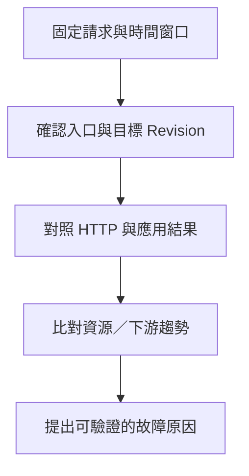

---
authors:
  - name: Charles Cao
tags:
  - Cloud Logging
  - Cloud Monitoring
  - Troubleshooting
---

# Cloud Logging、Cloud Monitoring 與故障判讀

使用者只會說「很慢」或「沒有回答」，但失敗可能發生在 Browser、雲端入口、worker、模型供應商或保存歷史的 API。維運的目的，是把症狀連回可驗證的失敗層，而非看到一個錯誤碼就調整所有資源。

## 學習目標

- [ ] 分辨請求日誌、應用日誌、平台日誌、稽核日誌與 metrics。
- [ ] 用同一時間窗口、Service／Revision 與請求識別資訊定位故障。
- [ ] 區分平台成功、應用成功與資料保存成功。

## 這篇筆記涵蓋的範圍

討論 GCP Logging／Monitoring 與員工 KM 的應用結果，不把 KM Monitor dashboard 當成 Google 監控服務。完整路徑見 [Firebase 與 CORS](firebase_hosting_request_paths.md)。

## 前置知識

理解 HTTP status、[Revision](cloud_run_core_concepts.md) 與 [Data API 保存邊界](storage_data_boundaries.md)。

## 基礎觀念：事件與時間序列各自回答不同問題

| 訊號 | 位於哪一層、為什麼需要 | 和誰互動、能回答什麼 |
|---|---|---|
| Request logs | Cloud Run 請求層自動產生 | Method、status、latency、Service／Revision；哪些請求失敗？ |
| Container logs | 應用寫到 stdout／stderr 等支援位置 | Flask／Gunicorn 的例外與業務摘要；程式走到哪一段？ |
| System logs | Cloud Run 平台層 | Instance 啟動、擴縮與容器異常；是不是啟動或記憶體問題？ |
| Audit logs | 控制層的資源管理操作 | 誰在何時改部署、IAM 或流量？不是逐筆員工對話紀錄 |
| Cloud Monitoring metrics | 時間序列與聚合 | Request 數、延遲、CPU、Memory、Instance；是否持續惡化？ |
| KM Monitor | 團隊的業務觀測應用 | 從 MongoDB／GCS 呈現使用及分析結果；可能有快取或靜態 snapshot |

Cloud Run 會收集 request、container、system logs。應用日誌若要與 request trace 關聯，需要傳遞並輸出適當 trace 欄位；不是寫了 `logger.info` 就自動得到完整分散式追蹤。[Cloud Run Logging](https://docs.cloud.google.com/run/docs/logging)

Metrics 可以發現趨勢，logs 可以定位個案。Dashboard 存在也不等於已建立 Alert Policy、通知對象或可用性目標；本輪未查驗 KM 的告警政策、uptime check 或 log sink。[Cloud Run Monitoring](https://docs.cloud.google.com/run/docs/monitoring)

## 本專案採用方式

| 觀測點 | 已核對的行為 | 程式／資料依據 |
|---|---|---|
| Model 回應 | 非成功可在 HTTP 200 內以 `return_code`、`data.is_error`、`error_layer` 表達 | Model `prod/app.py`；HTTP 契約 |
| Model 應用日誌 | 有摘要欄位 `return_code`、`is_error`、`time_cost`；詳細輸入輸出受程式開關控制 | 同上；不能假定所有欄位都是 `jsonPayload` |
| Monitor health | DB ping 例外仍包成成功 HTTP；`data.mongo` 才呈現連線問題 | Monitor `api/app.py::health` |
| Monitor refresh | 部分失敗記錄 exception，回 HTTP 502、failed 及最多 20 筆錯誤摘要 | 同上 `refresh_retrieval_traces` |
| 歷史效能觀測 | 2026-08-28 burst 報告保存 JMeter 與 Cloud Monitoring 數字 | loadtest `report/ai-asst-model-api_Flask-FastAPI_25-50-100users壓測報告_20260828.md` |

來源版本見 [GCP 資源地圖](gcp_resource_map.md)。此處核對程式與既有報告，沒有重新產生正式錯誤或執行壓測。

## 從症狀到故障層

| 症狀 | 先對照的證據 | 可能原因與判讀邊界 |
|---|---|---|
| Browser CORS 錯誤、API 沒收到 POST | Network 中 OPTIONS、Origin、實際 URL | 預檢失敗、URL 錯誤；也可能是入口拒絕未帶 CORS header，不能直接認定後端故障 |
| 401／403 | 回應 body、Cloud Run request log、有無應用 log | 區分 IAM 入口、KM JWT、session owner、Monitor allowlist／Scheduler SA；改 CORS 不會補權限 |
| HTTP 200，但 UI 無答案 | `return_code`、`is_error`、`error_layer` | 應用或上游失敗；只統計 HTTP 5xx 會漏報 |
| 回答出現，重新開啟後歷史消失 | Model final 與 Data append 的各自結果 | 可能是保存失敗／延遲，不應重新呼叫模型來修復保存狀態 |
| 429／A001 | Cloud Run status、精確上游錯誤與應用 envelope | 平台無可用容量和 Azure rate limit 是不同來源；全文找到數字 429 不代表限流 |
| 長時間後 504 | 請求經過哪個入口、client／Hosting／Run 各層期限 | Hosting 60 秒與 Run 300 秒不同；逾時不保證程式已停止所有工作 |
| worker timeout、5xx | Gunicorn 日誌、同 Revision 的長請求 | 應用 worker 被替換；先釐清等待下游還是計算阻塞 |
| Instance 重啟且 Memory 接近限制 | System logs、記憶體峰值、下載量 | 可能 OOM；程序與 `/tmp` 共用記憶體，平均值低也可能漏掉尖峰 |
| dashboard 數據沒變 | metrics cache 時間、snapshot／API 來源、refresh 摘要 | 快取舊資料或未涵蓋新 records，HTTP 成功不保證最新 |

## 如何讀懂查詢與圖表

```text title="Logs Explorer 篩選概念；SERVICE_NAME 替換為關注服務"
resource.type="cloud_run_revision"
resource.labels.service_name="SERVICE_NAME"
httpRequest.status>=500
```

這個條件只找平台 5xx，不涵蓋 HTTP 200 裡的 `A001`。應用錯誤需依實際輸出格式查 `textPayload` 或 `jsonPayload`，不要假設現行 Flask 已經輸出結構化 JSON。時間可先固定使用 UTC，再與 Asia/Taipei 報表換算；同時保留 Service、Revision、route、response UUID 或已去識別的 session 識別資訊。原始 token、對話全文與敏感欄位不適合加入可公開的故障案例。



讀延遲圖前先確認統計方法。2026-08-28 報告的 Cloud Monitoring 是 60 秒 alignment、每分鐘 P95；JMeter 是整個測試樣本的 P95。兩者窗口、採樣點與聚合方式不同，「各分鐘 P95 的最大值」也不是「全體請求 P95」。缺資料不能當成 0，更不能只憑 CPU 低就說服務沒有排隊。

## 設定改變會有什麼影響？

增加 log 詳細度有助除錯，也增加敏感資料曝露與寫入留存量；縮短 retention 或加 exclusion 節省容量，卻可能失去回溯事故所需證據。Alert threshold 太敏感會放大小樣本雜訊，太寬鬆則延遲發現問題；適合分開監看 HTTP 錯誤、應用錯誤、保存失敗和資料新鮮度，並定義有效觀測窗口。

變更 concurrency／workers 後，應對照同一負載與 Revision 的尾端延遲、錯誤率、Memory 與下游限流。若只是上游 Azure 429，增加 Cloud Run max instances 可能讓更多請求同時撞到同一配額。

??? question "目前是否已確認正式環境沒有錯誤？"
    本輪確認的是部署設定與歷史測試證據，未執行完整線上可用性稽核。2026-08-28 的 0 error 只能描述當時測試樣本，不能替代今天的日誌與告警觀測。

## 小結

先固定時間、入口與 Revision，再把 HTTP、應用結果和資料保存分開檢查。Logs 說明個案，metrics 說明趨勢，KM Monitor 補上業務資料；三者需要共同判讀。

## 延伸閱讀

- [Cloud Run：Logging](https://docs.cloud.google.com/run/docs/logging)
- [Cloud Run：Monitoring](https://docs.cloud.google.com/run/docs/monitoring)
- [Cloud Run：Audit logging](https://docs.cloud.google.com/run/docs/audit-logging)
- [Cloud Logging：Query language](https://docs.cloud.google.com/logging/docs/view/logging-query-language)
- [Image、回滾與設定漂移](revisions_rollbacks_drift.md)
