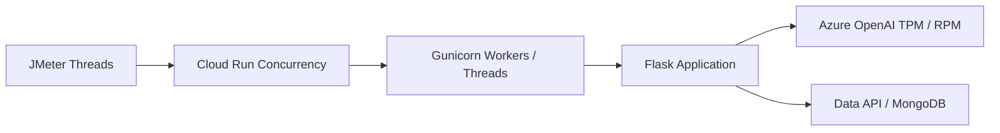

---
authors:
  - name: Charles Cao
tags:
  - Performance
  - JMeter
  - Capacity
---

# 效能測試與容量規劃學習路徑

服務「可以回應」不代表「能在多人同時使用時穩定回應」。容量規劃要同時觀察 Client 負載、Cloud Run、Application Server、資料庫與 Azure OpenAI；任何一層都可能先成為瓶頸。

## 學習目標

- [ ] 分辨 concurrent users、TPS、Latency、P95、P99 與 Error Rate。
- [ ] 理解 JMeter Thread Group、Ramp-up、Loop 與 Think Time。
- [ ] 知道 Cloud Run concurrency、Gunicorn threads 與 TPS 不是同一個數字。
- [ ] 說明 Azure OpenAI TPM、RPM 與 HTTP 429 如何限制整體吞吐量。

## 容量鏈路

| 指標 | 回答的問題 |
|---|---|
| Concurrent users | 同一時間有多少虛擬使用者正在執行流程？ |
| TPS／RPS | 每秒完成多少個 Transaction／Request？ |
| Average | 平均回應時間是多少？容易被極端值影響 |
| P95／P99 | 95%／99% 的 Request 在多少時間內完成？ |
| Error Rate | 失敗、Assertion 錯誤或 HTTP 非預期狀態的比例 |
| TPM／RPM | 模型 Deployment 每分鐘允許的 Token／Request 容量 |

## 建議閱讀順序

1. [JMeter、TPS、延遲與壓力測試](jmeter_load_testing.md)
2. [Azure OpenAI 的 TPM、RPM 與 HTTP 429](azure_openai_quota.md)
3. [Flask、FastAPI、Gunicorn 與 Uvicorn](flask_fastapi_gunicorn_uvicorn.md)
4. [Cloud Run：Service、Revision、Instance 與自動擴縮](cloud_run_core_concepts.md)

## 實際專案案例

!!! example "實際案例"
    Model API 的 JMeter 計畫以多個獨立 session 模擬多輪對話，並實際呼叫 Azure OpenAI。這不是免費的本機 benchmark：它會產生模型費用、消耗 TPM／RPM，也可能把 Cloud Run 擴張到 Max instances。

## 壓測前檢查

- [ ] 已定義成功條件：TPS、P95、P99、Error Rate 與 429 上限。
- [ ] 已確認測試會打到哪個環境，以及是否產生真實模型費用。
- [ ] 認證資料只透過 JMeter properties 或安全環境注入。
- [ ] 已安排 Ramp-up，不在第一秒一次啟動所有 users。
- [ ] 已知會團隊，並避開正式尖峰時段。

## 延伸閱讀

- [Apache JMeter：Test Plan](https://jmeter.apache.org/usermanual/test_plan.html)
- [Apache JMeter：Glossary](https://jmeter.apache.org/usermanual/glossary)
