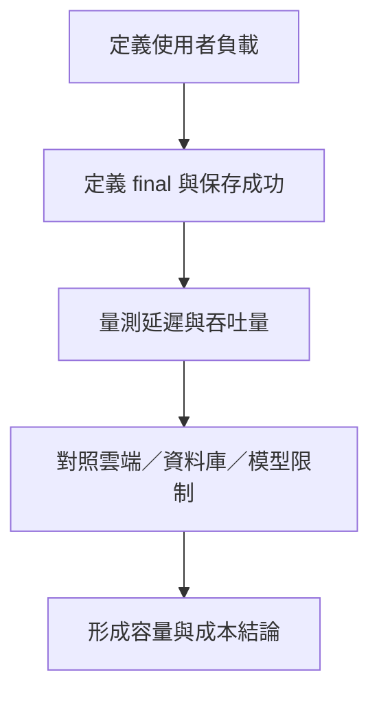

---
authors:
  - name: Charles Cao
tags:
  - Performance
  - JMeter
  - Capacity
---

# 效能測試與容量規劃學習路徑

服務「可以回應」不代表「能在多人同時使用時穩定回應」。容量規劃要同時觀察 Client 負載、Cloud Run、Application Server、資料庫與 Azure OpenAI；任何一層都可能先成為瓶頸。

## 學習目標

- [ ] 分辨 concurrent users、TPS、Latency、P95、P99 與 Error Rate。
- [ ] 理解 JMeter Thread Group、Ramp-up、Loop 與 Think Time。
- [ ] 知道 Cloud Run concurrency、Gunicorn threads 與 TPS 不是同一個數字。
- [ ] 說明 Azure OpenAI TPM、RPM 與 HTTP 429 如何限制整體吞吐量。
- [ ] 分辨 JSON／SSE 完成、首內容時間與歷史保存，並把容量和成本分開估算。

## 容量鏈路

```mermaid
flowchart TB
    Workload["定義使用者負載"] --> Contract["定義 final 與保存成功"]
    Contract --> Measure["量測延遲與吞吐量"]
    Measure --> Limits["對照雲端／資料庫／模型限制"]
    Limits --> Capacity["形成容量與成本結論"]
```

| 指標 | 回答的問題 |
|---|---|
| Concurrent users | 同一時間有多少虛擬使用者正在執行流程？ |
| TPS／RPS | 每秒完成多少個 Transaction／Request？ |
| Average | 平均回應時間是多少？容易被極端值影響 |
| P95／P99 | 95%／99% 的 Request 在多少時間內完成？ |
| Error Rate | 失敗、Assertion 錯誤或 HTTP 非預期狀態的比例 |
| TPM／RPM | 模型 Deployment 每分鐘允許的 Token／Request 容量 |
| 首內容／final／append | 使用者何時開始看到內容、何時完成回答、何時保存成功？ |
| 資源計費單位 | 相同交易量會消耗多少運算、儲存、傳輸與模型用量？ |

## 建議閱讀順序

1. [JMeter、TPS、延遲與壓力測試](jmeter_load_testing.md)
2. [Azure OpenAI 的 TPM、RPM 與 HTTP 429](azure_openai_quota.md)
3. [Flask、FastAPI、Gunicorn 與 Uvicorn](flask_fastapi_gunicorn_uvicorn.md)
4. [Cloud Run：Service、Revision、Instance 與自動擴縮](cloud_run_core_concepts.md)
5. [GCP 成本與整體容量](gcp_cost_capacity.md)
6. [Logging、Monitoring 與故障判讀](logging_monitoring_troubleshooting.md)

## 實際專案案例

!!! example "實際案例"
    舊 JMeter 計畫只重複提問，未 append 歷史；新版才加入 JSON／SSE final → Data API 保存的持久化多輪。2026-08-28 的 394 次成功 Model request 包含 382 次 runtime A/B 和 12 次單人持久化測試，不能稱為 100-session 多輪穩態。詳細條件與原始資料依據見 [JMeter 筆記](jmeter_load_testing.md)。

## 正式壓測的風險邊界

負載模型、成功條件、環境與版本必須成組解讀。正式測試會消耗 Azure 配額、GCP 用量，也可能寫入 MongoDB；隔離的實驗 Cloud Run 仍可能共用正式模型 deployment 與資料庫。是否採 burst、穩態或韌性重試情境，取決於要回答的問題；認證資料與測試 session 應有各自的保存及清理邊界。

## 延伸閱讀

- [Apache JMeter：Test Plan](https://jmeter.apache.org/usermanual/test_plan.html)
- [Apache JMeter：Glossary](https://jmeter.apache.org/usermanual/glossary)
