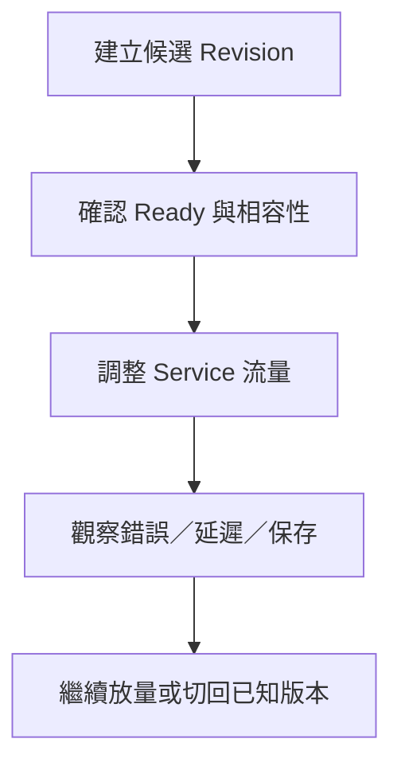

---
authors:
  - name: Charles Cao
tags:
  - Revision
  - Rollback
  - Configuration
---

# Image、Revision、流量切換、回滾與設定漂移

回滾不是把時間倒轉，而是讓後續請求改由某個已知版本處理。Image、Revision、Service 流量、Secret 與資料庫各有自己的版本；只恢復其中一項，未必恢復整個使用情境。

## 學習目標

- [ ] 分辨 tag、digest、Revision 與 traffic 的責任。
- [ ] 解釋新版本 Ready、接收流量與功能正常的差別。
- [ ] 指出回滾不會自動恢復的 Secret、前端、IAM 與持久資料。

## 這篇筆記涵蓋的範圍

接續 [Image 與 Artifact Registry](docker_artifact_registry.md) 和 [Cloud Run 基礎](cloud_run_core_concepts.md)，不重講 Docker build。本篇深入版本切換與設定追溯，區分 Repository 宣告和線上實際狀態。

## 前置知識

理解 [設定與 Secrets](configuration_and_secrets.md)、[資料邊界](storage_data_boundaries.md)。

## 基礎觀念：四種識別不能互相替代

| 名詞 | 是什麼、位於哪一層 | 和誰互動、為什麼需要 |
|---|---|---|
| Git commit | 程式來源版本 | 追溯 Dockerfile、依賴與 workflow |
| Image tag／digest | Registry 產物名稱／內容識別 | tag 易讀但可能被移動；digest 精確指向建置內容 |
| Revision | Cloud Run 不可變執行版本 | 包含 Image 與該版本的資源、啟動命令、env／Secret 引用等 |
| Service traffic | 對穩定入口的流量分配 | 決定新請求由哪個 Revision 接收；可分配比例或切回舊版本 |

以 tag 部署時 Cloud Run 解析為特定 digest；把 Registry 的同名 tag 改指其他 Image，不會原地替換既有 Revision 的程式。變更 revision template 會形成新版本，而純 traffic 調整不是重建 Image。[Cloud Run 部署 Image](https://docs.cloud.google.com/run/docs/deploying)、[Revisions](https://docs.cloud.google.com/run/docs/managing/revisions)

## 流量切換如何與 Runtime 互動？

這是版本發布的概念流程，不代表 KM 已有自動 canary。Ready 表示平台認為可以接收流量，不是完整問答與保存測試通過。流量分配是請求分布，不應假設同一員工每輪一定落在相同 Revision；多輪歷史需存在共享的 Data API／MongoDB，且新舊版本都讀得懂。[Cloud Run 流量遷移與回滾](https://docs.cloud.google.com/run/docs/rollouts-rollbacks-traffic-migration)

切換會逐步生效，既有長請求或 SSE 連線也可能仍在舊版本完成；觀測窗口內混合兩個 Revision 不一定是切換失敗。使用 tag URL 的測試流量與穩定 Service 入口分配也應分開理解。

## 實際設定查證

| 查證項目 | 現行結論 | 來源 | 查證日期 |
|---|---|---|---|
| Model 發布 | Image tag 使用 commit SHA 前七碼，部署 `prod/Dockerfile`；無明列比例放量流程 | Model `.github/workflows/deploy.yml` | 2026-09-07 |
| Model 線上版本 | `00057-hd5` 接收 100%，tag `2aed566`；本機 HEAD 是 `5c7064c` | Cloud Run Service；本機 Git | 2026-09-07 |
| Data 線上版本 | `00008-5f8` 接收 100%，tag 與本機皆為 `f208ae5` | Cloud Run Service；本機 Git | 2026-09-07 |
| Monitor 線上版本 | `00038-b55` 接收 100%，tag `4881dab`；本機 HEAD 是 `92c0695` | Cloud Run Service；本機 Git | 2026-09-07 |
| Data concurrency | workflow 沒明列，線上為 80 | Data deploy workflow；Cloud Run template | 2026-09-07 |
| 擴縮層次 | Model／Data／Monitor Service max 為 20；各 Revision template max 為 2／3／3 | Service 與 template annotations | 2026-09-07 |
| Secret | 三個 Service 的 Secret 環境變數引用都使用 `latest` | Cloud Run template，唯讀引用，不取 Secret 值 | 2026-09-07 |

本機 commit 比 Image tag 新，只代表來源與發布時間有差距，不能直接斷言部署失敗。Monitor 的後續 commit 可能只改 web；本輪引用的 Monitor API 檔案在兩版之間無差異。Model 的 ASGI 新程式則不代表主部署已改用 ASGI。完整來源基準見 [GCP 資源地圖](gcp_resource_map.md)。

## 設定漂移：宣告、部署與依賴必須一起比

設定漂移（Configuration drift）是期望設定與執行設定逐漸分開的現象，可能來自 Console 手動調整、不同 workflow、未宣告的預設值或外部依賴更新。查到差異後，要辨認它是刻意覆寫、版本時間差，還是遺漏管理的欄位。

| 要比較的範圍 | KM 的具體問題 | 改變後的影響 |
|---|---|---|
| Image、command、args | 相同 ASGI experiment Image 可被覆寫成 Gunicorn 啟動 | 只看 Image 名稱不足以推斷 Runtime |
| CPU、Memory、concurrency、timeout | Workflow 是否完整宣告？與 Revision 實值是否一致？ | 延遲、記憶體與負載不同，歷史壓測不能直接沿用 |
| Service／Revision scaling | Service max 20 與 Revision max 2／3 同時存在 | 作用範圍不同；不能擇一當整個系統的容量 |
| env／Secret 引用 | `--set-env-vars` 表達整組設定；未列欄位可能被移除 | Console 補上的值可能在下次部署失去；Secret 引用需分開比對 |
| Hosting release 與 Runtime override | 前端 URL／串流開關、Monitor build commit 是否同一組？ | HTML、JS 與 API 契約可能不相容 |
| 外部狀態 | JWT Secret 版本、IAM、GCS object、MongoDB schema | 同 Revision 也可能呈現不同結果 |

同時設定 Service 與 Revision max 時，有效上限受兩者較小值限制；Service max 在流量分割時還會依比例分配。以目前單一 Revision 接收 100% 的 Model 為例，20 與 2 並存時不能當成可擴到 20。這些限制也不是總費用硬上限。[Cloud Run 最大實例數](https://docs.cloud.google.com/run/docs/configuring/max-instances)

## 回滾可以恢復什麼，不能恢復什麼？

| 恢復目標 | 切回舊 Revision 的效果 | 仍需另外對照 |
|---|---|---|
| API 程式與該 Revision 設定 | 後續分配的請求使用舊 Image、command、env 引用 | 舊版本是否還能讀新格式資料 |
| Secret 值 | 只帶回當時的引用，不保證回到舊 Secret 內容 | `latest` 對新 Instance 解析的版本可能已改 |
| 已保存對話／GCS 檔案 | 不會復原或刪除 | 資料遷移、誤寫與備份恢復要有獨立方案 |
| Firebase 靜態網站 | 不會自動回到舊前端 | 前端 release、rewrite 與相容性需獨立確認 |
| IAM／Scheduler／告警 | 不會自動還原 | 這些不是 Revision template 內的同一組狀態 |

Secret 作為環境變數時，在 Instance 啟動前解析；官方建議鎖定數字版本。KM 使用 `latest`，所以舊 Revision 新啟動的 Instance 也可能取得新值，既有 Instance 則保留已載入值。Secret volume 的讀取生命週期不同，不要把兩種形式混寫。[Cloud Run Secret 設定](https://docs.cloud.google.com/run/docs/configuring/services/secrets)

Firebase 有 `pinTag` 可讓動態 rewrite 與特定 Cloud Run Revision 連動，但目前 Frontend `/eval` rewrite 沒有宣告它；不能假定回滾 Hosting 自動回滾 Eval API。[Firebase Hosting rewrite](https://firebase.google.com/docs/hosting/full-config)

## 風險邊界與恢復觀察

流量回切之後，要依 Revision 對照 HTTP 與應用錯誤率、P95、Data append、登入相容性及舊新資料讀取。若故障根因是 MongoDB、Secret 或 Azure 配額，單純回切 Image 可能沒有改善。候選版本、Image digest、前端版本、設定引用與資料相容性共同構成可 review 的恢復依據。

??? question "重新 build 同一個 commit 就等於精確回滾嗎？"
    不一定。基底 Image、未鎖定依賴或建置環境可能改變。同 commit 重建的 digest 未必相同；回到已知 Revision 比單憑 commit 名稱更能保留原執行產物，但仍受外部狀態影響。

## 小結

Image 管產物，Revision 管執行版本，traffic 管入口分配，資料與外部權限另有生命週期。可預期的回滾來自這幾層的一致記錄，而不是只保存一個 tag。

## 延伸閱讀

- [Cloud Run：Revision 管理](https://docs.cloud.google.com/run/docs/managing/revisions)
- [Cloud Run：流量切換與回滾](https://docs.cloud.google.com/run/docs/rollouts-rollbacks-traffic-migration)
- [Cloud Run：Secret 版本](https://docs.cloud.google.com/run/docs/configuring/services/secrets)
- [Cloud Run：最大實例數](https://docs.cloud.google.com/run/docs/configuring/max-instances)
