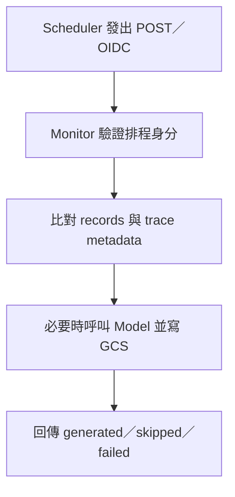

---
authors:
  - name: Charles Cao
tags:
  - Cloud Scheduler
  - Monitor
  - Operations
---

# Cloud Scheduler 與 KM Monitor 排程

Cloud Scheduler 決定「什麼時間呼叫哪個目標」，KM Monitor 決定「收到請求後做哪些工作」。把排程時間、身分驗證、應用工作與快取拆開，才能解釋排程成功為何不一定代表資料已經更新。

## 學習目標

- [ ] 讀懂 cron、時區、attempt deadline 與重試責任。
- [ ] 區分健康暖機、統計快取更新與 trace 預先計算。
- [ ] 判斷排程呼叫的身分、資料新鮮度與失敗邊界。

## 這篇筆記涵蓋的範圍

聚焦 Cloud Scheduler → Monitor HTTP 端點，以及 Monitor 對 Model、MongoDB、Cloud Storage 的依賴。分析 trace 在這裡只是可重建 JSON 產物，不展開檢索流程。

## 前置知識

先讀 [IAM 與 OIDC](iam_service_accounts_wif_jwt.md)、[資料與快取邊界](storage_data_boundaries.md)。

## 基礎觀念：排程器不是常駐在 Container 裡的鬧鐘

Cloud Run Instance 可能縮到零或被替換，所以在 Web process 裡放一個定時迴圈，既可能漏跑，也可能因多個 Instance 重複執行。Cloud Scheduler 把時鐘放在服務外部，用 cron 與時區定時送出請求。它是至少一次投遞（at-least-once），執行端應考慮重複呼叫。[Cloud Scheduler 概觀](https://docs.cloud.google.com/scheduler/docs/overview)

```text title="cron 五欄：分鐘、小時、日期、月份、星期"
0 * * * *       每小時的第 0 分鐘
*/5 * * * *     每 5 分鐘
```

`timeZone` 決定如何解讀 cron，與日誌保存的 UTC 時戳不同。Attempt deadline 是 Scheduler 等待某次 HTTP 回應的期限；Cloud Run timeout、Gunicorn worker timeout、下游 HTTP timeout 是另外幾個邊界。任何一層提前結束，都可能讓排程認為失敗，而後端部分工作已完成。[Scheduler 排程格式](https://docs.cloud.google.com/scheduler/docs/configuring/cron-job-schedules)

## 實際設定查證

下表為 2026-09-07 Cloud Scheduler 與 Cloud Run 唯讀設定，不是文件中的建議 cron。

| 查證項目 | 現行結論 | 來源 | 查證日期 |
|---|---|---|---|
| trace refresh | Job 名稱 `monitor-retrieval-traces-daily`，cron 卻是 `0 * * * *`，每小時執行 | Scheduler Job | 2026-09-07 |
| refresh target | `POST /monitor/admin/retrieval-traces/refresh`，ENABLED、Asia/Taipei、OIDC、deadline 900 秒 | Scheduler Job | 2026-09-07 |
| 健康暖機 | `monitor-api-warmer`，`*/5 * * * *`，GET `/monitor/health`，ENABLED、Asia/Taipei、deadline 180 秒 | Scheduler Job | 2026-09-07 |
| Monitor 平台 | Cloud Run timeout 900 秒、1 CPU／1 GiB、concurrency 80、Revision max 3 | Cloud Run Service | 2026-09-07 |
| 應用執行器 | 1 sync Gunicorn worker，timeout 120 秒 | Monitor `api/Dockerfile`，線上 tag 對應版本與本機相同 | 2026-09-07 |
| 重試設定 | 回傳 min backoff 5 秒、max backoff 3600 秒、max doublings 5；max retry duration 0 秒；未明列 retry count | Scheduler Job `retryConfig` | 2026-09-07 |

Job 名稱是標籤，cron 才決定頻率。重試退避參數存在，也不代表一定會額外重試；要一起解讀 retry count 與 duration 的預設值。官方定義兩者皆為 0 時，不做額外 retry，等待下一個排程；本次回傳沒有顯式 retry count，不能把應用的「排程將重試」訊息當作已配置重試的證據。[Cloud Scheduler RetryConfig](https://docs.cloud.google.com/scheduler/docs/reference/rest/v1/projects.locations.jobs#RetryConfig)

## 本專案採用方式：兩個 Job 做不同的事

| 呼叫 | 程式實際工作 | 它不能保證什麼 |
|---|---|---|
| GET `/monitor/health` | MongoDB ping，回傳 `status`、`mongo`、cache TTL | 不更新 metrics、不跑 trace、不保證所有 Instance 暖機 |
| GET `/monitor/metrics` | 依 TTL 重用或重建程序聚合快取；`refresh=1` 可略過快取 | 這不是上述 Scheduler refresh 端點 |
| POST admin trace refresh | 讀取 records、比對 metadata、呼叫 Model、寫 trace 到 GCS | 不代表重新建立所有業務資料或切換 Model 版本 |

程式依據為 Monitor `api/app.py`、`loaders.py`、`trace_store.py`。`_require_scheduler` 驗證 Google token 與 audience，再比對指定 SA email；缺少設定回 503，token 驗證失敗回 401，非指定 SA 回 403。健康端點本身沒有這個 decorator，即使 Job 附 OIDC token，也不能說兩個端點都有同樣的應用身分檢查。



這張流程圖由上往下讀，是一次排程工作。Monitor 呼叫 Model 時另外使用 KM 應用 token，不會把 Scheduler 的 Google token 當成員工 JWT 傳下去。

## 增量處理與資料新鮮度的限制

refresh 比對 `query_hash` 與 `graph_version`，相同就 skipped；不匹配才重算。`force=1` 略過既有 trace 快取，`limit` 限制的是成功 generated 數，並非掃描總筆數或失敗筆數。部分紀錄失敗時，程式保留已完成的 GCS 寫入，回 HTTP 502 與摘要，下次再依 metadata 略過成功項目。

這提供部分重跑能力，但不是 exactly-once：原始碼沒有分散式鎖或物件寫入 generation 前置條件，重複呼叫仍可能重算、重寫。更重要的是 admin refresh 只在 `_cache.records` 為空時載入 MongoDB；已有 records 時不檢查 metrics TTL。因此「每小時執行成功」不保證涵蓋最新對話，必須一起看 records 新鮮度和生成時間。

## 設定改變會有什麼影響？

提高頻率會增加 HTTP、MongoDB、Model 與 GCS 工作，也可能減少 Monitor 縮到零的機會。暖機每五分鐘執行，是一種主動流量，並不是平台承諾的 minimum instances。

把 Cloud Run timeout 提高到 900 秒，並沒有同步放寬目前單一 sync worker 的 120 秒 Gunicorn timeout。長 refresh 可能先被 worker 終止，留下部分產物；同時佔用單一 worker，也可能拖慢 dashboard 與 health。這是設定風險，不是本輪已重現的故障。變更前後要觀察工作耗時、failed、重複計算與使用者延遲，而非只看 HTTP 是否送達。

`RETRIEVAL_GRAPH_VERSION` 線上引用為 `2026-07-16-v1`，它是快取標籤，不能由字串日期推斷資料過期，也不能證明它與 Model 載入版本相符。更換標籤會改變重算範圍；模型資料更新卻未同步標籤，則可能繼續重用舊 trace。

??? question "Scheduler 顯示成功，就能說 MongoDB 正常嗎？"
    不一定。Monitor health 捕捉 MongoDB ping 例外後仍回 HTTP 200；要讀取 `data.mongo`。排程成功只證明這次 HTTP 目標按其規則回應，還要解讀應用結果與資料時間。

## 小結

排程維運要同時讀 cron、身分、期限、工作結果和快取新鮮度。排程名稱、HTTP 200 或長 timeout，任何一項都不足以代表整項工作可靠完成。

## 延伸閱讀

- [Cloud Scheduler：HTTP target authentication](https://docs.cloud.google.com/scheduler/docs/http-target-auth)
- [Cloud Scheduler：cron 與時區](https://docs.cloud.google.com/scheduler/docs/configuring/cron-job-schedules)
- [Cloud Scheduler：RetryConfig](https://docs.cloud.google.com/scheduler/docs/reference/rest/v1/projects.locations.jobs#RetryConfig)
- [Logging、Monitoring 與故障判讀](logging_monitoring_troubleshooting.md)
