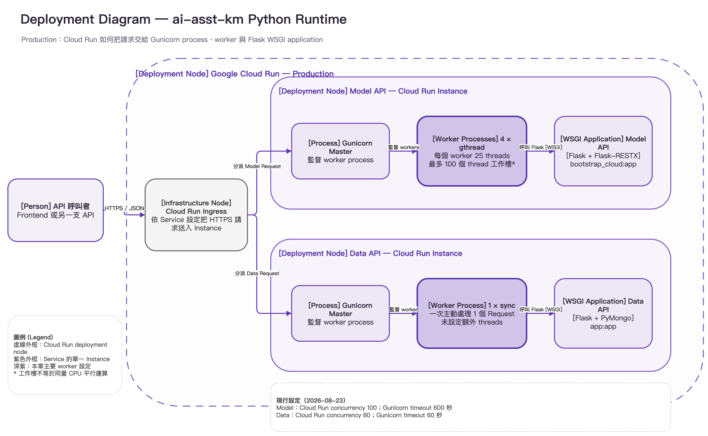

---
authors:
  - name: Charles Cao
tags:
  - Flask
  - FastAPI
  - Gunicorn
  - Uvicorn
---

# Gunicorn 與 Uvicorn 架構案例

[Flask、FastAPI、Gunicorn 與 Uvicorn](flask_fastapi_gunicorn_uvicorn.md) 講了 Framework、Interface、Server 三層的通用原理。這篇把那套原理套進 `ai-asst-km` 的三個服務：Model API、Data API，以及本站 AI 助理後端，看它們實際的技術組合、啟動指令與容量設定。

## 學習目標

- [ ] 讀懂三個服務的完整啟動指令，逐段說明每個參數的意義。
- [ ] 說出 Model API 為什麼用 4 個 `gthread` workers、Data API 為什麼用 1 個 `sync` worker、AI 助理後端為什麼是單一 Uvicorn process。
- [ ] 對照 Cloud Run concurrency 與 Application Server 拓撲，判斷平台上限與 Application 容量是否一致。
- [ ] 看懂 Cloud Run 與 Application Server 兩層 timeout 的差異與風險。

## 這篇筆記涵蓋的範圍

<figure markdown="span">
  
  <figcaption>兩支 API 都是 Flask + Gunicorn，但 Model API 與 Data API 的 worker 拓撲不同</figcaption>
</figure>

[下載 draw.io 可編輯原始檔](assets/diagrams/source/04_cloud_run_gunicorn_flask_runtime.drawio)

這是一張 **Deployment Diagram**，範圍是正式環境中兩支 API 的單一 Cloud Run Instance。閱讀順序由左至右：Cloud Run Ingress 收到 Request，交給 Instance 內的 Gunicorn master；master 管理 worker process，worker 再透過 WSGI 呼叫 Flask Application。

圖中只畫「服務如何啟動與接住 Request」，不重複完整系統邊界，也沒有畫 Flask 函式後面的 Azure OpenAI 或 MongoDB 呼叫。本站 AI 助理後端是單一 Uvicorn process，拓撲比兩支 Flask API 單純，因此沒有另外畫圖，直接用下方表格說明。

## 前置知識

先讀 [Flask、FastAPI、Gunicorn 與 Uvicorn](flask_fastapi_gunicorn_uvicorn.md)，能說出 `module:object`、`sync`／`gthread`、WSGI／ASGI 的差別。若對 Cloud Run 的 Instance 還不熟，可以先讀 [Cloud Run 的 Service、Revision 與 Instance](cloud_run_core_concepts.md)。

## 三個服務的技術組合總覽

| 服務 | 完整組合 | Application object | 執行模型 | 設定依據 |
|---|---|---|---|---|
| Model API | Gunicorn → WSGI → Flask | `bootstrap_cloud:app` | 4 個 `gthread` workers，每個 worker 25 threads | `ai-asst-model-api/prod/Dockerfile` |
| Data API | Gunicorn → WSGI → Flask | `app:app` | 1 個 `sync` worker | `ai-asst-data-api/Dockerfile` |
| 本站 AI 助理後端 | Uvicorn → ASGI → FastAPI | `chat_server:app` | 單一 Uvicorn process，未設定 `--workers` | `backend/Dockerfile` |

## 逐段讀懂啟動命令

### Model API

正式分支目前使用：

```dockerfile title="ai-asst-model-api/prod/Dockerfile"
CMD gunicorn -w 4 -k gthread --threads 25 --timeout 600 \
    -b 0.0.0.0:${PORT:-6001} bootstrap_cloud:app
```

| 片段 | 意義 |
|---|---|
| `gunicorn` | 啟動 Gunicorn master process |
| `-w 4` | 建立 4 個 worker processes |
| `-k gthread` | 每個 worker 使用 thread pool |
| `--threads 25` | 每個 worker 建立 25 個 Request threads |
| `--timeout 600` | worker 沉默超過 600 秒時，由 master 終止並重啟 |
| `-b 0.0.0.0:${PORT:-6001}` | 接受 Container 外部連線；Cloud Run 注入 `PORT`，本機預設 6001 |
| `bootstrap_cloud:app` | Import `bootstrap_cloud` module，再取得其中名為 `app` 的 WSGI Application |

這個拓撲共有 `4 × 25 = 100` 個 thread 工作槽。Repository 註解記錄這是經過內網 JMeter 驗證的組合；Cloud Run workflow 同時明確設定 `--concurrency 100`。

!!! example "為什麼是 gthread？"
    Model API 會等待外部模型與檢索相關 I/O，現行設定以 `gthread` 增加等待期間可安排的 Request 數（原理見 [Flask、FastAPI、Gunicorn 與 Uvicorn](flask_fastapi_gunicorn_uvicorn.md) 的 I/O 等待章節）。它仍只有 1 vCPU，因此 100 個工作槽不代表能同時進行 100 份 CPU 平行運算。

### Data API

正式分支目前使用：

```dockerfile title="ai-asst-data-api/Dockerfile"
CMD gunicorn -w 1 -k sync --timeout 60 \
    -b 0.0.0.0:${PORT:-6002} app:app
```

| 片段 | 意義 |
|---|---|
| `-w 1` | 只有 1 個 worker process |
| `-k sync` | 一次主動處理 1 個 Request |
| 未設定 `--threads` | 維持 1 個 thread；對 sync worker 不增加併發能力 |
| `--timeout 60` | sync worker 沉默超過 60 秒時會被終止並重啟 |
| `app:app` | Import `app.py`，取得其中的 Flask `app` object |

Data API 的單一 Instance 目前只有一個 Gunicorn Request 工作槽。它的 Request 通常較短，但仍需考慮 MongoDB 查詢、Connection Pool 與突發流量。

### 本站 AI 助理後端（Uvicorn）

`ai-deploy-docs` 這個 Repository 自己的 Chatbot 後端使用：

```dockerfile title="backend/Dockerfile"
CMD ["sh", "-c", "uvicorn chat_server:app --host 0.0.0.0 --port ${PORT:-8000}"]
```

| 片段 | 意義 |
|---|---|
| `uvicorn` | 啟動 Uvicorn |
| `chat_server:app` | Import `chat_server` module，取得其中名為 `app` 的 ASGI Application |
| `--host 0.0.0.0` | 接受 Container 外部連線 |
| `--port ${PORT:-8000}` | Cloud Run 注入 `PORT`，本機預設 8000 |

指令沒有帶 `--workers`，代表這個服務目前是單一 process、單一 event loop，沒有額外的多 worker 平行度；水平擴展靠 Cloud Run 增加 Instance 數量，而不是 Container 內的多 worker。

## Cloud Run concurrency 與 Application Server 拓撲對照

| Service | Cloud Run concurrency | Application Server 拓撲 | 可直接讀出的工作槽 | 判讀 |
|---|---:|---|---:|---|
| Model API | 100 | 4 gthread workers × 25 threads | 100 | 平台上限與 thread 工作槽對齊；仍須以壓測確認 1 vCPU、記憶體與下游服務能承受 |
| Data API | 80 | 1 sync worker | 1 | 平台上限高於 Application 工作槽；不一定立即出錯，但應用壓測確認排隊、延遲與擴縮行為 |
| 本站 AI 助理後端 | 10 | 單一 Uvicorn process（無固定 thread 工作槽，靠 event loop 切換等待中的 async 工作） | 沒有像 `gthread` 那樣的固定數字 | Cloud Run concurrency 是目前唯一明確的併發上限，實際能撐多少仍取決於 Route 是否都是真正 async |

!!! warning "這是容量檢查點，不是直接改設定的結論"
    Data API 的 `80 對 1` 是目前可查證的設定差異。是否改成較低 Cloud Run concurrency、增加 Gunicorn workers，或改用 gthread，必須先測量 Request 延遲、MongoDB Connection Pool、CPU、記憶體與成本；這篇不直接修改正式服務。

### 兩層 timeout 對照

| Service | Cloud Run Request timeout | Application Server timeout | 先記住的重點 |
|---|---:|---:|---|
| Model API | 300 秒 | 600 秒（Gunicorn） | Cloud Run 可能先中斷對 Client 的連線；Container 內的工作不一定立刻停止 |
| Data API | 60 秒 | 60 秒（Gunicorn） | 兩層數字相同，但 Client、資料庫與程式內部仍可能有更短 timeout |
| 本站 AI 助理後端 | 90 秒 | 未另外設定（Uvicorn 指令沒有帶等同 Gunicorn `--timeout` 的存活判斷參數） | 只有平台層 timeout 會中斷對 Client 的連線；Container 內沒有額外一層存活機制 |

## 實際設定查證

| 查證項目 | 現行結論 | 來源 | 查證日期 |
|---|---|---|---|
| Model Framework／Server | Flask 3.1 + Flask-RESTX + Gunicorn 23 | `ai-asst-model-api/prod/requirements.txt` | 2026-08-23 |
| Model Gunicorn | 4 gthread workers、每個 25 threads、600 秒 timeout | `ai-asst-model-api/prod/Dockerfile` | 2026-08-23 |
| Model Cloud Run | concurrency 100、1 vCPU、300 秒 Request timeout | Model deploy workflow；Cloud Run Service 唯讀查詢 | 2026-08-23 |
| Data Framework／Server | Flask 3.1 + Gunicorn 23 | `ai-asst-data-api/requirements.txt` | 2026-08-23 |
| Data Gunicorn | 1 sync worker、未設定額外 threads、60 秒 timeout | `ai-asst-data-api/Dockerfile` | 2026-08-23 |
| Data Cloud Run | concurrency 80、1 vCPU、60 秒 Request timeout | Data deploy workflow；Cloud Run Service 唯讀查詢 | 2026-08-23 |
| 本站 Chatbot Server | Uvicorn 直接執行 `chat_server:app`，未帶 `--workers` | `backend/Dockerfile` | 2026-08-24 |
| 本站 Chatbot Cloud Run | 1 vCPU、512Mi 記憶體、concurrency 10、max-instances 3、90 秒 Request timeout | `.github/workflows/deploy-chatbot.yml` | 2026-08-24 |

## 常見問題

??? question "`4 workers × 25 threads` 就代表每秒一定能處理 100 個 Request 嗎？"
    不代表。100 是同一 Instance 可安排的 thread 工作槽，不是每秒吞吐量。Request 時間、CPU、記憶體、GIL、Lock、外部 API rate limit 與 Connection Pool 都會影響實際結果。

??? question "Data API 的 Cloud Run concurrency 80 是從哪裡來的？"
    Data deploy workflow 沒有明確宣告 `--concurrency`；80 是對正式 Cloud Run Service 的唯讀查詢結果（查證日期 2026-08-23）。這也示範了為什麼只看 workflow 可能看不到完整現況。

??? question "為什麼本站 AI 助理後端不用多個 workers？"
    目前沒有明確設定依據能查證這個決策的具體原因；可以合理推測的方向是：Cloud Run concurrency 上限只有 10、`max-instances` 也只有 3，目前的流量與 I/O 等待特性可能還不需要額外的 process 平行度。若之後要調整，仍應先用負載測試找出瓶頸（CPU、記憶體，還是等待外部 API），再決定加 `--workers`、改用 Gunicorn 管理多個 Uvicorn worker，或維持現狀，而不是預設「多一定比較好」。

## 小結

- Model API 是 4 gthread workers × 25 threads；Data API 是 1 sync worker；本站 AI 助理後端是單一 Uvicorn process，三者拓撲都不同。
- `module:object` 在三個服務分別是 `bootstrap_cloud:app`、`app:app`、`chat_server:app`，寫法一致，指向的程式碼不同。
- Cloud Run concurrency（100／80／10）與 Application Server 拓撲要一起看，才能判斷平台上限與 Application 實際容量是否對齊。
- 兩層 timeout（Cloud Run 與 Gunicorn／Uvicorn）獨立設定，數字不一定相等，但要一起檢視。

## 延伸閱讀

- [Flask、FastAPI、Gunicorn 與 Uvicorn](flask_fastapi_gunicorn_uvicorn.md)：這篇案例對應的通用講義。
- [Cloud Run 學習路徑](cloud_run_overview.md)
- [Google Cloud：Cloud Run Maximum Concurrent Requests](https://docs.cloud.google.com/run/docs/about-concurrency)
- [Google Cloud：Cloud Run Request Timeout](https://docs.cloud.google.com/run/docs/configuring/request-timeout)
