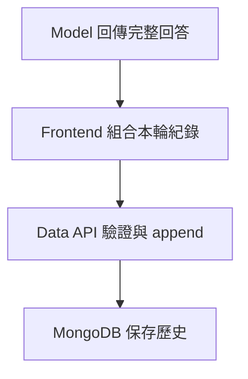

---
authors:
  - name: Charles Cao
tags:
  - Cloud Storage
  - MongoDB
  - Data
---

# Cloud Storage、Container 暫存空間與 MongoDB 的資料邊界

「資料在雲端」不足以判斷它會不會消失。重啟 Container、重新部署、覆寫物件與刪除 session，各自影響不同資料；先認清哪份是正式紀錄、哪份只是可重建快取。

## 學習目標

- [ ] 分辨 Image 內檔案、執行期檔案、物件儲存與資料庫。
- [ ] 解釋誰負責寫入對話、下載文件與保存分析 trace。
- [ ] 推論擴縮、回滾、快取與資料保留設定的影響。

## 這篇筆記涵蓋的範圍

討論 Model／Data／Monitor 之間的資料責任與生命週期，不展開檢索演算法或內部文件內容。[GCP 資源圖](gcp_resource_map.md)提供部署位置，本篇回答資料在哪一層被保存。

## 前置知識

先理解 [Image 與 Container](docker_artifact_registry.md) 的差異，以及 [Runtime 請求流程](runtime_request_flow.md) 中的 Frontend append。

## 基礎觀念：四種儲存承諾

| 類型 | 是什麼、為何需要 | 生命週期 | 適合保存 |
|---|---|---|---|
| Image 內檔案 | 建置產物中打包的唯讀基準內容 | 跟 Image digest 一起版本化 | 程式、依賴、隨版本交付的資源 |
| Container 可寫層／程序記憶體 | 執行時建立的本機資料 | Instance／process 結束即可能失去；不同實例不共享 | 下載快取、中間檔、聚合快取 |
| Cloud Storage | 以 Bucket、object name、generation 識別的物件儲存 | 獨立於 Container，依物件覆寫、刪除與政策改變 | 文件、JSON 產物與可下載檔案 |
| MongoDB | 可查詢、索引與更新的文件資料庫 | 獨立於 API Instance，由資料操作與保留政策管理 | session、對話、使用者歸屬、feedback |

Cloud Run 預設可寫檔案系統使用 Instance 記憶體，資料不跨 Instance 停止而保存；下載大量檔案也可能耗盡應用可用記憶體。這裡指 KM 使用的預設檔案系統，不能外推到另行配置的磁碟或 volume。[Cloud Run Container contract](https://docs.cloud.google.com/run/docs/container-contract)

Cloud Storage object 的名稱可以包含 `/`；在 flat namespace 中它是名稱前綴，不等於一般磁碟目錄。Object generation 可辨認某次寫入，但程式若只按固定名稱讀取，並沒有自動鎖住特定 generation。[Cloud Storage objects](https://docs.cloud.google.com/storage/docs/objects)

## 本專案採用方式

來源版本與查證範圍見 [GCP 資源地圖](gcp_resource_map.md)。2026-09-07 已確認 Monitor 線上有文件及 trace Bucket 引用；本輪沒有查物件內容、保留政策或 MongoDB 實際帳戶權限。

| 資料 | KM 的讀寫責任 | 程式／設定依據 |
|---|---|---|
| 對話與 feedback | Frontend 透過 Data API 寫 MongoDB；Data 驗證使用者與資料格式 | Frontend `ChatPage.tsx`、Data `app.py` |
| Model 使用的歷史 | Model 透過 Data API 唯讀歷史；`MongoSessionStore.save()` 為 no-op | Model `prod/model/session_store.py` |
| 本機 session | `SessionStore` 供單機路徑使用；不具跨 process 持久性 | 同上；不能拿它代表正式 Data API 保存契約 |
| Monitor 統計資料 | Monitor 直接用 PyMongo 查詢，展平並聚合；不經 Data API 逐筆下載 | Monitor `api/loaders.py`、`metrics.py`、`app.py` |
| 文件與 catalog | Monitor 使用 `KNOWLEDGE_GCS_BUCKET`／`PREFIX`；以 Google Storage SDK 讀物件 | Monitor `api/knowledge_api.py`、deploy workflow |
| 下載快取 | 文件下載到系統 temp 下的 `ai-asst-monitor-knowledge`，存在就重用 | Monitor `api/knowledge_api.py::resolve_key` |
| 分析 trace | `RETRIEVAL_TRACE_BUCKET` 中以 `retrieval-traces/{record_id}.json` 保存；可 load、save、delete | Monitor `api/trace_store.py` |
| 離線快照 | `snapshot.py` 可從 MongoDB 或本機 XLSX 產生靜態 JSON | Monitor `api/snapshot.py`；不是線上持續更新的資料庫 |

「只有 Data API 連 MongoDB」僅適用於原本的提問鏈路；納入 Monitor 後，Monitor 也是直接資料庫讀取者。Monitor 程式使用唯讀操作，workflow 引用獨立 `MONITOR_MONGO_URI`，但是否由資料庫角色強制唯讀，仍需 MongoDB 權限證據。

## 架構與設定解讀：生成成功不等於保存成功

這是單輪保存的小型流程。Model 回傳完整 envelope 後，Frontend 非同步保存 `user_ask` 與 `sys_answer`。Model 下一輪重新讀歷史，所以關閉網頁、append 失敗或下一題過快，都可能造成畫面已顯示回答但後端歷史尚未完整。正式持久化測試必須等 append 成功再進下一輪，不能只重複使用相同 session ID。

Data `app.py` 使用 `$push` append 歷史，而非把整包 model 輸出當成 GCS 文件。單次 MongoDB 文件更新的原子性，不等於 Model 回答與 Data append 構成跨服務交易，也不保證重試 append 不會重複。[MongoDB 單一文件原子性](https://www.mongodb.com/docs/manual/core/write-operations-atomicity/)

## 快取為什麼可能看見舊資料？

Monitor 有不同種類的快取，失效規則也不同。`MONITOR_CACHE_TTL=300` 管 `/monitor/metrics` 的程序內聚合快取；它不統一管理已下載文件、catalog、analysis 或 GCS trace。新增 Instance 會有自己的快取，暖機也不會讓所有 Instance 同時更新。

文件快取以 storage key 雜湊決定本機路徑，只在檔案不存在時下載。因此同一 object name 被覆寫後，既有 Instance 仍可能讀到舊本機檔案；catalog／analysis 也有程序內快取。版本化 object key 或明確的快取失效契約，是設計上的解法，不能假定單純替換 GCS 物件便已同步所有讀者。

## 設定改變會有什麼影響？

| 變更 | 對 KM 的影響 |
|---|---|
| Cloud Run 重啟、縮到零或回滾 | 本機下載與聚合快取重新建立；MongoDB 和 GCS 資料不會跟著回滾 |
| 改文件 bucket／prefix | Monitor 讀另一組 catalog 和物件；目錄相對 key 必須仍能解析；舊物件不會自動刪除 |
| 改 trace graph version | 下次 refresh 對 metadata 不匹配的紀錄重算；不會切換 Model 的實際資料版本 |
| 縮短 metrics TTL | 數據可能較新，但會增加 MongoDB 全量讀取與聚合工作 |
| 增加 Monitor instances | 增加多份程序快取、資料庫查詢與檔案下載，不是共享同一份快取 |
| 改 MongoDB collection | 新舊對話可能分流；不代表完成資料遷移 |
| 設定 GCS lifecycle／保留規則 | 影響刪除時機、恢復可能性與儲存費；須區分原始文件和可重建 trace |

??? question "Bucket 很耐久，是否就不需要備份？"
    耐久性處理儲存故障，不能替代誤刪、錯誤覆寫或應用程式寫壞資料的恢復方案。Object versioning、soft delete、保留政策與 MongoDB 備份是否啟用，不能從存在 Bucket 或 `db_backups` 本機資料夾推定。

## 小結

正式 session 在 MongoDB，文件與分析產物可放 GCS，Container 內檔案與程序記憶體只提供執行期快取。部署版本與資料版本有各自的生命週期，恢復時必須分別處理。

## 延伸閱讀

- [Cloud Run：Container 檔案系統](https://docs.cloud.google.com/run/docs/container-contract)
- [Cloud Storage：Object 概念](https://docs.cloud.google.com/storage/docs/objects)
- [Cloud Storage：Object Lifecycle Management](https://docs.cloud.google.com/storage/docs/lifecycle)
- [MongoDB：Write atomicity](https://www.mongodb.com/docs/manual/core/write-operations-atomicity/)
- [Cloud Scheduler 與 KM Monitor](scheduler_monitor.md)
